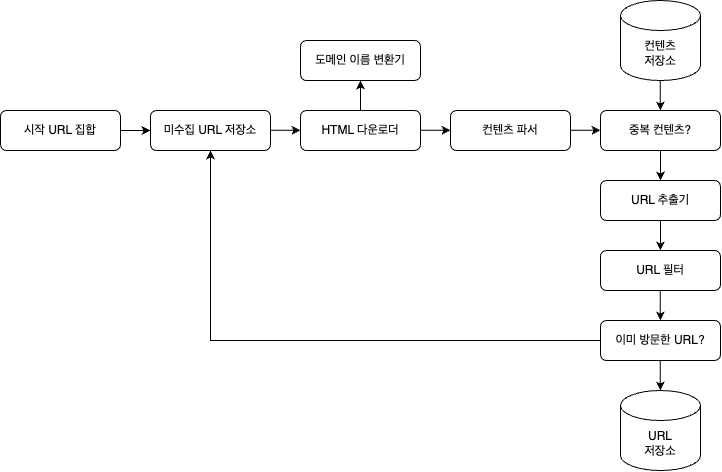
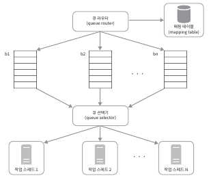
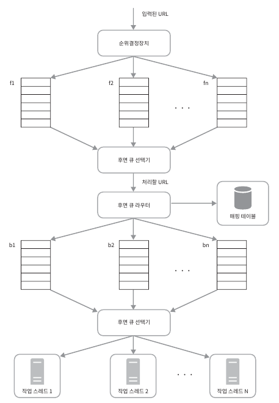
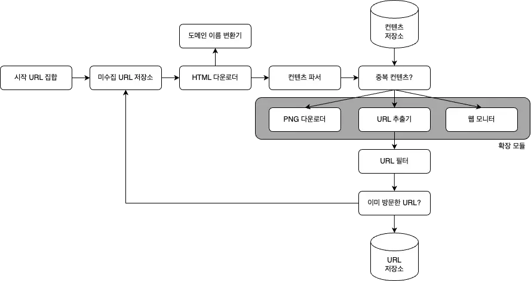

# 9장. 웹 크롤러
- 웹 크롤러는 **웹에 새로 올라오거나 갱신된 콘텐츠를 찾아내는 것**이 주된 목적이다 
- 콘텐츠는 **웹 페이지일 수도 있고, 이미지나 비디오, 또는 PDF 파일일 수도 있다**
- 웹 크롤러는 몇 개 웹페이지에서 시작하여 그 링크를 따라 나가면서 새로운 콘텐츠를 수집한다
- 검색 엔진 인덱싱
  - 크롤러는 웹 페이지를 모아 검색 엔진을 위한 `로컬 인덱스`를 만든다
- 웹 아카이빙
  - 나중에 사용할 목적으로 장기보관하기 위해 웹에서 정보를 모으는 절차를 말한다
- 웹 마이닝
  - 웹 마이닝을 통해 인터넷에서 유용한 지식을 도출해 낼 수 있다
- 웹 모니터링
  - 크롤러를 사용하면 인터넷에서 저작권이나 상표권이 침해되는 사례를 모니터링할 수 있다

## 1단계. 문제 이해 및 설계 범위 확정
- 웹 크롤러의 기본 알고리즘
  - URL 집합이 입력으로 주어지면 해당 URL들이 가리키는 모든 웹 페이지를 다운로드한다
  - 다운받은 웹 페이지에서 URL들을 추출한다
  - 추출된 URL들을 다운로드할 URL 목록에 추가하고 위의 과정을 처음부터 반복한다
- **요구사항**
  - 검색 엔진 인덱스
  - 매달 10억 개의 웹 페이지 수집
  - 새로 만들어진 웹 페이지나 수정된 웹 페이지도 고려해야 한다
  - 수집한 웹 페이지는 5년간 저장해야 한다
  - 중복된 콘텐츠를 갖는 페이지는 무시해도 된다
  - 중요한 것은 이런 질문을 통해 요구사항을 알아내고 모호한 부분을 제거하는 것이다.
- 좋은 크롤러가 만족해야 할 속성
  - 규모 확장성
    - 웹은 거대하므로 병행성(parallelism)을 활용하면 보다 효과적으로 웹 크롤링을 할 수 있다
  - 안정성(robustness)
    - 잘못 작성된 HTML, 아무 반응이 없는 서버, 장애, 악성 코드가 붙어 있는 링크 등과 같은 비정상적 입력이나 환경에 잘 대응할 수 있어야 한다
  - 예절(Politeness)
    - 크롤러는 수집 대상 웹 사이트에 짧은 시간 동안 너무 많은 요청을 보내서는 안된다
  - 확장성
    - 새로운 형태의 콘텐츠를 지원하기가 쉬워야 한다
- 개략적 규모 추정
  - 매달 10억 개의 웹 페이지를 다운로드한다
  - QPS = 10억 / 30일 / 24시간 / 3600초 = 대략 400 page/초
  - 최대 (Peak) QPS = 2 X QPS = 800 page/초
  - 웹 페이지의 평균 크기는 500k라고 가정
    - 10억 페이지 x 500k = 500 TB/월
    - 5년간 보관한다고 가정하면 결국 500TB X 12개월 X 5년 = 30PB의 저장용량이 필요하다.

## 2단계. 개략적 설계안 제시 및 동의 구하기

- 시작 URL 집합
  - 시작 URL 집합은 웹 크롤러가 크롤링을 시작하는 출발점이
  - 크롤러가 **가능한 많은 링크를 탐색할 수 있도록 하는 URL을 고르는 것이 바람직하다**
  - 일반적으로는 전체 URL 공간을 작은 부분집합으로 나누는 전략을 쓴다
- 미수집 URL 저장소
  - '**다운로드 할 URL'을 저장 관리하는 컴포넌트**를 미수집 URL 저장소라 부르며, 이는 FIFO 큐라고 생각하면 된다.
- HTML 다운로더
  - HTML 다운로더는 **인터넷에서 웹 페이지를 다운로드하는 컴포넌트**다
- 도메인 이름 변환기
  - 웹 페이지를 다운받으려면 **URL을 IP 주소로 변환하는 절차가 필요**하다. 
  - HTML 다운로더는 도메인 이름 변환기를 사용하여 URL에 대응되는 IP 주소를 알아낸다.
- 콘텐츠 파서
  - 웹 페이지를 다운로드하면 파싱과 검증 절차를 거쳐야한다
- 중복 콘텐츠인가?
  - 두 HTML 파일을 효율적으로 비교하기 위해 **웹페이지의 해시 값을 비교**하면 된다
- 콘텐츠 저장소
  - 콘텐츠 저장소는 HTML 문서를 보관하는 시스템이다
  - 저장할 데이터의 유형, 크기, 저장소 접근 빈도, 데이터의 유효 기간 등을 종합적으로 고려해야 한다
  - 인기 있는 콘텐츠는 메모리에 두어 접근 지연시간을 줄일 것이다.
- URL 추출기
  - URL 추출기는 HTML 페이지를 파싱하여 링크들을 골라내는 역할을 한다.
- URL 필터
  - URL 필터는 특정한 콘텐츠 타입이나 파일 확장자를 갖는 URL, 접속 시 오류가 발생하는 URL, 접근 제외 목록에 포함된 URL 등을 크롤링 대상에서 배제하는 역할을 한다.
- 이미 방문한 URL?
  - 이미 방문한 URL이나 미수집 URL 저장소에 보관된 URL을 추적할 수 있게 하는 자료구조를 사용할 것이다
  - 해당 자료 구조로는 **블룸 필터나 해시 테이블**이 널리 쓰인다
- URL 저장소
  - URL 저장소는 이미 방문한 URL을 보관하는 저장소다.

 

- 웹 크롤러 작업 흐름
1. 시작 URL들을 미수집 URL 저장소에 저장한다.
2. HTML 다운로더는 미수집 URL 저장소에서 URL 목록을 가져온다.
3. HTML 다운로더는 도메인 이름 변환기를 사용하여 URL의 IP 주소를 알아내고, 해당 IP 주소로 접속하여 웹 페이지를 다운받는다.
4. 콘텐츠 파서는 다운된 HTML 페이지를 파싱하여 올바른 형식을 갖춘 페이지인지 검증한다.
5. 콘텐츠 파싱과 검증이 끝나면 중복 콘텐츠인지 확인하는 절차를 개시한다.
6. 중복 콘텐츠인지 확인하기 위해서, 해당 페이지가 이미 저장소에 있는지 본다.
   - 이미 저장소에 있는 콘텐츠인 경우에는 처리하지 않고 버린다.
   - 저장소에 없는 콘텐츠인 경우에는 저장소에 저장한 뒤 URL 추출기로 전달한다.
7. URL 추출기는 해당 HTML 페이지에서 링크를 골라낸다.
8.  골라낸 링크를 URL 필터로 전달한다.
9.  필터링이 끝나고 남은 URL만 중복 URL 판별 단계로 전달한다.
10. 이미 처리한 URL인지 확인하기 위하여, URL 저장소에 보관된 URL인지 살피며 이미 저장소에 있는 URL은 버린다.
11. 저장소에 없는 URL은 URL 저장소에 저장할 뿐 아니라 미수집 URL 저장소에도 전달한다.

## 3단계. 상세 설계
### DFS를 쓸 것인가, BFS를 쓸 것인가?
- 웹 크롤러는 보통 BFS을 사용한다

### 미수집 URL 저장소
#### 예의
- 웹 크롤러는 수집 대상 서버로 **짧은 시간 안에 너무 많은 요청을 보내는 것**을 삼가야 한다.
 - 동일 웹 사이트에 대해서는 한 번에 한 페이지만 요청하는 원칙을 지켜야 한다
 - 이 요구사항을 만족 시키려면 **웹 사이트의 호스트명과 다운로드를 수행하는 작업 스레드** 사이의 관계를 유지하면 된다. 
   - 즉, 각 **다운로드 스레드는 별도의 FIFO 큐를 가지고 있어서** 해당 큐에서 꺼낸 URL만 다운로드한다.

- 큐 라우터
  - 같은 호스트에 속한 URL은 **언제나 같은 큐로 가도록 보장**하는 역할
- 매핑 테이블
  - 호스트 이름 <-> 큐 사이의 관계를 보관하는 테이블
- 큐 선택기
  - 큐 선택기는 큐들을 순회하면서 큐에서 URL을 꺼내서 해당 큐에서 나온 URL을 다운로드하도록 지정된 **작업 스레드에 전달**하는 역할
- 작업 스레드
  - 전달된 URL을 다운로드하는 작업을 수행한다. 

#### 우선순위
- 유용성에 따라 URL 의 우선순위를 나눌 때는 페이지 랭크, 트래픽 양, 갱신 빈도 등 다양한 척도를 사용할 수 있다

- 순위 결정 장치
  - URL 을 입력으로 받아 우선순위 계산
- 큐
  - 우선순위별로 큐가 하나씩 할당됨
- 전면 큐 
  - 우선순위 결정 과정 처리
- 후면 큐 선택기
  - 크롤러가 예의바르게 동작하도록 보증

#### 신선도
- 데이터의 신선함을 유지하기 위해서는 이미 다운로드한 페이지라고 해도 주기적으로 재수집할 필요가 있다
- URL 을 재수집하기 위한 전략
  - 웹 페이지의 변경 이력 활용
  - 우선순위를 활용하여, 중요한 페이지는 좀 더 자주 재수집

#### 미수집 URL 저장소를 위한 지속성 저장장치
- 대부분의 URL 은 디스크에 두지만, **IO 비용을 줄이기 위해 메모리 버퍼에 큐를 둔다**
- 버퍼에 있는 데이터는 주기적으로 디스크에 기록한다

### HTML 다운로더
- HTML 다운로더는 HTTP 프로토콜을 통해 웹 페이지를 내려 받는다.

#### Robots.txt (로봇 제외 프로토콜)
- 이 파일에는 크롤러가 수집해도 되는 페이지 목록이 들어 있으므로, 웹 사이트를 긁어 가기 전에 **크롤러는 해당 파일에 나열된 규칙을 먼저 확인해야 한다**.
- Robots.txt 파일을 거푸 다운로드하는 것을 피하기 위해 이 파일을 주기적으로 다시 다운받아 캐시에 보관할 것이다.

#### 성능 최적화
1. 분산 크롤링
- 성능을 높이기 위해 크롤링 작업을 **여러 서버에 분산**하는 방법이다. 
- 각 서버는 **여러 스레드**를 돌려 다운로드 작업을 처리한다

2. 도메인 이름 변환 결과 캐시
- 도메인 이름 변환기는 DNS 요청을 보내고 결과를 받는 작업의 동기적 특성 때문에 크롤러 성능의 병목 중 하나이다
- DNS 조회 결과로 얻어진 **도메인 이름과 IP 주소 사이에 관계를 캐시에 보관**해 놓고 크론 잡 등을 돌려 주기적으로 갱신하도록 해 놓으면 성능을 높일 수 있다.

3. 지역성
- 크롤링 작업을 수행하는 서버를 지역별로 분산하는 방법이다.

4. 짧은 타임아웃
- 지정한 타임아웃 시간 동안 서버가 응답하지 않으면 크롤러는 해당 페이지 다운로드를 중지하고 다음 페이지로 넘어간다.

#### 안정성
- 안정해시
  - 다운로더 서버들에 부하를 분산할 때 적용 가능한 기술이다. 이 기술을 이용하면 다운로더 서버를 쉽게 추가하고 삭제할 수 있다.
- 크롤링 상태 및 수집 데이터
  - 장애가 발생할 경우에도 쉽게 복구할 수 있도록 크롤링 상태와 수집된 데이터를 지속적 저장장치에 기록해 두는 것이 바람직하다.
- 예외 처리
- 데이터 검증

#### 확장성

- 새로운 모듈을 끼워 넣음으로써 새로운 형태의 콘텐츠를 지원할 수 있도록 설계한다

#### 문제 있는 콘텐츠 감지 및 회피
1. 중복 컨텐츠
   - 해시나 체크섬을 통해 탐지할 수 있다.
2. 거미 덫 (크롤러가 무한 루프에 빠지도록 설계한 웹페이지)
   - URL의 최대 길이를 제한하면 회피할 수 있으나, 모든 덫을 피할 수 있는 만능 해결책은 없다. 따라서 수작업으로 덫을 확인하고 찾아낸 후 크롤러 탐색 대상에서 제외하거나 URL 필터 목록에 걸어둔다. 
3. 데이터 노이즈

## 4단계. 마무리
- 서버 측 렌더링
  - 웹 페이지를 있는 그대로 다운받아 파싱해해보면 동적으로 생성되는 링크를 발견할 수 없을 것이다. 페이지를 파싱하기 전 다이나믹 렌더링을 거친다면 문제를 해결할 수 있다.
- 원치 않는 페이지 필터링
  - 스팸 방지 컴포넌트를 두어 품질이 조악하거나 스팸성 페이지를 걸러내면 좋다.
- 데이터베이스 다중화 및 샤딩
- 수평적 규모 확장성
  - 수평적 규모 확장성을 달성하는 데 중요한 것은 서버를 무상태 서버로 만드는 것이다.
- 가용성 / 일관성 / 안정성
- 데이터 분석 솔루션