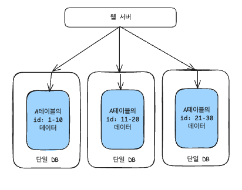

# DB 부하 줄이기

## 데이터 자체를 쪼개기

### Sharding

샤딩 구조

하나의 DB를 개별 서버의 샤드로 나누는 것을 의미한다.
* 샤드란? 데이터를 나눈 작은 단위
* 즉 데이터를 나눈 작은 단위(샤드)를 개별 DB 서버에서 사용하는 것

같은 스키마(테이블 구조)를 가진 샤드를 여러대로 분리한다는 점이 특징
* 동일한 테이블을 여러 DB 서버(샤드)로 나누어 트래픽을 분산시키는 수평적 확장
* 개별 샤드에 동일한 스키마의 중복되지 않는 데이터가 저장되어 있다.

#### 장점
* 여러 서버에 데이터가 분산 저장되어 쿼리 성능 향상 (필요한 데이터가 있는 샤드에만 접근하므로, 스캔 범위도 줄어들고 병렬적으로 여러 샤드 스캔이 가능함)
* 개별 샤드에 대해 병렬적으로 RW 가능 -> 쓰기 성능 향상
* 단일 DB의 용량 문제도 해결할 수 있음 (대용량 데이터 분리) 

#### 단점
* 전체 데이터에 대한 쿼리 복잡도 향상
  * e.g., 전체 데이터 개수를 조회하는 쿼리
* 샤드 간 트랜잭션 관리 복잡도 향상

#### 장애 복구
* 문제가 생긴 샤드만 복구
* replication/백업된게 있으면 바로 복구 가능, 그 외에는 다운타임 발생(?)

### Partitioning

파티셔닝 구조

샤딩과 비슷하지만 **하나의 DB 서버 내에서 한 테이블의 데이터를 분리하는 것**을 의미한다.
* 한 테이블에 있는 다량의 데이터를 여러 파티션으로 나눠서 저장하는 것
* 개별 파티션에 동일한 스키마, 중복되지 않는 데이터가 존재한다.

#### 장점
* 필요한 데이터가 있는 파티션만 스캔하여 쿼리 -> 성능 향상
* 여러 파티션에 대해 병렬적 RW 작업 가능 -> 쓰기 성능 향상
* 단일 DB 서버 한 대로 데이터 분산 가능

#### 단점
* 샤딩과 마찬가지로, 파티션을 나눌 키/전략 설정이 필요함
* 하나의 파티션에 데이터가 몰리는 불균형 발생 가능
* 여러 파티션에 걸쳐있는 데이터를 조회해야 하는 쿼리 복잡도 향상

#### 장애 복구
* 백업이 있으면 해당 백업본으로 복구 -> 데이터 양이 많다면 복구가 오래걸릴 수 있음
* MySQL 등 일부 DBMS에서는 파티션에 대한 replication도 제공해서 바로 복구 가능

## 데이터를 쪼개지 않고 성능 향상하기

### Replication

레플리케이션 구조

DB 다중화로 **같은 스키마, 같은 데이터의 DB 서버를 여러 대** 두어 사용하는 것.
* 동일 데이터를 여러 DB 서버에 복제

master-slave 구조로 활용한다.
* 쓰기 작업은 master DB에 대해 수행되고, slave DB는 읽기 전용으로 사용된다.
  * Read 성능은 향상 가능하지만, Write 성능은 크게 향상되지 않는다.
* Slave DB는 Master DB와의 데이터 정합성을 binary log를 사용하여 비동기적으로 맞춘다.

AWS에서 RDS DB 인스턴스를 하나 생성할 때 replica를 지정할 수 있는데, 이 때도 한 DB는 master DB, 다른 DB는 slave DB로 read-only endpoint를 가지게된다.

#### 장점
* failover(자동으로 대체 노드로 전환) 가능
* 여러 대의 slave DB로 조회 성능 향상

#### 단점
* 쓰기 성능은 크게 향상되지 않음(그래도 읽기는 slave DB에 발생하니까 write 쿼리만 받으면 향상이 되려나?)
* 데이터 불일치 가능성

#### 장애 복구(failover)
* master DB 장애 시, slave DB 한 대가 master DB를 대신한다.
* slave DB 장애 시, 신규 slave DB를 투입 / 다른 slave DB로 쿼리를 보낸다.

### (Shared Storage) Clustering

클러스터링 구조

Replication과 유사하게 여러 대의 DB 서버가 존재하지만, **하나의 공유 데이터베이스(storage)를 참조**한다.
* DB 서버: DBMS(MySQL, MariaDB)이 실행되는 서버
* 공유 스토리지: 실제 데이터가 쓰이는 디스크/저장소

#### Active-Active 구조
* 두 대의 DB 서버가 있다 가정할 때, 두 대 모두 트래픽을 받는 구조
* 동시 처리량은 늘어나나, **스토리지 자체에는 병목이 생긴다.**
* 한 DB 서버에 장애 발생 시, 다른 DB 서버로 여전히 대응 가능

#### Active-StandBy 구조
* Active 서버가 트래픽을 받는 동안, Stand-by 서버는 대기 상태
* active 서버에 문제가 발생하면 stand-by 서버가 active로 전환
* 스토리지 병목은 해결 가능하나, stand-by -> active 전환 사이에 순단 발생 가능
* 활성화 된 서버 수가 active-active에 비해 적기 때문에 트래픽 처리량은 감소

#### 장점
* 데이터 일관성 유지 가능
* DB 서버가 다운되어도 다른 DB 서버가 대체 가능
* DB 서버가 여러대기 때문에 RW 모두 성능 향상 가능

#### 단점
* 공유 스토리지 자체에 장애가 발생하면 SPOF가 될 수 있음
* 여러 서버가 한 대의 스토리지에 접근하기 때문에 락 관리 복잡함 증가

---

# 서비스 평가하기 (SLA/SLO/SLI)

> 하려다가 시간 없어서 대충..

## SLI(Service Level Indicator)
서비스의 성능을 측정하는데 사용할 정량적 지표

### SLI에 포함될 수 있는 지표

#### Availability(가용성)
* 서비스가 정상 운영되고 있는 시간/비율에 대한 지표 (즉, 시간의 개념)
* 사용자가 특정 시점에 요청을 보냈을 때, 서비스가 그에 대해 응답을 보낼 수 있었는가?
* 서버 Uptime Downtime 등으로 평가 가능
* (총 시간 - 다운타임) / 총 시간 

#### Reliability(신뢰성/안정성)
* 서비스가 오류 없이 제공되는 시간/비율에 대한 지표 (즉, 의도한 동작을 하는지 결과에 초점)
* MTBF(평균 장애 간격 시간), MTTR(평균 장애 복구 시간), MTTF(평균 장애 발생 시간) 등으로 측정

#### Error Rate(에러율) -> 안정성 평가 지표로 둘 수도 있음
* HTTP 5XX 응답 비율
* 특정 서버에서 발생한 특정 문자열을 포함한 에러 로그 개수

#### Latency(응답 레이턴시)
* 전체 요청 중 몇 퍼센트에 대해 평균 몇 초 이내에 응답을 반환할 것인지

## SLO(Service Level Objective)
서비스 제공 시, 서비스 담당자들이 내부적으로 달성해야할 측정 가능한 지표 
* 적어도 이 정도는 보장하겠다! 라고 정의하는 목표

### SLO 예시
* 가용성 99.95%
* 안정성/MTTR(평균 장애 복구 시간) 1시간 이내
* 에러율 1%
* p99 레이턴시 200ms

## SLA(Service Level Agreement)
서비스가 고객에게 어느정도의 서비스 품질을 보장해줄 것인지, 보장하지 못하면 어떤 패널티가 있는지 등에 대한 규약
* 고객을 위한 서비스 품질 약속

