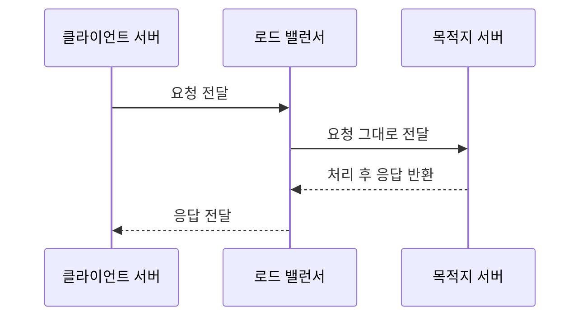

# 서비스 성능 측정에 주로 활용되는 지표들

## 초당 처리량: TPS, QPS

> 서비스의 처리량(throughput)을 측정할 수 있는 지표

해당 지표의 값이 높을 수록 서비스의 처리량이 뛰어난 것으로 생각할 수 있다.

### QPS(Query Per Second)

작은 단위의, 하나의 요청(=쿼리)을 서비스가 초당 얼마나 처리할 수 있는가

* MySQL SELECT 쿼리 한 개
  * DB 자체의 성능 파악, 쿼리 효율 측정에 활용 가능
* GET /api/path/to/resource API 한 개 호출
  * 웹 서버, API 서버의 성능 측정에 활용 가능

### TPS(Transaction Per Second)

사용자 입장에서 특정 행위(=트랜잭션)를 수행할 때, 해당 동작이 초당 몇 번 처리될 수 있는가

* 주문 동작에 대한 TPS
  * 주문 생성 -> 결제 -> 결제 후, 주문 완료 확인이 하나의 주문 동작일 때
  * 아래처럼 하나의 트랜잭션 내에서 총 6번의 쿼리가 발생한다.
    * 주문 생성 API 호출
    * 주문 생성 과정에서의 DB 호출 (1번이라고 가정)
    * 결제 API 호출
    * 결제 과정에서의 DB 호출 (1번이라고 가정)
    * 주문 내역 조회 API 호출
    * 조회 과정에서의 DB 호출 (1번이라고 가정)
  * (클라이언트 입장에서의) 하나의 동작에 대한 성능을 측정할 때 활용 가능
  * QPS와 TPS를 활용하여, 어떤 지점에서 병목이 발생하는지 확인할 수도 있다.

> 🤔 물론 단일 API 하나를 호출할 때의 처리량도 TPS로 측정 가능하다.
> * 해당 API 호출이 오류 없이 성공으로 응답되는 것 == 하나의 트랜잭션이 성공한 것이라면, TPS로 볼 수 있다.
> * 이 때, QPS는 단순히 요청량만을 측정하기 때문에 오류여부와 상관없이 순 요청량만을 측정하고
> * TPS는 트랜젹션 성공이 핵심이기 때문에 오류없이 성공적으로 응답된 것만 측정한다.


## 가용성(Availability)

> 서비스가 사용자에게 제공이 되고 있는 시간을 비율로 나타내는 것

서비스가 구동되고 있는 시간(=가용시간, up-time)을 활용하여 계산한다.

```
가용성(%) = (가용 시간)/(측정 기준이 되는 전체 시간)
```

* 보장할 가용성은 보통 99%, 99.9%, 99.99%.. 등으로 표현한다.


## 레이턴시

서비스의 응답 속도 (경우에 따라 다르나, 보통 ms 단위로 표현한다.)

실제 서비스 호출의 경우, 아래와 같은 흐름으로 구성된다.



이 떄, 요청을 처리하는 서버의 레이턴시는 아래 방법으로 측정할 수 있음

1. LB 레이턴시

(AWS의 경우) ELB에 "응답 지연 시간"이라는 지표가 있다.
* 해당 지표는 LB에 요청이 들어온 시간 ~ 요청이 나갈 때 LB를 거친 시간까지를 의미한다.

2. 목적지 서버가 제공하는 메트릭으로 측정되는 레이턴시

목적지 서버에 메트릭 수집기를 적용하거나, 프로세스 자체가 노출하는 메트릭에 포함된 응답 시간을 활용할 수 있다.
* 스프링 어플리케이션의 경우 `spring acuator`로 스프링 어플리케이션 메트릭이 노출된다.
* 프로메테우스가 수집 가능한 형태로 수집되는 메트릭의 경우, `http_server_requests_seconds_sum` 등을 활용하여 API의 평균 응답 시간을 측정할 수 있다. 
