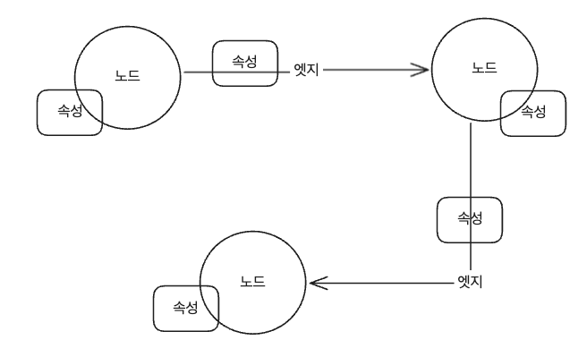
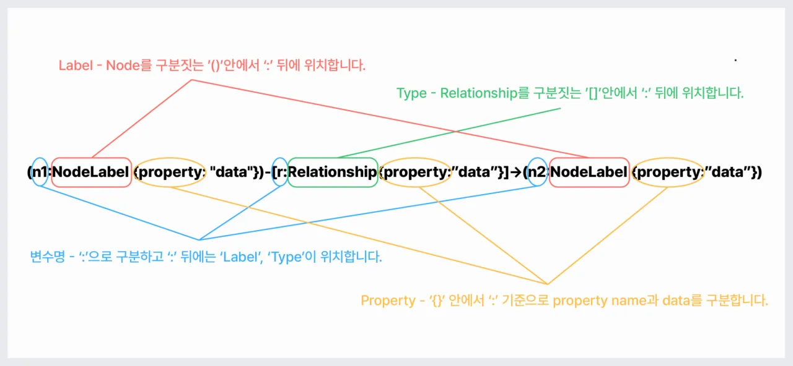
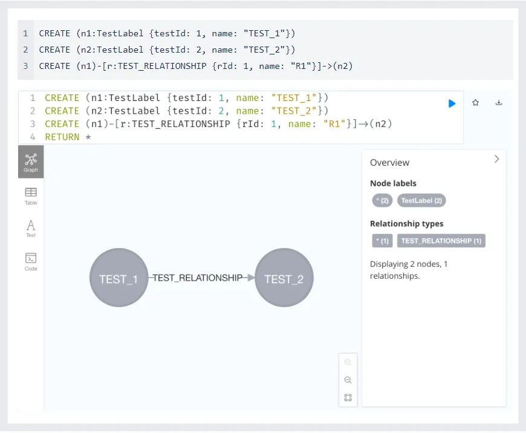
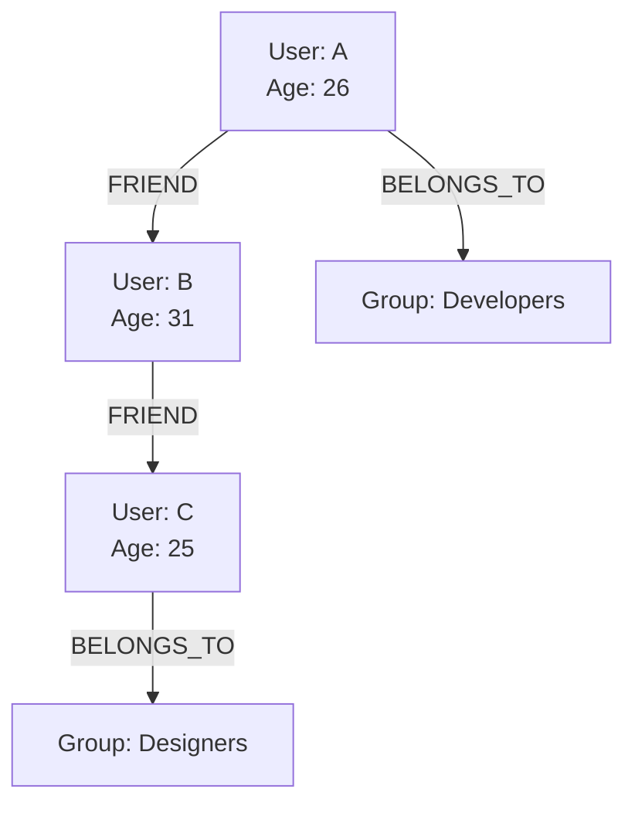

# 심화

## 1. 사용자 규모에 대한 질문을 통해 무엇을 구체화하고 시스템 설계에 어떻게 활용할 수 있는가?

사용자 규모를 통해서 트래픽을 예측할 수 있다. (2장의 QPS 계산과 유사)

- RPS(초당 트래픽) == (일일 사용자 수(DAU)) * (한 사람이 하루에 평균적으로 요청을 얼마나 보내는가) * (동시 사용자 비율) / (1일을 초로 변환한 값)
- 하나의 요청당 메모리가 얼마나 소모되는지, 서버 응답 시간이 어떻게 되는지 등을 계산하여 서버 사양 결정에 활용할 수 있다.
- 필요한 메모리 크기, CPU 개수 → 서버 하나의 사양과 서버 개수 결정

---

## 2. 그래프 데이터베이스

> 관계형 데이터베이스는 다음 3가지가 포함된 **그래프 구조**로 데이터를 표현하며, **엔티티 간의 관계를 강조하는데 유용하다.**

### 정의



- 노드: 객체 그 자체(데이터를 저장하는 기본 단위. e.g., 사람)
- 엣지: 노드 간의 관계 (e.g., 사람 A가 물건 B를 구매)
  - 시작 노드, 종료 노드, 유형/방향이 있다.
  - 상하관계, 작업 및 소유권, 일대다-다대다 관계를 표현할 수 있다.
- 속성: 노드와 엣지의 특성(메타데이터 e.g., 사람의 이름, 나이, 물건 B를 구매한 일자 등)
  - 속성이 있는 그래프를 속성 그래프라고 하기도 한다.

### 특징

- 고정된 스키마가 없다.(GQL에 따라 다르지만 노드의 속성 등을 자유롭게 표현 가능)
- 데이터를 엔티티(노드)들 사이의 관계를 표현한 네트워크로 저장한다.
- 소셜 네트워킹, 추천 엔진, 사기 탐지 등 데이터 간의 관계를 만들거나, 관계를 중심으로 쿼리해야하는 상황에 유용하다.
  - 사기 탐지: 결제 시, 해당 사용자의 정보가 다른 사기 사건과 연루가 되어있는지 파악하는 용도로 사용 가능 → 중고나라 사기조회 어떤 식으로 구현되어있는지 궁금했는데 기술 블로그가 딱히 없네..
  - 경로 최적화
- 다루게 될 데이터를 점과 선으로 표현할 수 있고, 그 관계에서 의미있는 데이터가 만들어지는 경우에 그래프 DB를 쓰기 적합하다고 판단할 수 있다.

### 장점
- 스키마 변경이 유용하다. (고정된 스키마가 없다고 생각하는게 맞을 듯)
  -  어떤 GQL인지에 따라 다르겠지만.. Cypher(밑에서 설명)의 경우, 노드의 라벨/엣지의 타입이 같아도 속성(property)는 노드/엣지마다 자유롭게 입력이 가능하다.
- 관계형 DB는 얽힌 엔티티가 많아질 수록 조인&서브쿼리로 쿼리 성능이 저하된다. 반면, 그래프 DB는 관계 중심의 쿼리가 훨씬 간소화된다.
  - RDB: 조인으로만 연결된 데이터 검색 가능
    - 모든 테이블 스캔 -> 데이터 검색&관계 매칭을 위한 키 비교 수행
- 그래프 DB: 노드가 이미 엣지로 연결되어 있기 때문에, 관계 탐색 시 엣지의 견결을 따라가는 방식으로 빠른 접근 가능
  - 새롭게 관계를 맺을 필요 없이 이미 구성된 관계를 따라간다. -> 탐색 대상 국소화(그래프 알고리즘이랑 동일한 논리)

### 쿼리 언어: GQL(Graph Query Language)

- GQL도 DBMS별로 방언이 다양하다.(Neo4j의 Cypher, Amazon Neptune의 Gremline, SPARQL 등)
- Neo4j가 지원하는 GQL은 Cypher라고 부른다.

#### Cypher



- 하나의 노드는 여러 Label을 가질 수 있다.
  - 라벨은 일종의 클래스(Class)라고 볼 수 있다. (e.g., User, Admin)
- 하나의 relationship(엣지)는 하나의 type만 가질 수 있으며, label과 구분된다.
  - 타입은 엣지의 **의미**라고 볼 수 있다. (e.g., FRIEND, FOLLOW)
- 노드, relationship은 속성(property)를 가질 수 있다.

아래는 노드, 엣지 생성 예시



#### 예시 (RDB VS Graph DB)

> **사용자 A의 친구의 친구들 중에서 특정 그룹에 속하는 사용자를 찾으라.** (한 다리 건너 친구들 중, 특정 그룹에 있는 친구를 추천할 때)
> - 사용자: 이름이 “A”인 User
> - 조회 대상 그룹: 이름이 “Developers”인 Group

#### RDB 설계
1. 데이터 모델
- User 테이블: 사용자 정보 (id, name)
- Friendship 테이블: 사용자의 친구 관계를 나타내는 매핑 테이블 (id, user_1_id, user_2_id)
- Group 테이블: 사용자가 속할 수 있는 그룹 (id, name)
- UserGroup 테이블: 사용자와 그룹의 N:M 관계 매핑 테이블 (id, user_id, group_id)

2. SQL  쿼리
```sql
SELECT DISTINCT u3.*
FROM User u1
JOIN Friendship f1 ON u1.id = f1.user1_id -- 사용자A(u1)의 친구 ID 찾기
JOIN User u2 ON f1.user2_id = u2.id -- 사용자A의 친구(u2) 정보 찾기
JOIN Friendship f2 ON u2.id = f2.user1_id -- 사용자 A의 친구(u2)의 친구(u3) ID 찾기
JOIN User u3 ON f2.user2_id = u3.id -- 사용자 A의 친구의 친구(u3) 정보 찾기
JOIN UserGroup ug ON u3.id = ug.user_id -- 사용자 A의 친구의 친구(u3)가 속한 그룹 ID 찾기
JOIN Group g ON ug.group_id = g.id -- 사용자 A의 친구의 친구가 속한 그룹 정보 찾기
WHERE u1.name = 'A' AND g.name = 'Developers';
```

#### Graph DB 설계
1. 데이터 모델
- 노드: User, Group
- 엣지: FRIEND(친구 관계), BELONGS_TO(소속)

2. GQL 쿼리
```gql
MATCH (u1:User {name: 'A'})-[:FRIEND]->(u2:User)-[:FRIEND]->(u3:User) -- 친구의 친구의 친구
MATCH (u3)-[:BELONGS_TO]->(g:Group {name: 'Developers'}) -- 친구의 친구의 친구(u3)이 그룹에 속한 것
RETURN DISTINCT u3;
```

<details><summary>참고용 데이터 구조</summary>



```gql
// 1. 사용자 노드 생성
CREATE (a:User {name: "A", age: 26})
CREATE (b:User {name: "B", age: 31})
CREATE (c:User {name: "C", age: 25})

// 2. 그룹 노드 생성
CREATE (developers:Group {name: "Developers"})
CREATE (designers:Group {name: "Designers"})

// 3. 관계(Edge) 생성
// 친구 관계 (a의 친구의 친구가 c)
CREATE (a)-[:FRIEND]->(b)
CREATE (b)-[:FRIEND]->(c)

// 그룹 소속 관계
CREATE (a)-[:BELONGS_TO]->(developers)
CREATE (c)-[:BELONGS_TO]->(designers)
```
</details> 

<br>

#### 레퍼런스
- [AWS-관계형 데이터베이스란 무엇인가요?](https://aws.amazon.com/ko/relational-database/)
- [와디즈 기술블로그-그래프 데이터베이스로 '친구' 서비스 도입하기](https://blog.wadiz.kr/%EA%B7%B8%EB%9E%98%ED%94%84-%EB%8D%B0%EC%9D%B4%ED%84%B0%EB%B2%A0%EC%9D%B4%EC%8A%A4%EB%A1%9C-%EC%B9%9C%EA%B5%AC-%EC%84%9C%EB%B9%84%EC%8A%A4-%EB%8F%84%EC%9E%85%ED%95%98%EA%B8%B0/)
