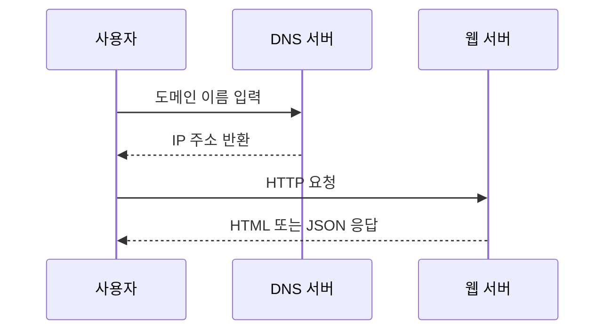
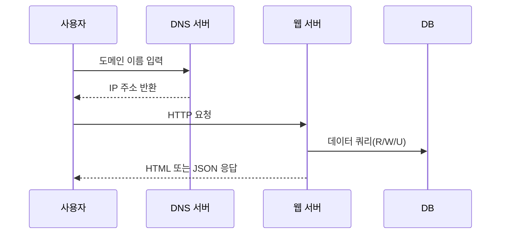
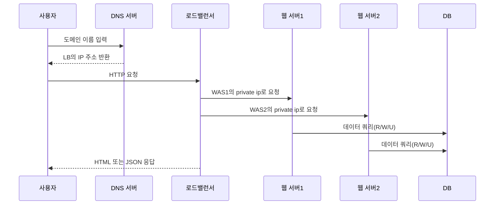
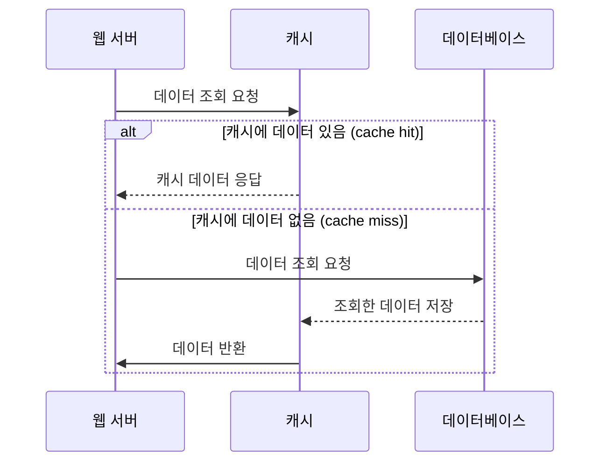
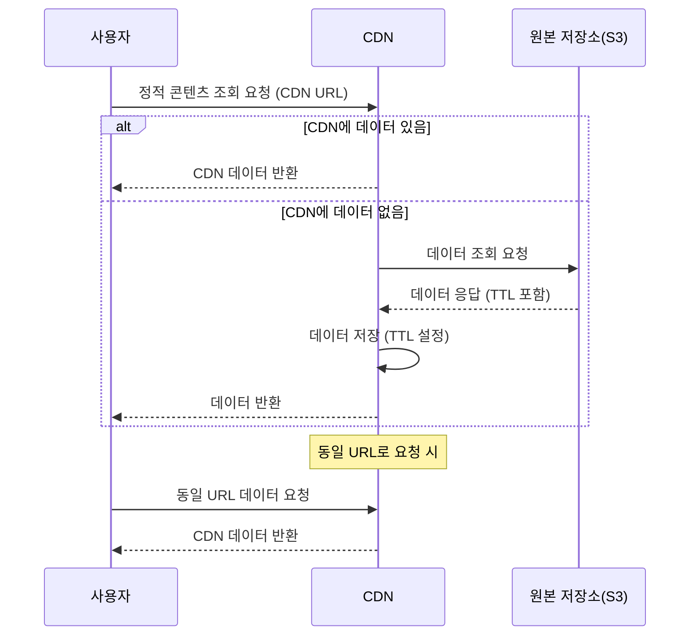

# 1. 사용자 수에 따른 규모 확장성

## 1. 단일 서버 구조

* 단일 웹 서버

하나의 서버에서 웹 앱, 데이터베이스, 캐시 등이 모두 실행되는 구조

**웹 앱 VS 모바일 앱**
* 웹 어플리케이션: 일반적인 웹 서버
  * 자바, 파이썬 등으로 백엔드 서버 구현
  * 프레젠테이션용(클라이언트)는 HTML, JS 등으로 구현
* 모바일 앱: HTTP로 웹 서버와 통신, JSON 포맷을 데이터를 주고받는다.

## 2. DB 분리

* 웹 서버(트래픽 처리, 비즈니스 로직 처리)
* DB 서버

트래픽을 처리하는 웹 서버와 DB를 분리하면 각 서버를 독립적으로 확장할 수 있다.

**DB 종류**

* RDB(관계형 데이터베이스)
  * MySQL, PostgreSQL...
  * 테이블, 열, 칼럼(?) 으로 표현
* NoSQL(비 관계형 데이터베이스)
  * CouchDB, Redis, Amazon DynamoDB, MongoDB...
  * 종류
    * 키-값 저장소(key-value)
    * 그래프 저장소
    * 칼럼 저장소
    * 문서 저장소(document)
  * 일반적으로 join 연산을 지원하지 않는다.
  * NoSQL이 유익할 수 있는 상황
    * 낮은 응답 시간 요구
    * 데이터가 비정형 데이터인 경우 
    * 데이터의 직렬화/역직렬화만 필요한 경우
    * 아주 많은 양의 데이터를 저장해야 하는 경우

## 3. 스케일업/스케일아웃

서버의 성능/트래픽 처리량을 개선하기 위한 정책

1. 스케일 업(scale-up)
* 수직적 규모 확장
* 서버 한 대의 사양을 높이는 것(cpu, mem 등)
* 단점
  * 사양 향상에 한계가 있음 
  * 자동복구(failover), 다중화(redundancy) 방안이 없음 (장애 발생 시 중단, SPOF)

2. 스케일 아웃(scale-out)
* 수평적 확장
* 서버를 추가하여 처리량을 늘리는 것
* 대규모 어플리케이션 지원에 적합

### 로드밸런서

서버 스케일 아웃으로 여러대가 운영되고 있을 때, 트래픽을 부하 분산해주는 역할

* domain의 IP는 LB의 public IP와 매핑된다.
* 같은 LB의 트래픽을 받는 서버 그룹(==타겟 그룹?) 내에서는 private IP를 사용한다.
  * 같은 네트워크 내에서만 private ip로 서로 식별이 가능하다.
  * 외부 인터넷을 통해서는 private ip에 접속할 수 없다.
* failover(장애복구) 제공 -> 정상 서버로 트래픽 인입, 장애 서버 대신 신규 서버 투입
* 가용성 향상
* 트래픽 증가 시, 추가 스케일아웃 진행

### DB 다중화 (Replication)

master(RW), slave(RO) DB 분리

* Write 작업은 master DB에 수행
* Read 작업으 slave DB에 수행
  * slave DB는 주기적으로 master DB의 사본을 전달받아 데이터 싱크
  - 어떻게 싱크하더라? -> binary log 사용

* 일반적으로 read 연산이 더 비중이 크므로, slave의 수가 더 많다.
* 성능 향상: slave DB의 수가 많아지면 read의 병렬 처리가 가능해져 DB 쿼리 속도 향상
* 안정성/신뢰성(reliability): DB 일부가 파괴되어도, (DB 서버를 여러 지역에 배치해 두었다면) 외부 지역에 있는 DB가 살아있으므로 데이터 보존 가능
* 가용성(availability): 데이터 복제로, 한 DB에 장애가 생겨도 다른 DB를 활용하여 서비스 지속 가능

**장애 상황 대응**
1. slave DB 다운
* 다른 slave DB가 read 역할 대신 수행(또는 새로은 slave DB 투입)

2. master DB 다운
* slave DB가 master DB의 역할을 수행하고, 새로운 slave DB 추가
* production 일 때, slave DB가 master DB와 완전히 동일한 상태가 아니라면, recovery script를 사용하여 데이터 복구 필요
* 다중 마스터, 원형 다중화로 이런 상황을 대처할 수는 있다.(책에서 다루지 않음)

## 4. 응답 시간 개선

### 캐시

자주 조회되고 수정이 빈번하게 발생하지 않는 데이터를 캐시 계층에 넣어두어 DB에 가지 않아도 데이터를 조회할 수 있도록 성능 개선

* 캐시 계층: 데이터를 임시 보관하는 계층

* 아래는 read-through 전략

장점
1. 성능 개선
2. DB 부하 감소
3. 캐시 계층을 독립적 확장 가능

유의 사항
1. 캐시는 갱신은 자주 일어나지 않으나, 조회는 많이 되는 데이터를 저장한다. (캐시 힛이 자주 일어나는 데이터를 저장한다.)
2. 원본 데이터는 영구 저장소에 저장해야한다. (캐시 서버 재시작 시 데이터 제거됨)
3. 캐시 만료 정책 설정
4. 캐시-DB 데이터 일관성 보장: 원본 갱신과 캐시 갱신을 단일 트랜잭션 내에서 처리
5. 장애 대응: SPOF가 되지 않도록 캐시 서버를 **여러 지역에 분산**
   - 캐시 서버가 다운된다고 해서 서비스가 다운이 되는게 맞나? 캐시 서버 다운 시 DB에서 데이터를 조회할 수 있도록 구성하면 SPOF가 아닌건 아닌지..
6. 캐시 메모리 크기: 차라리 넉넉한게 낫다. (캐시 데이터 급증에도 대응 가능)
7. 캐시 eviction 전략: LRU / LFU / FIFO

### CDN(콘텐츠 전송 네트워크)

정적 콘텐츠(e.g., 이미지, JS, CSS) 서빙할 수 있는 서버를 **지리적으로 다양한 위치에 분산시켜 두는 것**

* 동적 콘텐츠 캐싱: 쿼리 요청값(path, param, cookie) 등에 따라 HTML 페이지를 응답하는 것

유의사항
1. 비용: CDN은 3자가 운영하는 서비스, CDN에 들어오고 나가는 데이터양으로 비용 청구
2. 만료 시간 설정: 시의성이 중요한 데이터(time-sensitive)는 만료 시간 설정이 중요 (원본 데이터와 다른 값이 저장되어 있거나, 너무 원본데이터를 자주 조회하거나)
3. CDN 장애 대응: 원본 서버로부터 데이터를 조회하도록 구성
4. 캐시 무효화(invalidation)
  * 직접 CDN에 저장된 캐시 데이터 무효화 가능
  * 버저닝을 통해 원본 저장소에 있는 특정 버전의 데이터를 캐싱 -> 조회하도록 지정 가능 (image.png?v=2)

## 5. 무상태(stateless) 웹 계층

수평적 웹 계층 확장을 위해, 웹 서버는 무상태성을 보장해야한다. (서버가 상태를 가지면 안된다.)

상태에 대한 데이터(e.g., 세션) 등은 공용 저장소(e.g., redis같은 NoSQL)에서 관리

* 서버가 상태성을 가지는 상황을 대비하여 LB에서 sticky-session을 제공하긴 하나, LB에 부담을 주는 기능이다.
  * [sticky-session](https://docs.aws.amazon.com/ko_kr/elasticloadbalancing/latest/classic/elb-sticky-sessions.html): 쿠키를 기반으로 클라이언트를 계속 같은 인스턴스(서버)로 라우팅해주는 기능

* 서버 무상태성 보장으로 auto-scaling(트래픽 양에 따라 자동으로 서버를 스케일아웃/인)도 가능해짐

## 6. 데이터 센터(DC)

데이터 센터: 컴퓨팅 관련 하드웨어 장비들이 저장되는 물리적 위치

여러대의 데이터 센터에 서버를 분산해두면 가장 가까운 데이터 센터로 사용자의 요청이 전달된다. == 지리적 라우팅(geoDNS-routing)
* geoDNS: 사용자 위치에 따라 가장 가까운 데이터 센터의 IP를 도메인 값으로 반환하는 DNS 서비스

데이터 센터를 통해 한 DC에 장애 발생 시, 다른 DC로 트래픽을 전환시켜서 장애를 대응할 수 있다.

유의 사항
1. 트래픽 우회: 가장 가까운 DC로 트래픽을 보낼 수 있는 효괒거인 방법을 찾아야한다. (geoDNS가 이 기능 제공)
2. 데이터 동기화: DC마다 별도의 DB를 가질 경우, 데이터 일관성을 보장해야 한다.
   * 데이터를 여러 DC에 다중화하는 것으로 해결 가능 (동기적 복제, 비동기적 복제)
3. 여러 DC에 동일한 서버가 배포되도록 CI/CD 구성

## 7. 메세지 큐

메시지의 무손실(durability, 저장된 메시지는 소비되기 전까지 안전하게 보관됨)를 보장하는 비동기 통신 컴포넌트

producer -> queue -> consumer

장점
1. 서비스/서버간 결합이 느슨해져서 규모 확장성이 보장되는 안전한 어플리케이션 구성 가능
2. producer/consumer가 서로의 상태에 상관 없이 작업 수행 가능

## 8. 로그, 메트릭, 자동화

실행되는 서비스를 모니터링하기 위한 도구 필요

### 로그

* 서비스에서 발생하는 로그(e.g., 에러로그)를 모니터링
* 로그를 중앙에서 볼 수 있는 도구를 사용할 수 있다.
  * fluent bit, grafana loki 등

### 메트릭

* 호스트 단위 메트릭: 서버의 CPU/메모리 사용량 등을 모니터링
* 종합 메트릭: DB 계층 성능, 캐시 계층 성능 등 종합적인 계층 성능 모니터링
* 비즈니스 메트릭: 서비스의 비즈니스 연관 지표(서비스 사용자 수, 수익 등) 모니터링

### 자동화

* 시스템 생산성 향상을 위한 CI/CD 도구 등

## 9. DB 확장(스케일 업/아웃)

DB 부하에 대응하기 위한 DB 증설 방법

### 수직적 확장(스케일업)

DB 서버의 CPU/RAM 등을 증설하는 방법. 고성능 DB 한 대로 어느정도의 부하는 감당 가능하다.

유의사항
1. 스케일업에 한계가 있다.
2. SPOF
3. 비용 증가

### 수평적 확장(스케일 아웃)

DB를 작은 단위(샤드)로 분할하여 증설하는 방법. **샤딩(sharding)이라고 부른다.**

같은 스키마를 사용하는 데이터를 여러 DB에 중복 없이 분산 저장하는 방법

샤딩키(파티션 키, 하나 이상의 칼럼으로 결정됨)를 지정하여 해당 키를 기반으로 어떤 데이터를 어떤 샤드에 저장할지 결정하게 된다.
* 샤딩키를 통해 올바른 샤드에 쿼리를 날려서 데이터 조회/변경을 효율적으로 처리할 수 있도록 한다.
* 데이터가 고르게 저장될 수 있도록 샤딩키를 정하는게 핵심

* 재샤딩(resharding): 샤드키 계산 함수를 변경하여 데이터를 재배치하는 작업
  1. 데이터 수 증가로 하나의 샤드로는 감당이 어려울 때
  2. 하나의 샤드에 데이터가 너무 많이 몰려서 더 이상 공간이 없을 때
  * 안정 해시(consistent hashing)으로 문제 해결 가능
* 유명인사 문제(hotspot key 문제): 하나의 샤드에 질의가 집중되어 과부하가 걸리는 것
* 조인과 비정규화: 하나의 DB가 여러 샤드로 쪼개지면, 서로 다른 샤드에 있는 데이터는 조인이 어렵다. 
  * 데이터 비정규화로 조인 없이 하나의 테이블에서 쿼리가 수행되도록 개선 가능

