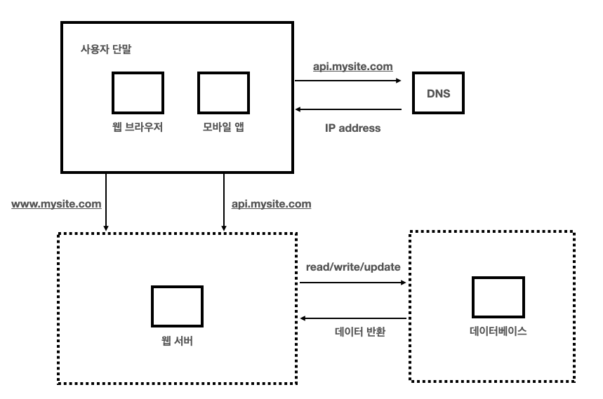
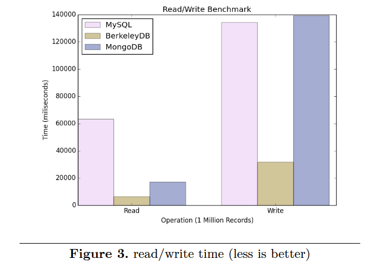
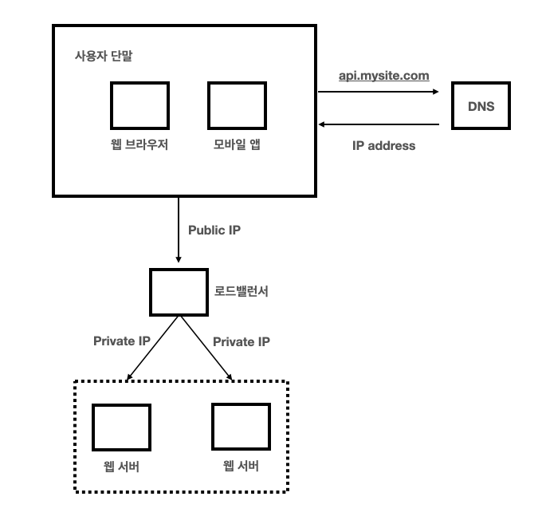
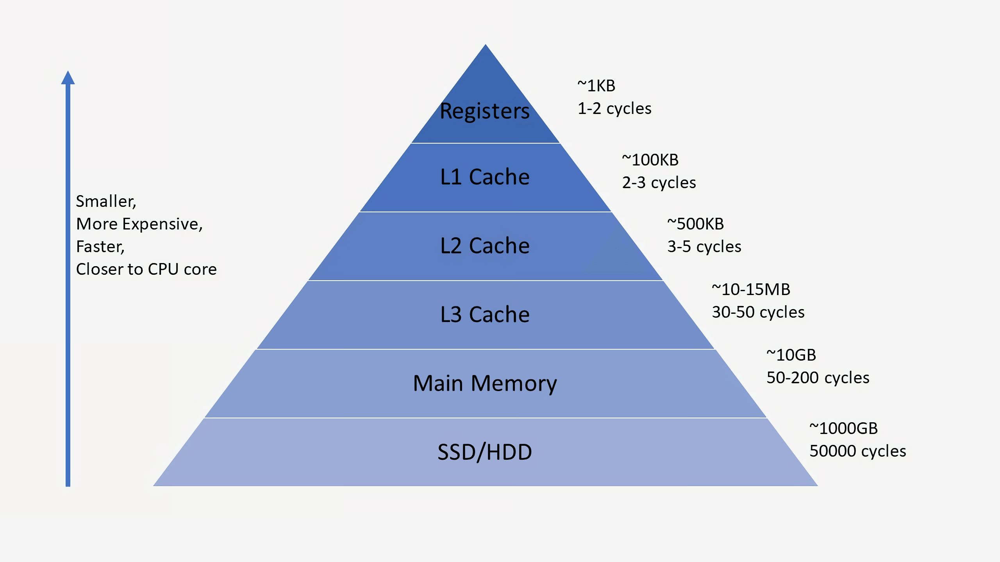
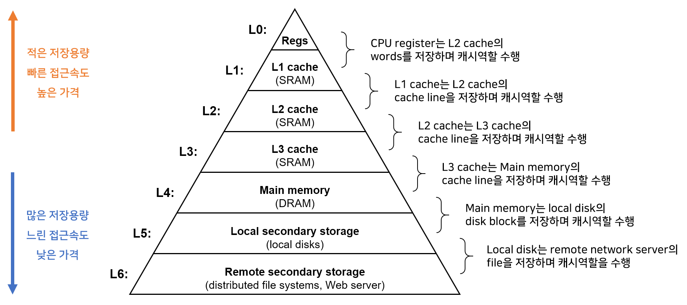
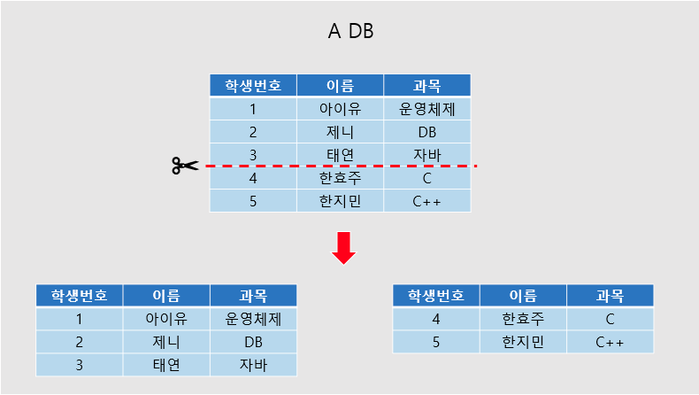
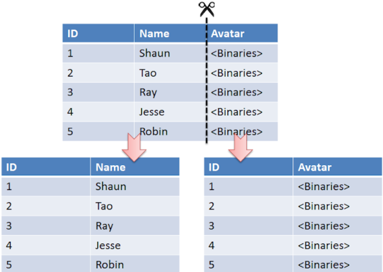
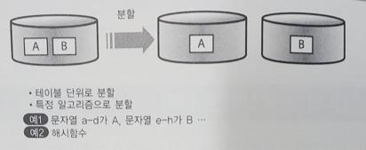

# 1장. 사용자 수에 따른 규모 확장성
## 단일 서버
- 웹 앱, 데이터베이스, 캐시 등이 전부 서버 한대에서 실행된다
1. 사용자는 도메인 이름을 이용하여 웹사이트에 접속
   - 접속을 위해서는 도메인 이름을 도메인 이름 서비스 (DNS) 에 질의하여 IP 주소로 변환하는 과정 필요
2. DNS 조회 결과로 웹 서버의 IP 주소 반환
3. 해당 IP 주소로 HTTP 요청 전달
4. 요청을 받은 웹 서버는 HTML 페이지나 JSON 형태의 응답 반환

## 데이터베이스
- 사용자가 늘면 서버 하나로는 충분하지 않아 여러 서버를 두어야 한다
  - 웹/모바일 트래픽 처리 용도
  - 데이터베이스용

### 어떤 데이터베이스를 사용할 것인가?
- 비관계형 데이터베이스는 흔히 NoSQL로 불리며 Cassandra, Amazon DynamoDB 등이 있다
- NoSQL은 키-값 저장소, 그래프 저장소, 칼럼 저장소, 문서 저장소 등으로 분류된다.
    > 
    > reference ; https://ganganichamika.medium.com/deep-dive-into-nosql-database-types-80340598124
    > - 키-값 저장소 
    >   - 데이터가 키와 값의 쌍으로 저장 
    >   - 대표적인 데이터베이스: Redis, Riak, Amazon DynamoDB  
    > - 칼럼 저장소 
    >   - 데이터가 로우(키 값), 컬럼 패밀리, 컬럼 이름으로 구성  
    >   - 2차원 키-값 저장소  
    >   - 대표적인 데이터베이스: HBase, Cassandra, Hypertable
    > - 문서 저장소  
    >   - 키-값 모델을 확장한 형태로, 데이터가 문서(보통 JSON이나 XML 형식) 형태로 저장  
    >   - 대표적인 데이터베이스: MongoDB, CouchDB 
- 비관계형 데이터베이스는 일반적으로 조인 연산은 지원하지 않는다
- 비관계형 데이터베이스가 바람직한 선택인 경우
  - 아주 낮은 응답 지연시간이 요구될 때
    > 
    > 
    > reference ; https://velog.io/@park2348190/%EB%85%BC%EB%AC%B8%EB%B2%88%EC%97%AD-SQL-vs-NoSQL-A-Performance-Comparison  
    > - NoSQL 데이터베이스는 일반적으로 밀리초(ms) 단위의 매우 낮은 응답 지연시간을 제공할 수 있다 
  - 다루는 데이터가 비정형이라서 관계형 데이터가 아닐 때
    > 비정형 데이터 : 미리 정의된 데이터 모델이나 스키마가 없는 데이터
    > - 텍스트 파일 (워드 문서, PDF 등)
    > - 멀티미디어 파일 (이미지, 오디오, 비디오)
    > - 소셜 미디어 게시물
    > - 이메일 내용
    > - 센서 데이터
    > - 로그 파일  
    > 
    > 이러한 데이터는 고정된 스키마를 가진 관계형 데이터베이스에 저장하기 어려우므로, 유연한 스키마를 제공하는 NoSQL 데이터베이스를 활용하여 다양한 형태의 데이터를 쉽게 저장 및 관리 가능
  - 데이터를 직렬화하거나 역직렬화만 하면 될 때
    > NoSQL 데이터베이스, 특히 문서 저장소는 JSON, YAML, XML 등의 형식으로 데이터를 직접 저장 가능 -> 객체와 저장 형식 간의 변환 작업이 줄어듦
    > 
  - 아주 많은 양의 데이터를 저장할 필요가 있을 때
    > 일반적으로 테라바이트(TB) 또는 페타바이트(PB) 규모의 데이터를 다룰 때 NoSQL이 유리할 수 있다
    > - NoSQL이 대용량 데이터 처리에 유리한 이유
    >   - 수평적 확장성: 새로운 서버를 추가하여 쉽게 용량을 늘릴 수 있다 
    >       - ❓ NoSQL 이 스케일 아웃하기 더 편한가? 
    >   - 분산 아키텍처: 데이터를 여러 노드에 분산 저장하여 대규모 병렬 처리 가능
    >       - ❓ RDBMS 에서는 어떤 식으로?
    >   - 스키마 유연성: 다양한 형태의 대용량 데이터를 효율적으로 저장 가능
    >   - 높은 쓰기 성능: 많은 NoSQL 데이터베이스는 대량의 쓰기 작업에 최적화되어 있음
    >       - ❓ 쓰기 작업에 최적화된 이유?

## 수직적 규모 확장 vs 수평적 규모 확장
- `스케일 업` (수직적 규모 확장) : 서버에 고사양 자원 (더 좋은 CPU, 더 많은 RAM 등) 을 추가하는 것
- `스케일 아웃` (수평적 규모 확장) : 더 많은 서버를 추가하여 성능을 개선하는 것
- 서버로 유입되는 트래픽 양이 적을 때는 스케일 업이 좋은 선택이다.
    > 트래픽 양이 "적다"는 것에 대한 정확한 수치 기준은 없고 상황에 따라 상대적이며, 다음과 같은 요소들을 고려할 수 있다. 
    > 1. 현재 서버의 성능: CPU, 메모리, 디스크 I/O 등의 **리소스 사용률이 낮은 수준**(예: 50% 미만) 유지
    > 2. 응답 시간: 사용자에게 **허용 가능한 응답 시간** 내에 서비스를 제공 가능
    > 3. 동시 사용자 수: 일반적으로 수천 명 이하의 동시 사용자를 처리할 수 있다면 단일 서버로 충분할 수 있음
    > 4. 성장률: 트래픽이 급격히 증가하지 않고 **안정적이거나 완만하게 증가**한다면 스케일 업으로 대응 가능
    > 5. 비용 효율성: 스케일 업이 스케일 아웃보다 비용 효율적인 경우
    > 6. 애플리케이션의 특성: 일부 애플리케이션은 수직적 확장에 더 적합할 수 있다. 
    >    - 단일 스레드 작업이 많은 경우 CPU 성능 향상이 효과적일 수 있음 -> ❓ 이유는?
- 다만 스케일 업에는 한계가 있다. 
- 자동복구나 다중화 방안이 제시되지 않아 장애 발생 시 취약하다
- 따라서 대규모 애플리케이션을 지원하는 데는 스케일 아웃이 더 적절하다
- 너무 많은 사용자가 접속하여 웹 서버가 한계 상황에 도달하게 되면, 응답 속도가 느려지거나 서버 접속이 불가능해질 수도 있다
  - 이 때, 부하 분산기 또는 로드밸런서를 도입한다

### 로드밸런서

- 로드밸런서 : **부하 분산 집합에 속한** 웹 서버들에게 **트래픽 부하를 고르게 분산**해주는 역할을 한다
- 서버 접속 흐름
  - 사용자는 로드 밸런서의 **공개 IP 주소**로 접속 (웹 서버는 클라이언트 접속을 직접 처리하지 않음)
  - 로드밸런서는 웹 서버와 통신하기 위해 **사설 IP 주소** 이용
    - 사설 IP 주소 : 같은 네트워크에 속한 서버 사이의 통신에서만 쓰일 수 있는 IP 주소로, 인터넷을 통해서는 접속 불가능
- 로드밸런서의 부하 분산 집합에 웹서버를 추가하면 장애 자동 복구하지 못하는 문제 해소되며, 웹 계층 가용성 (시스템이 정상 사용 가능한 정도) 이 향상된다
  - 서버 1 다운 시 모든 트래픽은 서버 2 로 전송
  - 트래픽이 가파르게 증가할 경우, 웹 서버 계층에 더 많은 서버를 추가하기만 하면 로드밸런서가 자동적으로 트래픽을 분산하기 시작한다 
  > ✅ **로드밸런서의 트래픽 분산 원리**
  > - 각 서버의 상태(사용량, 처리 능력/용량 등)를 모니터링하고, 적절한 알고리즘을 사용하여 트래픽을 분산한다.
  > - 로드밸런싱 알고리즘은 크게 2가지 범주로 나뉜다
  >   - `정적 로드 밸런싱` : 고정된 규칙을 따르며 현 서버 상태와 무관
  >     - 라운드 로빈 방식 : 클라이언트 요청 순서대로 서버를 배정하는 방식
  >     - 가중 라운드 로빈 방식 : 서버마다 가중치를 설정하고 가중치에 따라 서버를 배정하는 방식 
  >     - IP 해시 방식 : 클라이언트 IP 주소를 해싱이라고 하는 계산을 수행하여 숫자로 변환하여, 개별 서버에 매칭해 처리
  >   - `동적 로드 밸런싱` : 서버의 현재 상태 검사
  >     - 최소 연결 방식 : 연결이 가장 적은 서버를 확인하고 해당 서버로 트래픽 전송
  >     - 최소 응답시간 방식 : 응답 속도가 빠른 서버부터 우선적으로 트래픽 로드 배분 -> ❓ 근데 응답속도가 빠른지 아닌지는 어떻게 확인하는 거임?
  >     - 리소스 기반 방식 : 현재 서버 부하를 분석하여 트래픽 전송. 에이전트라고 하는 특수 소프트웨어는 각 서버에서 실행되며 컴퓨팅 용량 및 메모리와 같은 **서버 리소스의 사용량을 계산**하고, 해당 서버에 트래픽을 배포하기 전에 에이전트에 충분한 여유 리소스가 있는지 확인함
  > - 가장 많이 사용되는 알고리즘은 ? 
  >   - **라운드 로빈 방식은 구현이 간단하고 공평한 분배가 가능하다는 장점이 있어 많은 로드밸런서에서 기본적으로 사용되는 알고리즘**
  >   - NGINX: NGINX는 웹 서버이자 로드밸런서로 널리 사용되며, 기본적으로 라운드 로빈 방식 사용
  >   - AWS Application Load Balancer (ALB): 이전에는 ALB가 라운드 로빈 알고리즘만을 사용하여 수신 요청을 백엔드 대상에 배포했음
  >   - HAProxy: 오픈 소스 로드밸런서
  >   - Apache HTTP Server mod_proxy_balancer: Apache의 로드밸런싱 모듈
  > - ❓L4 로드 밸런서 / L7 로드 밸런서에 대하여

### 데이터베이스 다중화
- 서버 사이에 주(master)-부(slave) 관게를 설정하고, 데이터 원본은 주 서버에, 사본은 부 서버에 저장하는 방식이다
- `쓰기 연산`은 **마스터**에서만 지원한다
  - **부 데이터베이스**는 주 데이터베이스로부터 사본을 전달받으며, `읽기 연산` 만을 지원한다
  - ❓사본을 어떻게 전달받는가
- 대부분 애플리케이션은 읽기 연산의 비중이 쓰기 연산보다 훨씬 높다
  - 통상 부 데이터베이스의 수가 주 데이터베이스의 수보다 많다
- 데이터베이스를 다중화했을 때 얻을 수 있는 이득
  - 더 나은 성능
    - 읽기 연산은 부 데이터베이스 서버들로 분산되므로, **병렬로 처리될 수 있는 질의 수가 늘어나서** 성능이 향상됨
  - 안정성
    - 자연 재해 등의 이유로 데이터베이스 서버가 파괴되어도 데이터는 보존됨 -> 지역적으로 떨어진 여러 장소에 다중화시켜 놓을 수 있기 때문
  - 가용성
    - 하나의 데이터베이스 서버에 장애가 발생해도, 다른 서버에 있는 데이터를 가져와 계속 서비스할 수 있음
- 부 서버가 1대 뿐인데 다운되었다면, 읽기 연산은 한시적으로 모두 주 데이터베이스로 전달된다. 또한 즉시 새로운 부 데이터베이스 서버가 장애 서버를 대체할 것이다
  > ✅ 즉시 새로운 부 데이터베이스가 추가되니까, 장애가 난 부 서버를 대체한다는 건가 ? 즉시 어떻게 데이터베이스가 추가되지 ? 
  실제로는 새로운 서버를 준비하고 데이터를 동기화하는 데 어느 정도 시간이 소요된다.  
  이 기간 동안 시스템은 degraded mode(성능 저하 모드)로 운영될 수 있다.   
  > 고가용성 시스템에서는 이러한 상황에 대비해 **미리 준비된 대기 서버(standby server)를 두어 빠르게 전환할 수 있도록 하는 경우도 있음**
  >
  > 스탠바이 서버 (Standby Server)
  > - 주로 고가용성(HA) 시스템에서 사용되는 용어
  > - 주 서버(Primary/Master)의 장애 시 **즉시 대체할 수 있도록 준비된 서버**
  > 
  > 슬레이브 서버 (Slave Server):
  > - 마스터-슬레이브 복제 구조에서 사용되는 용어
  > - 마스터 서버의 데이터 변경사항을 복제하여 동기화하는 서버  
  > 
  > 공통점
  > - 데이터 동기화: 모두 주 서버(마스터)의 데이터 변경사항을 지속적으로 동기화
  > - 읽기 전용 작업: 일반적으로 읽기 전용 쿼리를 처리 가능
  > - 장애 대비: 주 서버 장애 시 대체 역할을 할 수 있음
  > 
  > 차이점
  >  - 스탠바이 서버는 주로 고가용성을 위해 사용되며, **즉시 주 서버로 전환될 수 있도록 준비된 상태를 유지** -> ❓ 이게 슬레이브 서버랑은 어떻게 상태가 다른거지?
  > - 슬레이브 서버는 주로 읽기 부하 분산을 위해 사용되며, 항상 마스터 서버의 복제본 역할을 함
  > - PostgreSQL에서는 이러한 서버를 "standby server"라고 부르며, **데이터를 지속적으로 동기화하고 필요시 주 서버로 승격될 수 있음** -> ❓ 지속적으로 동기화하는게 슬레이브랑 다른건가? 더 자주 동기화하나? 
  >   - 이 서버는 "warm standby" 또는 "hot standby" 모드로 운영될 수 있으며, 후자의 경우 읽기 전용 쿼리를 처리할 수 있음
  >   - 기본적으로 주 서버의 데이터를 복제하고 필요시 대체 역할을 하는 서버를 지칭한다고 볼 수 있음
- 주 데이터베이스 서버가 다운되면, 부 데이터베이스 서버가 새로운 주 서버가 될 것이다
  - 하지만 이 경우, 부 서버에 보관된 데이터가 최신상태가 아닐 수 있으므로 없는 데이터는 `복구 스크립트` 를 돌려서 추가하거나, `다중 마스터`, `원형 다중화` 방식을 도입하여 이런 상황에 대처할 수 있다

  > **다중 마스터**
  >  - **여러 데이터베이스 서버가 동시에 마스터 역할을 수행하는 구조**
  >      - 모든 노드가 읽기 및 쓰기 작업을 처리할 수 있음
  >      - 높은 가용성과 확장성 제공
  >      - 지리적으로 분산된 환경에서 유용
  >      - 데이터 충돌 해결 메커니즘 필요
  > 
  > **원형 다중화 방식**
  >  - 데이터베이스 서버들이 원형 구조로 연결되어 데이터를 복제하는 방식
  >     - 각 노드는 다음 노드에 데이터를 복제
  >     - 마지막 노드는 첫 번째 노드에 데이터를 복제하여 원형 구조 형성
  >     - 단일 장애점(Single Point of Failure) 제거
  >     - 네트워크 트래픽 분산

## 캐시
- 캐시 : 값비싼 연산 결과 또는 자주 참조되는 데이터를 메모리 안에 두고, 뒤 이은 요청이 보다 빨리 처리될 수 있도록 하는 저장소
- 애플리케이션 성능은 `데이터베이스를 얼마나 자주 호출하느냐`에 크게 좌우되는데, 캐시는 그런 문제를 완화할 수 있다

### 캐시 계층
- 캐시 계층 : 데이터가 잠시 보관되는 곳
  - 캐시 계층을 두면 성능이 개선될 뿐만 아니라, 데이터베이스 부하를 줄일 수 있고, 캐시 계층 규모를 독립적으로 확장시키는 것도 가능하다
  > 수평적 확장 (Scale-Out)
  > - 가장 일반적인 방법으로, 캐시 서버의 수를 늘리는 것
  > - 여러 캐시 서버를 클러스터로 구성하여 부하를 분산시킴
  > - 일반적으로 consistent hashing (안정 해시) 알고리즘을 사용하여 데이터를 여러 캐시 서버에 분산 저장  
  > 
  > 수직적 확장 (Scale-Up)
  > - 개별 캐시 서버의 리소스를 증가시키는 방법
  > - 메모리, CPU, 네트워크 대역폭 등을 증가시켜 단일 서버의 성능을 향상시킴
- `캐시 우선 읽기 전략 (read-through)`
  - 요청 받은 웹서버가 캐시에 응답이 저장된지 확인
  - 캐시에 저장되어 있다면 해당 데이터를 클라이언트에 반환. 
  - 없는 경우에는 데이터베이스 질의를 통해 데이터를 찾아 캐시에 저장 후 클라이언트에 반환 
  
  > **계층화된 캐시 (Layered Caching)**
  > 
  > 
  > CPU Register > L1 Cache > L2 Cache > L3 Cache > RAM > SSD > HDD 순의 접근 속도를 지니는데, **이 중에 Redis가 사용하는 계층이 RAM이다.**
  > - Redis : 주로 메인 메모리 (RAM) 에 데이터를 저장하고 관리하는 인메모리 데이터 구조 저장소
  > - L1 캐시: CPU 내부에 위치 / CPU 코어마다 별도로 존재하는 가장 빠른 속도로 접근할 수 있는 캐시 
  > - L2 캐시: L2 캐시는 CPU 회로판에 별도의 칩으로 내장된다. L1 캐시를 먼저 뒤지고, L2 캐시를 뒤져 데이터를 찾는다.
  > - L3 캐시 : L2 캐시로 충분히 커버할 수 있기 때문에 웬만한 프로세서에서는 L3 캐시 메모리를 달고있지 않다. L1/L2 캐시 메모리 정도만 CPU 성능에 직접적인 영향을 미치기에 L3 캐시는 크게 신경쓰지 않는것이 일반적인 추세다. L3 캐시는 CPU가 아닌 메인보드에 내장되는 경우가 더 많다.
  >
  > 지역 분산 캐시 (Geographically Distributed Cache)
  > - 전 세계적으로 분산된 사용자를 위해 여러 지역에 캐시 서버를 배치
  > - CDN과 유사한 개념으로, 사용자와 가까운 위치의 캐시 서버를 사용
  >    - Amazon ElastiCache for Redis를 사용하면 여러 AWS 리전에 걸쳐 글로벌 데이터 스토어를 구성 가능

### 캐시 사용 시 유의할 점
- 캐시가 바람직한 상황
  - 데이터 갱신은 자주 일어나지 않지만 참조는 빈번하게 일어나는 경우
- 캐시는 데이터를 휘발성 메모리에 두므로, 영속적으로 보관해야 하는 데이터는 캐시에 두면 안된다
  - 캐시 서버가 재시작되면 캐시 내의 모든 데이터는 사라진다
- 캐시에 보관된 데이터의 만료 정책을 어떻게 가져갈 것인가? -> ❓ 기준을 보통 어떻게 가져가는지?
  - 만료 기한이 너무 짧으면 데이터베이스를 너무 자주 읽게 되고, 너무 길면 원본과 차이날 가능성이 존재한다
  > ✅ **레디스의 만료기한 도래 시 데이터 삭제 정책**
  >
  > 레디스는 기본적으로 TTL 이 만료된 데이터를 아래 2가지 방법으로 삭제
  > - 주기적으로(100ms) 만료시간이 설정된 일부 키를 임의로 선택하여 만료여부를 확인 후 삭제
  >    - 레디스에 저장된 모든 키를 확인할 경우 CPU 부하가 심해진다. 레디스는 이를 막기위해 일부 키만을 선택하여 확인한다.
  > - 만료된 데이터에 접근시 삭제
  >    - 키를 가져올 때 만료시간이 설정되어 있을 경우 만료여부를 확인한다. 만료되었다면 이 시점에 키를 삭제하고 아무것도 반환하지 않는다.

- 저장소 원본 갱신 연산과 캐시 갱신 연산이 단일 트랜잭션으로 처리되지 않는 경우, 일관성 (데이터 저장소의 원본과 캐시 내의 사본이 같은지 여부) 이 깨질 수 있다
- 캐시 서버를 한 대만 두면 SPOF 가 될 수 있다
  - 따라서 여러 지역에 걸쳐 캐시 서버를 분산시켜야 한다 -> ❓ 여러 지역에 걸쳐 분산시킨 예시가 있는가?
- 캐시메모리가 너무 작으면 데이터가 너무 자주 캐시에서 밀려나 (eviction) 캐시의 성능이 떨어지게 된다
  - 캐시 메모리를 과할당하여 이 문제를 해결할 수 있다 -> ❓ 어느 정도로 과할당하는 건지?
- 데이터 방출 정책 : 캐시가 꽉 차면 추가로 캐시에 데이터를 넣어야할 경우 기존 데이터를 내보내야 하는 것
  - 가장 널리 쓰이는 정책 : LRU (Least Recently Used - 마지막으로 사용된 시점이 가장 오래된 데이터를 내보내는 정책)

  > 레디스의 데이터 방출 정책
  > - noeviction: 메모리가 고갈된 경우 새로운 쓰기 작업을 하려고 할 때 에러를 반환한다.
  > - allkeys-lru: 가장 최근에 사용되지 않은 키를 삭제한다.
  > - allkeys-random: 키 공간에서 임의의 키를 삭제한다.
  > - allkeys-lfu: 사용빈도가 적은 키를 삭제한다.
  > - **volatile-lru: 만료기간이 설정된 키 중에서 가장 최근에 사용되지 않은 키를 삭제한다.**
  > - volatile-random: 만료기간이 설정된 키 중에서 임의의 키를 삭제한다.
  > - volatile-lfu: 만료기간이 설정된 키 중에서 사용빈도가 적은 키를 삭제한다.
  > - volatile-ttl: 만료기간이 설정된 키 중에서 ttl 이 가장 짧은것을 삭제한다.
  
## 콘텐츠 전송 네트워크 (CDN)
- CDN : `정적 콘텐츠`를 전송하는 데 쓰이는, 지리적으로 분산된 서버의 네트워크
  - 이미지, 비디오, CSS, javascript 파일 등을 캐시할 수 있음
  - 동적 콘텐츠 캐싱 : 요청 경로, query string, cookie, request header 등의 정보에 기반하여 HTML 페이지를 캐시하는 것
- CDN 동작 원리
  - 사용자가 웹사이트 방문하면, 그 사용자에게 가장 가까운 CDN 서버가 정적 콘텐츠를 전달한다 -> ❓ 가장 가까운지 어떻게 측정하지?
  1. 사용자 A 가 이미지 URL 을 이용해 image.png 에 접근한다
  2. CDN 서버의 캐시에 해당 이미지가 없는 경우, 서버는 원본 서버에 요청하여 파일을 가져온다
    (원본 서버는 웹서버일 수도, 아마존 S3 같은 온라인 저장소일 수도...)
  3. 원본 서버가 파일을 CDN 서버에 반환한다
       - `응답 HTTP 헤더에는 해당 파일이 얼마나 오래 캐시될 수 있는지` 설명하는 TTL (Time-To-Live) 값이 들어있다 -> ❓ TTL 을 보통 어느정도로 설정하지?  
  4. CDN 서버는 파일을 캐시하고 사용자에게 반환하며, 이미지는 TTL에 명시된 시간이 끝날 때까지 캐시됨 -> ❓ 끝나면 CDN 에서 자동 삭제되나 ? CDN 서버용량은 어느정도로 설정?
  5. 또다른 사용자가 같은 이미지에 대한 요청을 CDN 에 전송한다
  6. 만료되지 않았다면 캐시를 통해 처리된다

### CDN 사용 시 고려해야 할 사항
- 비용
- 적절한 만료 시한 설정
- CDN 장애에 대한 대처 방안 : CDN 자체가 죽었을 때, 해당 문제를 감지하여 원본 서버로부터 직접 콘텐츠를 가져오도록 구성하는 것이 필요할 수도 있음 -> ❓ 어떻게 감지하지?
- 콘텐츠 무효화 방법 : 아직 만료되지 않은 콘텐츠라 해도 CDN 에서 제거 가능

## 무상태 (stateless) 웹 계층
- `상태 정보` (사용자 세션 데이터와 같은) 를 웹 계층에서 제거해야 수평적으로 확장할 수 있다
- `무상태 웹 계층` : 상태정보를 관계형 데이터베이스나 NoSQL 같은 지속성 저장소에 보관하고, 필요할 때 가져오도록 하는 것

### 상태 정보 의존적인 아키텍처
- 상태를 보관하는 서버는 클라이언트 정보, 즉 상태를 유지하여 요청들 사이에 공유되도록 한다
- 문제는 같은 클라이언트로부터의 요청은 항상 같은 서버로 전송되어야 한다
  - 대부분의 로드밸런서가 이를 지원하기 위해 `고정 세션` (sticky-session) 기능을 제공하고 있음
  - 하지만 이는 로드밸런서에 부담을 주며, 뒷단에 서버를 추가하거나 제거하기에 까다로우며 장애 처리도 복잡해짐 -> ❓ 고정세션에 대하여

### 무상태 아키텍처
- **웹 서버는 상태 정보가 필요할 경우, 공유 저장소로부터 데이터를 가져온다**
  - 따라서 상태정보는 웹서버로부터 물리적으로 분리되어 있다
- 공유 저장소는 관계형 데이터베이스, Memcached/Redis 같은 캐시 시스템, NoSQL 모두 가능하다
  - NoSQL 은 규모 확장 (트래픽 양에 따라 웹 서버를 자동으로 추가하거나 삭제하는 기능) 이 간편하다 -> ❓오토스케일링 원리?
- **상태 정보가 웹 서버로부터 제거되었으므로, 트래픽 양에 따라 웹 서버를 넣거나 빼기만 하면 자동으로 규모를 확장할 수 있게 된다**

## 데이터 센터
- `지리적 라우팅` (geo-routing, geoDNS-routing) 장애가 없는 상황에서 사용자는 가장 가까운 데이터 센터로 안내된다
  - 사용자의 위치에 따라 도메인 이름을 어떤 IP 주소로 변환할지 결정할 수 있도록 해주는 DNS 서비스
- 데이터 센터 중 하나에 심각한 장애가 발생하면 모든 트래픽은 장애가 없는 데이터 센터로 전송된다
- 다중 데이터센터 아키텍처를 만들 때 해결해야 하는 기술적 난제
  - 트래픽 우회 : 올바른 데이터 센터로 트래픽을 보내는 효과적인 방법 찾기 -> ❓ 원리가 뭐지?
  - 데이터 동기화
    - 데이터 센터마다 별도 데이터베이스를 쓴다면 장애가 복구되어 트래픽이 다른 DB로 우회한다 해도, 해당 데이터센터에는 찾는 데이터가 없을 수 있다
    - 이런 상황을 막는 보편적 전략은 **데이터를 여러 데이터 센터에 걸쳐 다중화하는 것**
  - 테스트와 배포 : 웹 사이트 또는 애플리케이션을 여러 위치에서 테스트해 보는 것이 중요

## 메시지 큐
- 메시지 큐 : 메시지의 무손실(즉, 메시지 큐에 일단 보관된 메시지는 소비자가 꺼낼 때까지 안전히 보관된다는 특성) 을 보장하는, 비동기 통신을 지원하는 컴포넌트
- 메시지 큐를 이용하면 서비스 또는 서버 간 결합이 느슨해져서, 규모 확장성이 보장되어야 하는 안정적 애플리케이션을 구성하기 좋다.
- 생산자와 소비자 서비스의 규모는 각기 독립적으로 확장될 수 있다. 
  - 큐의 크기가 커지면 더 많은 작업 프로세스를 추가해야 처리 시간을 줄일 수 있다 -> ❓ 큐 크기가 커지면 그만큼 더 많은 작업이 들어오니까 더 많은 작업프로세스를 더 추가해야하는 것?

## 로그, 메트릭 그리고 자동화
- 로그: 에러 로그는 서버 단위로 모니터링 할 수도 있지만, 로그를 단일 서비스로 모아주는 도구 (ex. ELK 스택 (Elasticsearch, Logstash, Kibana)) 를 활용하면 더 편리하게 검색하고 조회할 수 있다. 
- 메트릭: 메트릭을 잘 수집하면 사업 현황에 관한 유용한 정보를 얻을 수도 있고, 시스템의 현재 상태를 손쉽게 파악할 수도 있다.
  - 호스트 단위 메트릭: CPU, 메모리, 디스크 I/O에 관한 메트릭
  - 종합(aggregated) 메트릭: 데이터베이스 계층의 성능, 캐시 계층의 성능 -> ❓ 성능 측정 데이터가 어떤식으로 나오는지
  - 핵심 비즈니스 메트릭: 일별 능동 사용자(daily active user), 수익(rev-enue), 재방문(retention)
- 자동화: 지속적 통합을 도와주는 도구를 활용

## 데이터베이스의 규모 확장
### 수직적 확장
- 스케일 업이라고도 부르는 수직적 규모 확장법은 기존 서버에 더 많은, 또는 고성능의 자원(CPU, RAM, 디스크 등)을 증설하는 방법
  - 데이터베이스 서버 하드웨어에는 한계가 있으므로 CPU, RAM 등을 무한 증설할 수는 없다.
  - SPOF(Single Point of Failure) 로 인한 위험성이 크다.
  - 비용이 많이 든다.

### 수평적 확장
- 데이터베이스의 수평적 확장은 샤딩(sharding) 이라고도 부르는데, 더 많은 서버를 추가함으로써 성능을 향상시킬 수 있도록 한다
  > ✅ 데이터베이스의 수평적 확장 방법  
  > 1. 샤딩(Sharding): 대규모 데이터셋을 더 작은 조각(샤드)으로 나누어 여러 데이터베이스에 `분산 저장`하는 기법
  > 2. 레플리케이션(Replication): 동일한 데이터베이스 복사본을 여러 서버에 생성하는 방식 (데이터베이스 다중화)
  > 3. 페더레이션(Federation): 기능별로 데이터베이스를 분할하는 방식  ex) 결제, 주문, 프로필 등 각 기능별로 별도의 데이터베이스를 사용하여 각 데이터베이스의 읽기/쓰기 트래픽을 줄이고 전반적인 성능을 향상시킴
  > 4. 파티셔닝(Partitioning): 큰 테이블을 더 작고 관리하기 쉬운 부분으로 나누는 기법

- 샤딩 : 대규모 **데이터베이스를 샤드(shard)라고 부르는 작은 단위로 분할하는 기술**
  - **모든 샤드는 같은 스키마를 쓰지만, 샤드에 보관되는 데이터 사이에는 중복이 없다.**
  > ✅  데이터베이스를 분할하는 2가지 방법 : 샤딩과 파티셔닝
  > 1. 파티셔닝 
  >    - 매우 큰 테이블을 여러개의 테이블로 각 행들을 분할하는 작업
  >    - 수평 파티셔닝 : 하나의 테이블의 각 행을 다른 테이블에 분산시키는 것  (**보통 수평 분할은 하나의 데이터베이스 안에서 이루어지는 경우를 지칭) <-> 샤딩 : 서로 다른 데이터베이스로 분산**  
  >     -> ❓ 그럼 수평 파티셔닝은 스케일아웃할 필요가 없는 거아냐? 왜 파티셔닝이 수평 확장 방법에 포함된거임?
  > 
  >    - 수직 파티셔닝 : 테이블의 일부 열을 빼내는 형태로 분할.  
  >      - 정규화도 수직 파티셔닝과 관련된 거라고 할 수 있지만, 수직 파티셔닝은 이미 정규화된 데이터를 분리하는 과정이라고 생각해야 함  
  > 
  > 
  >      - 그래서 파티셔닝은 수직이건 수평이건 간에 보통 하나의 데이터베이스 안에서 이루어지는 경우를 말하는 구나~ 라고 정리하려고 했는데 파티셔닝이란 테이블을 각각 서로 다른 서버에 놓아서 분산하는 방법이라고 함 (https://velog.io/@injoon2019/%EB%8C%80%EA%B7%9C%EB%AA%A8-%EC%84%9C%EB%B9%84%EC%8A%A4%EB%A5%BC-%EC%A7%80%ED%83%B1%ED%95%98%EB%8A%94-%EA%B8%B0%EC%88%A0-13%EC%9E%A5.-MySQL%EC%9D%98-%EC%8A%A4%EC%BC%80%EC%9D%BC%EC%95%84%EC%9B%83%EA%B3%BC-%ED%8C%8C%ED%8B%B0%EC%85%94%EB%8B%9D) -> 여기서 뇌 터짐. 
  >
  >            
  >
  > 단일 서버 내 파티셔닝
  > - 일반적으로 말하는 파티셔닝은 하나의 데이터베이스 서버 내에서 데이터를 분할하는 기법
  > - 이 경우 서버 대수를 늘리지 않아도 됨. 주로 성능 최적화와 데이터 관리를 위해 사용됨
  >
  > 다중 서버 파티셔닝 (분산 파티셔닝)
  > - 테이블 A와 테이블 B를 서로 다른 서버에 분산하여 저장하는 방식
  > - 이 경우 서버 대수를 늘려야 함
  > 2. 샤딩
  >    - 샤딩 : 동일한 스키마를 가지고 있는 **여러대의 데이터베이스 서버들에 데이터를 작은 단위로 나누어 분산 저장**하는 기법
  >         - 물리적으로 서로 다른 컴퓨터에 데이터를 저장하므로, 쿼리 성능 향상과 더불어 부하가 분산되는 효과까지 얻을 수 있다. 즉, 샤딩은 데이터베이스 차원의 수평 확장(scale-out)인 셈!
- **샤딩 전략을 구현할 때 고려해야 할 가장 중요한 것은 샤딩 키를 어떻게 정하느냐 하는 것**
  - 샤딩 키는 파티션 키라고도 부르는데, `데이터가 어떻게 분산될지 정하는 하나 이상의 칼럼`으로 구성된다. 
  - 샤딩 키를 정할 때는 **데이터를 고르게 분할할 수 있도록 하는 게** 가장 중요하다.
- 샤딩을 도입하면 풀어야 할 새로운 문제
  - 데이터의 재 샤딩
    - 데이터가 너무 많아져서 하나의 샤드로는 더 이상 감당하기 어려울 때
    - 샤드 간 데이터 분포가 균등하지 못하여 어떤 샤드에 할당된 공간 소모가 다른 샤드에 비해 빨리 진행될 때
      - 샤드 소진(shard exhaustion) 이라고도 부르는 이런 현상이 발생하면 샤드 키를 계산하는 함수를 변경하고 데이터를 재 배치하여야 한다
  - 유명 인사 문제: 핫스팟 키(hotspot key) 문제라고도 부르는데, 특정 샤드에 질의가 집중되어 서버에 과부하가 걸리는 문제
  - 조인과 비정규화 : 하나의 데이터베이스를 여러 샤드 서버로 쪼개고 나면, 여러 샤드에 걸친 데이터를 조인하기가 힘들어진다
    - 데이터베이스를 비정규화하여 하나의 테이블에서 질의가 수행되도록 하면 문제를 해결할 수 있다

### 백만 사용자, 그리고 그 이상
- 웹 계층은 무상태 계층으로
- 모든 계층에 다중화 도입
- 가능한 한 많은 데이터를 캐시할 것
- 여러 데이터 센터를 지원할 것
- 정적 콘텐츠는 CDN을 통해 서비스 할 것
- 데이터 계층은 샤딩을 통해 그 규모를 확장할 것
- 각 계층은 독립적 서비스로 분할할 것
- 시스템을 지속적으로 모니터링 하고, 자동화 도구들을 활용할 것