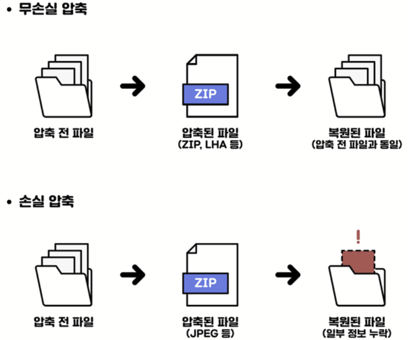

# 2장. 개략적인 규모 추정
- 개략적 규모 추정 : 추정치를 계산하는 행위로서, **어떤 설계가 요구사항에 부합할 것인지 보기 위한 것**

## 모든 프로그래머가 알아야 하는 응답지연 값
- L1 캐시 참조
- 분기 예측 오류
    > ✅ 분기 예측 오류란
    > - 분기 예측 : **다음 실행될 조건문이 어떤 곳으로 분기할 것인지를 확실히 알게 되기 전에 미리 추측**하는 CPU 기술
    > - 파이프라인 병목
    >   - cpu는 효율성을 위해 파이프라인(pipeline) 이라는 구조를 사용한다
    >   - 이 파이프라인에 명령어(코드)를 한줄 한줄 집어넣어서 동작하는데, if문 (분기문) 을 만나면 다음에 오는 명령어는 2가지 경우의 수가 생긴다. 
    >   - 이 다음에 올 명령어를 if문이 계산되기 전 까지 알 수 없으므로 cpu는 if 문이 계산되는 동안 놀게 된다. (파이프라인이 속도가 느려지는 경우 : control hazard)
    > - 파이프라인 병목을 해결하기 위한 방법 -> `분기 예측`
    > - 만약 파이프라인이 조건 값의 계산이 끝날 때까지 대기한다면, 조건 분기 명령이 전체 파이프라인을 통과할 때까지 다음 명령은 파이프라인에서 수행되지 못하고 대기하게 될 것이다.
    >  분기 예측기는 이런 낭비를 막기 위해 **단순한 알고리즘에 따라 다음 명령을 미리 추론한 후 미리 실행시**킨다.
    >   - 분기 예측기의 예측이 맞을 경우 -> 파이프라인은 낭비 없이 계속 수행
    >  - 분기 예측기의 예측이 틀릴 경우 -> 미리 실행되던 명령이 파이프라인에서 모두 취소되고 올바른 명령이 다시 실행
    > - ✅ 분기 예측 오류 : 분기 예측기가 **올바른 예측에 실패하면 파이프라인의 개수 만큼의 클럭 주기가 낭비된다. 복잡한 파이프라인 구조를 가진 현대 아키텍처에서는, 분기 예측기가 실패하면 10-20 클럭 주기가 낭비된다.**
    > - 조건 분기문이 처음 파이프라인에 들어왔을 때 활용할 수 있는 정보는 많지 않다.  분기 예측기는 해당 조건 분기문이 분기한 이력이나 루프 구조, 함수 구조 등의 정보를 바탕으로 다음 분기를 예측한다.
    > - reference;  
https://m.blog.naver.com/ektjf731/223052793786?recommendTrackingCode=2   https://blog.skby.net/%ED%8C%8C%EC%9D%B4%ED%94%84%EB%9D%BC%EC%9D%B8-%EB%B6%84%EA%B8%B0%EC%98%88%EC%B8%A1%EA%B3%BC-%EC%98%88%EC%B8%A1%EC%8B%A4%ED%96%89/
- zippy 로 1KB 압축
    > ✅ Zippy 에 대하여
    > - zippy는 메모리 내 데이터를 직접 압축할 수 있는 기능을 제공하므로, 파일 시스템을 거치지 않고도 압축할 수 있음
    > - zippy는 기본적으로 deflate 압축 알고리즘 사용 -> 이는 ZIP 형식에서 가장 일반적으로 사용되는 압축 방식
    > - deflate : 널리 사용되는 무손실 데이터 압축 알고리즘
    > 
 
- 메모리는 빠르지만, **디스크는 아직 느리다**
- 디스크 탐색은 가능한 한 피하라
- 단순한 압축 알고리즘은 빠르다    
- 데이터를 인터넷으로 전송하기 전, **가능한 압축하라**
- 데이터 센터는 보통 여러 지역에 분산되어 있으며, 센터간 데이터 주고받는 데 시간이 소요된다

## 가용성에 관계된 수치들
- `고가용성` : 시스템이 오랜 시간동안 지속적으로 중단 없이 운영될 수 있는 능력
- 대부분 서비스는 99% ~ 100% 사이의 값을 갖는다
- SLA (Service Level Agreement) : 서비스 사업자와 고객 사이에 맺어진 합의
  - 서비스 사업자가 제공하는 `서비스 가용시간`이 공식적으로 기술됨

## 예제 : 트위터 QPS 와 저장소 요구량 추정
- Query Per Second란
    - 데이터베이스나 웹 서버 API 등에서 **특정 작업이나 요청이 초당으로 얼마나 처리되는지를 나타내는 지표**
- QPS(Query Per Second) 추정치
  - 일간 능동 사용자 = 월간 능동 사용자 * 50% = 1.5억
  - QPS = 일간 능동 사용자 * 2트윗 / (24시간 * 3600초) = 약 3500
  - 최대 QPS = 2 * QPS = 약 7000
    > ✅ **최대 QPS (peek QPS)**
    > - 최대 QPS : 시스템이 처리해야 할 것으로 예상되는 최고 쿼리 비율을 나타내며, 주로 사용량이 많거나 트래픽이 급증하는 시기에 발생
    > - 파레토 법칙은 많은 성과에서 결과의 약 80%가 20%의 원인에서 발생
    > - ex) 예상 분포 특성을 기반으로 계산하여, 많은 시스템에서 하루 중 20%의 시간 동안 80%의 트래픽이 발생한다고 가정할 수 있음 (파레토 원칙을 변형) 이러한 패턴을 고려하면 평균 QPS의 2배 정도가 최대 QPS로 나타날 수 있음
    > - ❓ 왜 2를 곱했을까? 
    >    - 2배라는 수치는 절대적인 규칙은 아니고, 실제 시스템의 특성, 과거 데이터, 예상되는 성장률 등을 고려하여 적절한 배수를 선택해야 함 (일부 시스템에서는 1.5배나 3배를 사용하기도 함)

## 팁
- 근사치를 활용한 계산
- 가정을 적어두라
- 단위를 붙이라
- QPS, 최대 QPS, 저장소 요구량, 캐시 요구량, 서버 수 등을 추정하는 문제가 많이 출제된다
