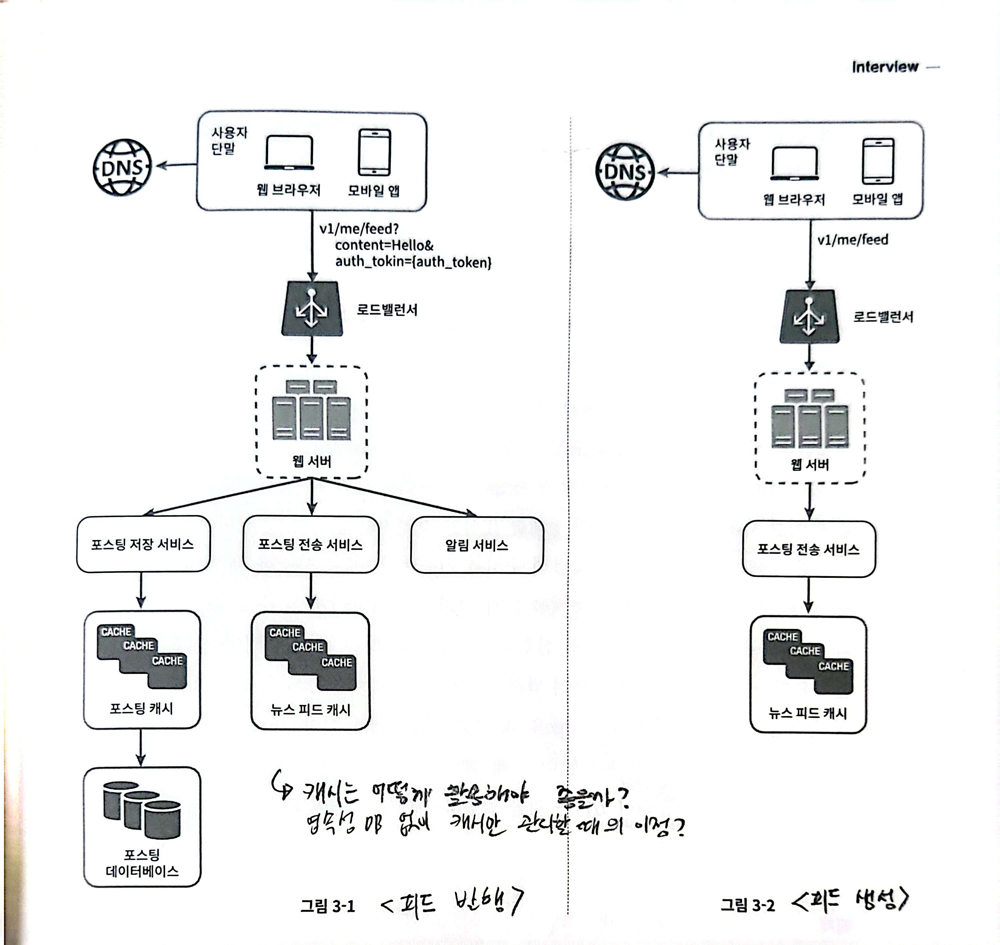
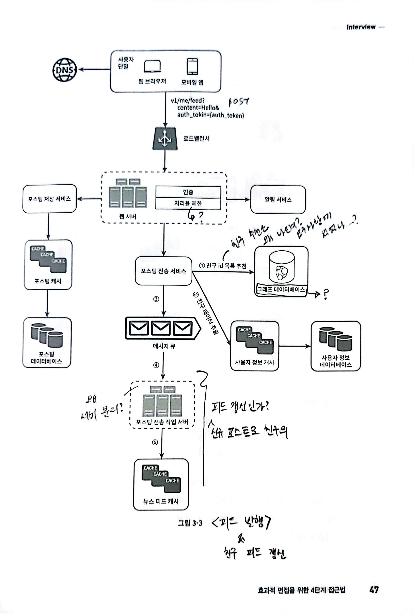
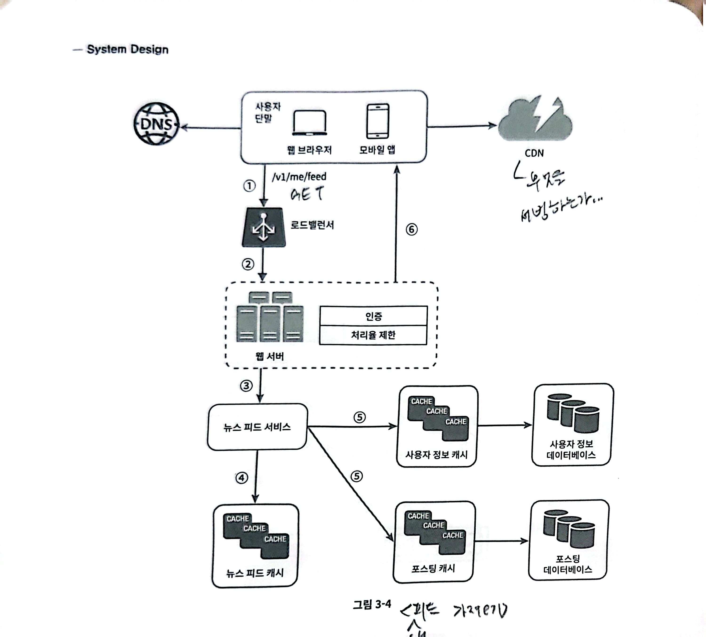

# 시스템 면접 공략법

> 두 명의 동료가 모호한 문제를 풀기 위해 협력하여 그 해결책을 찾아내는 과정에 대한 시뮬레이션
- 설계 과정에서 내린 결정들에 대한 방어 능력
- 면접관의 피드백을 건설적으로 처리할 자질이 있는지
- 압박이 심한 상황도 잘 헤쳐나갈 수 있는지
- 모호한 문제를 건설적으로 해결할 능력이 있는지
- 좋은 질문을 던질 능력이 있는지
- 오버 엔지니어링으로 빠지지는 않을지(부정적 신호 판단)


## 면접 4단계

### 1. 문제 이해 및 설계 범위 확정 (3 ~ 10분)

> 질문을 통한 요구사항 이해/구체화/범위 좁히기

면접관과 질문을 주고 받으면서 요구사항, 가정들을 분명하게 만들어나갈 수 있어야한다.

**엔지니어가 가져야 할 중요한 기술 중 하나**
- 올바른 질문을 하는 것
- 적절한 가정을 하는 것
- 시스템 구축에 대한 정보를 모으는 것


**어떤 질문을 해야하는가?**

```text
1. 구체적으로 어떤 기능을 만들어야하는지?
2. 제품 사용자 수는?
3. 회사 규모가 얼마나 커질 것으로 예상하는가? 몇 달, 몇 년 뒤의 사용자 규모 예상값
4. 회사가 주로 사용하는 기술 스택은 무엇인가? 설계 단순화를 위해 쓸 수 있는 기존 서비스가 무엇이 있는지?
```

❓ 이런 질문들을 기반으로 무엇을 파악할 수 있는가? 설계의 어떤 측면에 도움이 되는가?


### 2. 개략적인 설계안 제시 및 동의 구하기 (10~15분)

> 개략적인 설계안을 제시하고, 이에 대한 면접관의 동의를 얻기.
> 즉, “전체적인 범위의 설계를 확정하기”

- 최초 청사진을 제안하여 면접관과 같은 팀인 것 처럼 논의
- 다이어그램을 그려서 제안에 사용
- 해당 설계안이 요구사항을 만족하는지에 대해 개랸적으로 계산, 설명
- (가능하다면) 시스템의 사용 사례를 몇 가지 제시 (엣지케이스 발견에도 도움이 된다.)

**요구사항이 큰 규모에 대한 설계라면, 보다 자세한 사항(DB 스키마, API 엔드포인트 설계) 등은 생략해도 좋다. 특정 서비스의 백엔드 설계 등이라면 설명해도 무방**

[](./images/overall.jpeg)

### 3. 상세 설계 (10~25분)

> 설계 대상 컴포넌트들에 대해서 우선순위 정하기
> → 세부 설계를 위해 여러 컴포넌트들 중, 무엇에 더 집중해야하는지를 결정

- 시스템의 성능
    - 병목 구간
    - 자원 요구량 추정치
    - e.g., 채팅 시스템이라면, 채팅 레이턴시 줄이기와 (컴포넌트 세부사항으로) 사용자 ON/OFF 상태를 어떻게 표시할 것인지에 대해 구체적으로 설명한다.
- 특정 시스템 컴포넌트의 세부사항
    - e.g., URL 단축기 생성이라면, 해시 함수의 구현에 대해 구체적으로 설명한다.

[](./images/detail-1.jpeg)
[](./images/detail-2.jpeg)

### 4. 마무리 (3~5분)

> 설계 결과에 대한 후속 질문을 받거나, 스스로 더 보완하는 단계

- 개선 가능한 지점을 찾거나
- 설계를 요약하여 다시 설명하거나
- 오류 발생 시 어떤 문제가 생기는지에 대해 고려
- 운영 이슈(메트릭/로그 수집, 모니터링 방법, 배포 전략)에 대한 고려
- 규모 확장 요구사항에 대한 확장성 고려
- 미처 다루지 못한 사항을 추가 제안

## 시스템 면접에서 해야할 것

1. 질문을 통해 “확실한 것을” 확인하라. ⇒ 스스로의 가정을 맞다고 믿지 말자
2. 문제 요구사항을 이해하라
3. 정답이나 최선의 답안은 없다.
4. 면접관이 사고의 흐름을 이해할 수 있도록 지속적으로 면접관과 소통하라
5. 가능하다면 여러 해법을 제시해라
6. 개략적 설계에 면접관이 동의하면, 각 컴포넌트의 세부사항을 **중요한 컴포넌트부터** 설명하라
7. 면접관과 논의하여 아이디어를 끌어내라

## 시스템 면접에서 하지 말아야할 것

1. 전형적인 문제에 준비도 안된채로 면접장에 가지 말것
2. 요구사항, 가정을 분명히 하지 않은 상태로 설계를 제시하지 말것
3. 처음부터 특정 컴포넌트를 너무 깊게 설명하지 말것. 개략적 설계 우선 설명
4. 힌트 청하기, 소통을 주저하지 말것