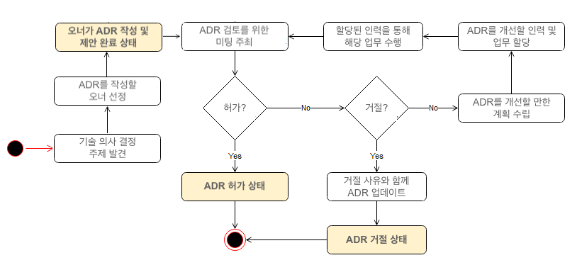

# 3장. 시스템 설계 면접 공략법
- 시스템 설계 면접에는 정해진 결말도 없고, 정답도 없다.
- 설계 기술을 시연하는 자리이고, 설계 과정에서 내린 결정들에 대한 방어 능력을 보이는 자리이다.
- **면접관의 피드백을 건설적인 방식으로 처리할 자질이 있음**을 보이는 자리이다.
- 시스템 설계 면접이 잘 진행되면, 지원자가 `협력에 적합한` 사람인지, `압박이 심한 상황도 잘 헤쳐나갈` 자질이 있는지, `모호한 문제를 건설적으로 해결할 능력이 있는지` 등을 살펴볼 수 있다
- 설계의 순수성에 집착한 나머지 타협적 결정을 도외시하고 과도한 엔지니어링을 하고 마는 엔지니어들이 현업에도 많다
  > ✅ **오버 엔지니어링의 위험을 피할 수 있는 방법**  
  > **1. 기술 의사 결정 과정 기록하기**
  > - 다음과 같은 패턴을 보인다면, 기술 부채가 계속 쌓이면서 오버 엔지니어링이 일어날 가능성이 높다
  >   - 해결할 문제와 솔루션에 대한 충분한 검토없이 기술 도입 결정
  >   - 잘못된 선택이나 변화에 대한 두려움 때문에 필요한 결정을 하지 않음
  >   - 의사 결정 과정이 투명하지도 추적되지도 않아 중복된 논의가 계속됨 
  > - 이런 경우, `아키텍처 결정 기록 (Architectural Decision Records, ADR) 프로세스`를 사용할 수 있다. 
  >   - ADR : **소프트웨어 아키텍처에 필요한 구성 요소에 대한 의사 결정, 동기 및 맥락 및 그리고 결과에 대해 설명하는 간단한 문서**
  >   - ADR 프로세스를 사용함으로써 동일한 기술 주제에 대한 반복적인 토론을 방지하고, 기존 직원 혹은 신규 입사자에게 기술 도입 과정을 효과적으로 전달할 수 있다
  > - “왜, RDB가 아니라 NoSQL을 선택했는지, 왜 구현 방법으로 Amazon DynamoDB를 선택했는지”, “왜 쿠버네티스를 선택했는지, 왜 운영 방법으로 Amazon EKS를 선택했는지”, “왜, API의 도메인 범위를 이렇게 나누었는지” 등등 각 의사 결정 사항을 ADR 문서로 저장한다
  > - ADR 문서는 다양한 템플릿이 존재하는데, 보통 **‘문제에 대한 정의’, ‘의사 결정에 대한 동기 및 맥락’, ‘최종 결정 사항’, ‘예상 결과’, ‘결정 참여자’** 등의 항목을 짧더라도 구체적으로 담아야 한다.
  >     
  > 
  > **2. 해결하려는 문제 정확히 파악하기**
  > - 해결하려는 문제에 대해 정의를 내리고, **도입하려는 기술에 대한 동기와 맥락을 정확히 알아야만** 올바른 의사 결정을 할 수 있다
  > - ex) 매일 발생하는 대량 로그 처럼 일회적인 쓰기 사용량이 높다고 해서 무턱대고 NoSQL을 선택하는 경우
  >   - 쓰기 이후에도 읽기나 분석 요구가 많은 경우라면, 간단한 파일 저장소나 Elasticsearch 같은 다른 솔루션을 고려할 필요도 있음. 
  > 
  > **3. 문제 해결 기술 후보를 선정하고 테스트하기**
  > - 몇 가지 후보를 선택하고 이를 테스트한 후, 나온 결과를 보고 선택해야 해야 한다
  >  
  > 
  > 추가적으로 가끔 오버엔지니어링 처럼 보이는 것이 필요할 때도 있다. 예를 들어, 시스템 보안이나 개인 정보 보호 같은 영역은 법적인 규정 준수 문제들이 있기 때문에 현재 가지고 있는 것 보다 더 많은 고려가 필요하다.

  > ✅ **오버 엔지니어링에 대한 현직자의 생각**  
  > 확장이나 축소 가능한 상태를 유지하는게 핵심 
  > ex) 현 요구사항보다 +a 를 구현했더라도 축소 가능한 상태로 설계가 되어 있다면 괜찮음.  (from. https://youtu.be/yDOT2-6KPZc?si=nOAjBWaujwo0FJZ2)

## 효과적 면접을 위한 4단계 접근법
### 1단계 : 문제 이해 및 설계 범위 확정
- **요구사항을 완전히 이해하지 않고 답을 내놓는 행위는 아주 엄청난 부정적 신호다**
- 답부터 들이밀지 말라. 속도를 늦춰라. 깊이 생각하고 질문하여 요구사항과 가정들을 분명히 하라
- 엔지니어가 가져야 할 가장 중요한 기술
  - 올바른 질문을 하는 것  
  - 적절한 가정을 하는 것
  - 시스템 구축에 필요한 정보를 모으는 것
- **요구사항을 정확히 이해하는 데 필요한 질문을 하라**
  - 구체적으로 어떤 기능인가?
  - 제품 사용자 수는?
  - 회사의 규모는 얼마나 되리라 예상하는가?
  - 회사가 주로 사용하는 기술스택은?
- **요구사항을 이해하고 모호함을 없애**는 게 이 단계에서 가장 중요하다

### 2단계 : 개략적인 설계안 제시 및 동의 구하기
- 설계안에 대한 **최초 청사진을 제시하고 의견을 구하라**
- **핵심 컴포넌트를 포함하는 다이어그램**을 그려라
- 최초 설계안이 **시스템 규모에 관계된 제약 사항들을 만족하는지를 개략적으로 계산**해보라

### 3단계 : 상세 설계
- 면접관과 해야할 일은 설계 대상 컴포넌트 사이의 우선순위를 정하는 것이다
  - 대부분의 경우 면접관은 **특정 시스템 컴포넌트들의 세부사항을 깊이 있게 설명하는 것**을 보길 원한다
- 불필요한 세부사항에 시간을 쓰지 말라

### 4단계 : 마무리
- **만든 설계를 다시 한번 요약**해주는 것도 도움이 될 수 있다
- 오류가 발생하면 무슨 일이 생기는지 (서버 오류, 네트워크 장애 등) 따져보자
- 메트릭은 어떻게 수집하고 **모니터링**은 어떻게 할 것인가? 로그는? **시스템은 어떻게 배포**해 나갈 것인가?
  > ❓ 시스템의 배포 방식 종류
- **규모 확장 요구**에 어떻게 대처할 것인가?

#### 해야할 것
- **질문을 통해 확인하라. 스스로 내린 가정이 옳다 믿고 진행하지 말라**
- 요구사항을 정확히 이해했는지 다시 확인하라
- 면접관과 소통하라
- 가능하다면 여러 해법을 함께 제시하라
- 가장 중요한 컴포넌트부터 진행하라
- 면접관의 아이디어를 이끌어내라
- 포기하지 말라

#### 하지 말아야 할 것
- 요구사항이나 가정들을 분명히 하지 않은 상태에서 설계를 제시하지 말라
- 개략적 설계를 마친 뒤에 세부사항으로 나아가라
- 소통을 주저하지 말라

### 시간 배분
- 1단계 - 문제 이해 및 설계 범위 확정 (3~10분)
- 2단계 - 개략적인 설계안 제시 및 동의 구하기 (10~15분)
- 3단계 - 상세 설계 (10~25분)
- 4단계 - 마무리 (3~5분)
