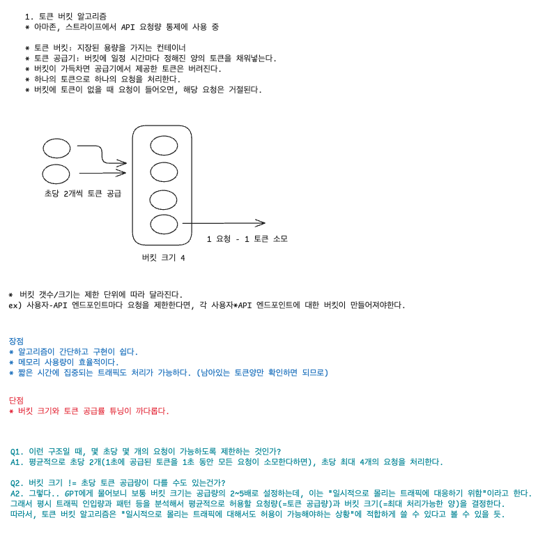
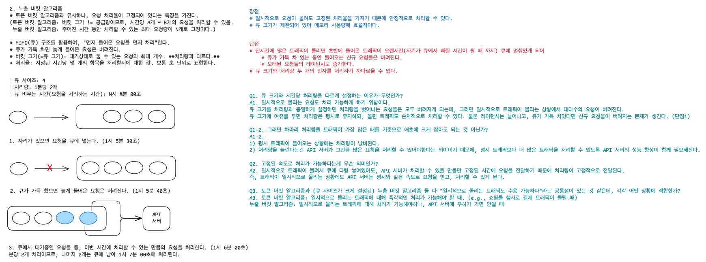
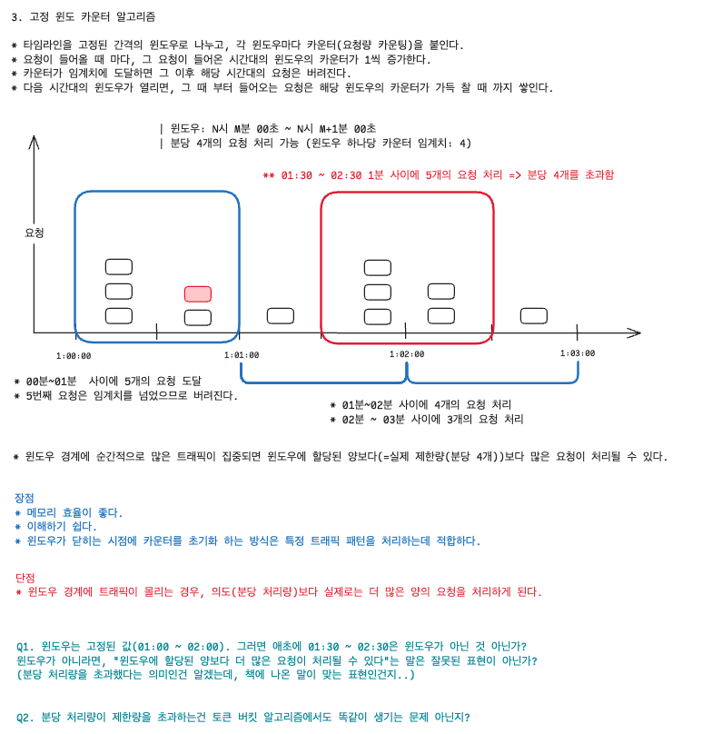
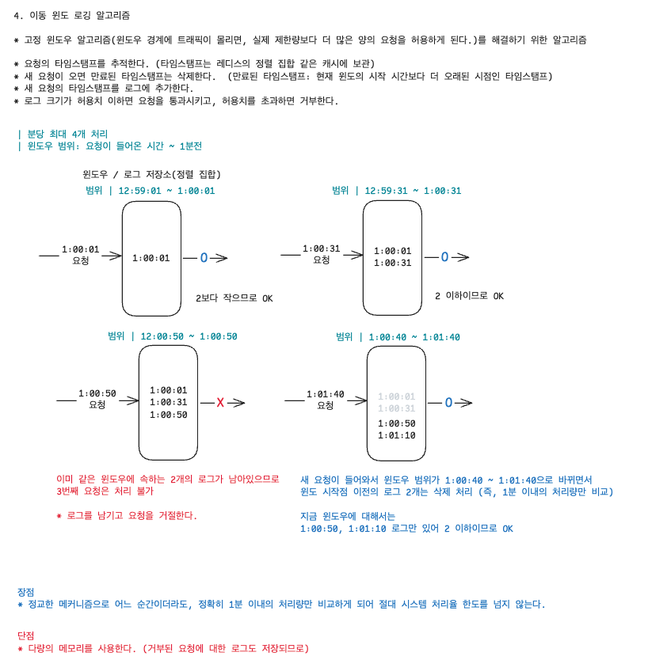
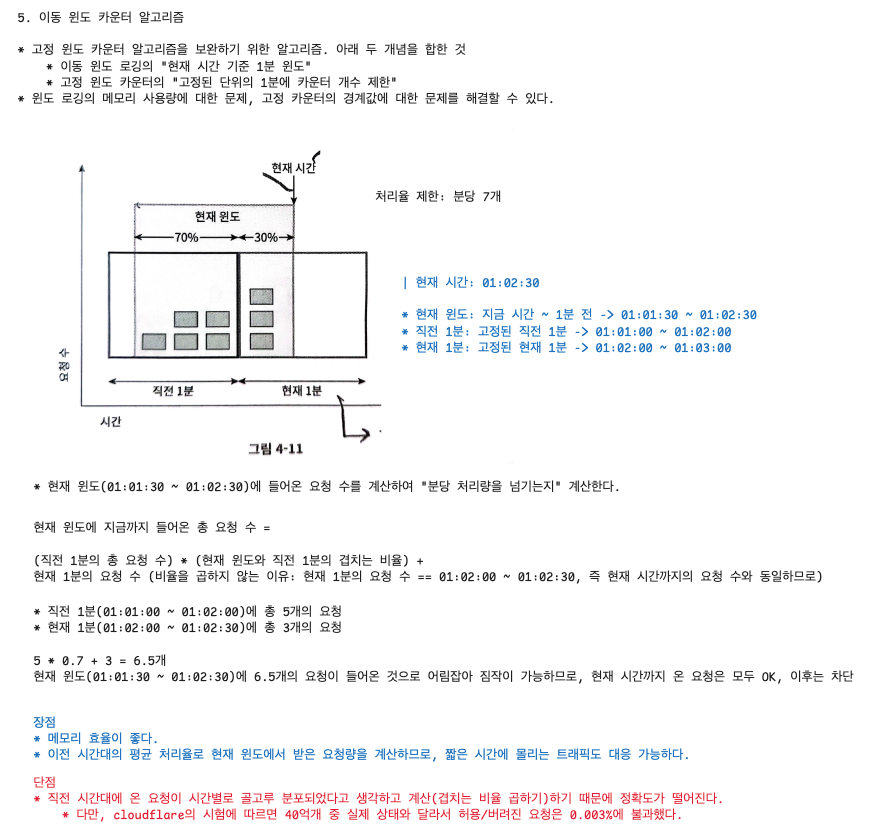

# 4. 처리율 제한 장치의 설계

> 처리율 제한 장치(rate limiter): 클라이언트 또는 서비스가 보내는 트래픽의 처리율(rate)를 제어하기 위한 장치

- ❓서비스가 보내는 트래픽 제어는 뭐지..?

HTTP 요청인 경우, API 요청 횟수가 제한 장치에 설정된 임계치(threshold)를 넘긴 시점부터의 요청은 차단한다.

#### 장점
1. DoS(Denial of Service) 공격에 의한 자원 고갈 방지
   - 트위터: 3시간 동안 300개의 트윗만 허용
   - 구글 독스 API: 사용자당 분당 300회의 read만 허용
2. 비용 절감
   - 추가 요청에 대한 처리 제한으로 우선순위가 높은 API에 더 많은 자원 할당 가능
3. 외부 제공 API를 사용하는 경우,(third party API) API 호출에 의한 과금을 방지하기 위해 필요
4. 서버 과부하 방지
   - 봇이나 잘못된 사용으로 인한 트래픽을 걸러내는데 사용 가능

## 1단계: 문제 이해 및 설계 범위 확정

### 요구사항 정리
* 서버 측 API를 위한 제어 장치 설계
* 다양한 형태의 제어 규칙을 커버할 수 있어야함 (요청량을 클라이언트 ID, IP 등 다양한 기준으로 제어할 수 있어야한다.)
* 대규모 요청을 처리할수 있어야한다.
  * 필요에 따라 스케일아웃이 가능해야할 수 있다.
* 분산 환경에서 동작해야한다.
* 독립된 서비스여도 되고, 어플리케이션 코드에 포함되어도 된다.
* 처리율 제한 장치에 의해 차단된 요청은 API 호출자에게 해당 사실을 알려야 한다.
* 낮은 응답시간 (처리율 제한 장치의 처리 속도가 최종 API 응답 시간에 영향을 주어서는 안된다.)
* 가능한 적은 메모리를 사용해야 한다.
* 제한 장치에 장애가 생겨도 전체 시스템에 영향을 주어서는 안된다.

## 개략적 설계 (1차)

### 처리량 제한 프록시

비교대상: 게이트웨이

## 2단계: 개략적 설계안 제시 및 동의 구하기 (알고리즘)

### 제한 장치의 위치

1. 클라이언트 측
- 클라이언트 요청은 쉽게 위변조가 가능하기 때문에 처리율 제한을 안정적으로 걸 수 없다.
- 모든 클라이언트의 구현을 통제하는데 어려움이 있을 수 있다.
2. 서버 측
   1. API 서버와 처리율 제한 장치를 묶어서 위치시키는 방법
   2. 미들웨어(API G/W)를 두는 방법
      * 클라우드 마이크로서비스인 경우, 처리율 제한장치는 **보통** API G/W 컴포넌트에 구현된다.
      * API G/W: 처리율 제한, SSL 종단, 사용자 인증, IP 화이트리스트 관리 등을 지원하는 fully managed service 이다.

### 처리율 제한 장치 판단에 고려할 수 있는 요소
* 현재 사용하고 있는 기술 스택
* 현재 상황에 맞는 처리율 제한 알고리즘
* 마이크로서비스 기반의 아키텍처이고, IP 화이트리스트 등의 추가 처리가 필요하다면 G/W를 고려할 수 있다.
* 제한 장치를 구현할 충분한 인력이 없다면 클라우드 업체에서 제공하는 API G/W를 활용할 수 있다.

### 처리율 제한 알고리즘

#### 1. 토큰 버킷 알고리즘

#### 2. 누출 버킷 알고리즘

#### 3. 고정 윈도 카운터 알고리즘

#### 4. 이동 윈도 로깅 알고리즘

#### 5. 이동 윈도 카운터 알고리즘

### 개략적인 아키텍처
> 얼마나 많은 요청이 접수되었는지 계산할 수 있는 카운터를 추적 대상(e.g., 사용자-API 단위) 별로 두어, 요청을 허용하거나 거부하는 것이 핵심

* 접근이 잦은 카운터는 캐시가 바람직하다.
  * 메모리 상에서 동작하여 접근이 빠르다.
  * 시간에 기반한 만료 정책을 지원한다.

#### 활용하기 좋은 레디스 명령어
* INCR: 메모리에 저장된 카운터 값을 1만큼 증가시킨다.
* EXPIRE: 카운터에 타임아웃 값을 설정한다. 설정 시간이 지나면 카운터가 자동 삭제된다.