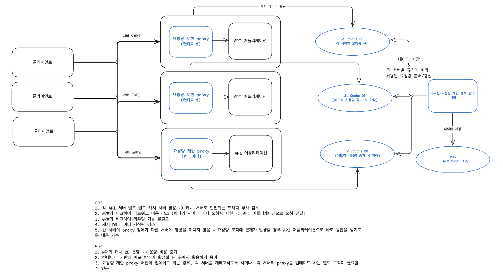
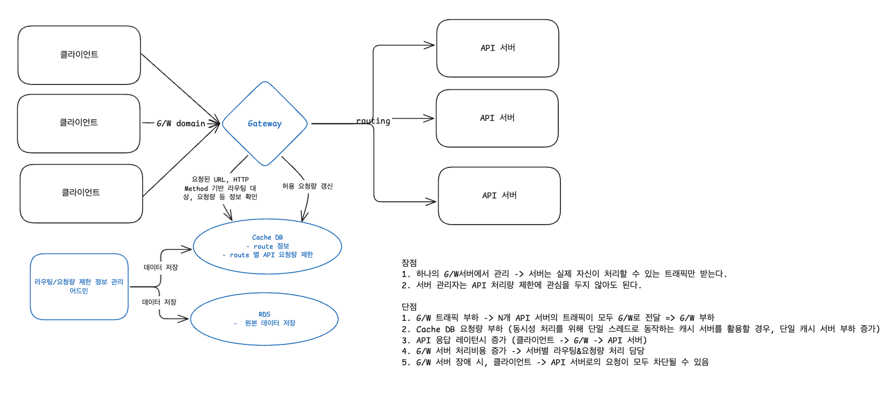

# 4. 처리율 제한 장치의 설계

> 처리율 제한 장치(rate limiter): 클라이언트 또는 서비스가 보내는 트래픽의 처리율(rate)를 제어하기 위한 장치

- ❓서비스가 보내는 트래픽 제어는 뭐지..?

HTTP 요청인 경우, API 요청 횟수가 제한 장치에 설정된 임계치(threshold)를 넘긴 시점부터의 요청은 차단한다.

#### 장점
1. DoS(Denial of Service) 공격에 의한 자원 고갈 방지
   - 트위터: 3시간 동안 300개의 트윗만 허용
   - 구글 독스 API: 사용자당 분당 300회의 read만 허용
2. 비용 절감
   - 추가 요청에 대한 처리 제한으로 우선순위가 높은 API에 더 많은 자원 할당 가능
3. 외부 제공 API를 사용하는 경우,(third party API) API 호출에 의한 과금을 방지하기 위해 필요
4. 서버 과부하 방지
   - 봇이나 잘못된 사용으로 인한 트래픽을 걸러내는데 사용 가능

## 1단계: 문제 이해 및 설계 범위 확정

### 요구사항 정리
* 서버 측 API를 위한 제어 장치 설계
* 다양한 형태의 제어 규칙을 커버할 수 있어야함 (요청량을 클라이언트 ID, IP 등 다양한 기준으로 제어할 수 있어야한다.)
* 대규모 요청을 처리할수 있어야한다.
  * 필요에 따라 스케일아웃이 가능해야할 수 있다.
* 분산 환경에서 동작해야한다.
* 독립된 서비스여도 되고, 어플리케이션 코드에 포함되어도 된다.
* 처리율 제한 장치에 의해 차단된 요청은 API 호출자에게 해당 사실을 알려야 한다.
* 낮은 응답시간 (처리율 제한 장치의 처리 속도가 최종 API 응답 시간에 영향을 주어서는 안된다.)
* 가능한 적은 메모리를 사용해야 한다.
* 제한 장치에 장애가 생겨도 전체 시스템에 영향을 주어서는 안된다.

## 개략적 설계 (1차)

### 처리량 제한 프록시

비교대상: 게이트웨이

