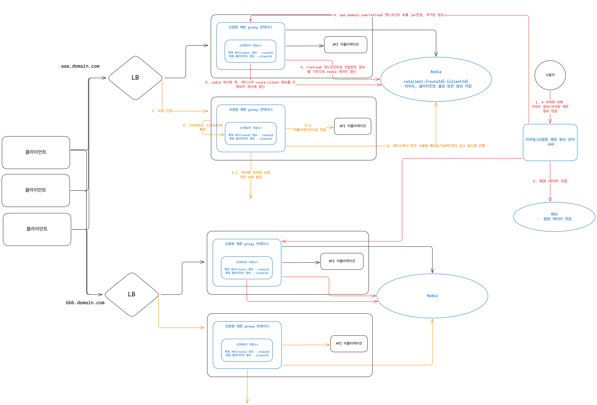

# 4. 처리율 제한 장치의 설계

> 처리율 제한 장치(rate limiter): 클라이언트 또는 서비스가 보내는 트래픽의 처리율(rate)를 제어하기 위한 장치

- ❓서비스가 보내는 트래픽 제어는 뭐지..?

HTTP 요청인 경우, API 요청 횟수가 제한 장치에 설정된 임계치(threshold)를 넘긴 시점부터의 요청은 차단한다.

#### 장점
1. DoS(Denial of Service) 공격에 의한 자원 고갈 방지
   - 트위터: 3시간 동안 300개의 트윗만 허용
   - 구글 독스 API: 사용자당 분당 300회의 read만 허용
2. 비용 절감
   - 추가 요청에 대한 처리 제한으로 우선순위가 높은 API에 더 많은 자원 할당 가능
3. 외부 제공 API를 사용하는 경우,(third party API) API 호출에 의한 과금을 방지하기 위해 필요
4. 서버 과부하 방지
   - 봇이나 잘못된 사용으로 인한 트래픽을 걸러내는데 사용 가능

## 1단계: 문제 이해 및 설계 범위 확정

### 요구사항 정리
* 서버 측 API를 위한 제어 장치 설계
* 다양한 형태의 제어 규칙을 커버할 수 있어야함 (요청량을 클라이언트 ID, IP 등 다양한 기준으로 제어할 수 있어야한다.)
* 대규모 요청을 처리할수 있어야한다.
  * 필요에 따라 스케일아웃이 가능해야할 수 있다.
* 분산 환경에서 동작해야한다.
* 독립된 서비스여도 되고, 어플리케이션 코드에 포함되어도 된다.
* 처리율 제한 장치에 의해 차단된 요청은 API 호출자에게 해당 사실을 알려야 한다.
* 낮은 응답시간 (처리율 제한 장치의 처리 속도가 최종 API 응답 시간에 영향을 주어서는 안된다.)
* 가능한 적은 메모리를 사용해야 한다.
* 제한 장치에 장애가 생겨도 전체 시스템에 영향을 주어서는 안된다.

## 개략적 설계 (1차)

### 처리량 제한 프록시
[](./images/proxy-2.png)

<details><summary>비교대상: 게이트웨이</summary>

[](./images/gateway.png)

</details>

---

## 2단계: 개략적 설계안 제시 및 동의 구하기 (알고리즘)

### 제한 장치의 위치

1. 클라이언트 측
- 클라이언트 요청은 쉽게 위변조가 가능하기 때문에 처리율 제한을 안정적으로 걸 수 없다.
- 모든 클라이언트의 구현을 통제하는데 어려움이 있을 수 있다.
2. 서버 측
   1. API 서버와 처리율 제한 장치를 묶어서 위치시키는 방법
   2. 미들웨어(API G/W)를 두는 방법
      * 클라우드 마이크로서비스인 경우, 처리율 제한장치는 **보통** API G/W 컴포넌트에 구현된다.
      * API G/W: 처리율 제한, SSL 종단, 사용자 인증, IP 화이트리스트 관리 등을 지원하는 fully managed service 이다.

### 처리율 제한 장치 판단에 고려할 수 있는 요소
* 현재 사용하고 있는 기술 스택
* 현재 상황에 맞는 처리율 제한 알고리즘
* 마이크로서비스 기반의 아키텍처이고, IP 화이트리스트 등의 추가 처리가 필요하다면 G/W를 고려할 수 있다.
* 제한 장치를 구현할 충분한 인력이 없다면 클라우드 업체에서 제공하는 API G/W를 활용할 수 있다.

### 처리율 제한 알고리즘

#### 1. 토큰 버킷 알고리즘

[](./images/토큰버킷알고리즘.png)

#### 2. 누출 버킷 알고리즘

[](./images/누출버킷.png)

#### 3. 고정 윈도 카운터 알고리즘

[](./images/고정윈도우.png)

#### 4. 이동 윈도 로깅 알고리즘

[](./images/이동로깅.png)

#### 5. 이동 윈도 카운터 알고리즘

[](./images/이동윈도카운터.png)


### 개략적인 아키텍처
> 얼마나 많은 요청이 접수되었는지 계산할 수 있는 카운터를 추적 대상(e.g., 사용자-API 단위) 별로 두어, 요청을 허용하거나 거부하는 것이 핵심

* 접근이 잦은 카운터는 캐시가 바람직하다.
  * 메모리 상에서 동작하여 접근이 빠르다.
  * 시간에 기반한 만료 정책을 지원한다.

#### 활용하기 좋은 레디스 명령어
* INCR: 메모리에 저장된 카운터 값을 1만큼 증가시킨다.
* EXPIRE: 카운터에 타임아웃 값을 설정한다. 설정 시간이 지나면 카운터가 자동 삭제된다.

---

## 3단계: 상세 설계
> 상세 설계에서는 다음 내용을 고려해볼 수 있다.
> 1. 처리 제한된 요청들은 어떻게 처리되는가?
> 2. 제한 규칙은 어떻게 만들어지고, 규칙은 어디에 저장되는가?

### 처리율 제한 규칙을 어떻게 관리/적용할 것인가?

- 예시) Lyft는 처리율 제한에 오픈소스(Envoy Proxy)를 사용하고 있다. 
  - 아래는 envoy proxy 에서 config file로 처리율 제한 규칙을 적용하는 예시

```yaml
domain: messaging 
descriptors:
    - key: message_type
      Value: marketing
      rate_limit: 
          unit: day
          requests_per_unit: 5
```
<details><summary>config file 처리율 제한 규칙</summary>

- 마케팅 종류의 메시지를 하루 최대 5까지만 처리할 수 있도록 제한
- 클라이언트가 분당 5회까지만 로그인할 수 있도록 제한
- 이건 설정파일 (config file)로 규칙을 관리하고, 이런 config file은 디스크에 저장된다.

</details>

#### 참고
- [Envoy](https://github.com/envoyproxy/ratelimit): Lyft에서 발전한 오픈소스로, 하나의 서버 내에 사이드카 형태로 처리율 제어 기능을 제공한다.

- ❓Spring Cloud Gateway는 제한량을 어떻게/어디에 저장하고 있는가?
  - 제한량을 redis와 같은 단일 스레드 기반의 저장소에 저장하여 관리한다.
  - 기본적으로 토큰 버킷 알고리즘을 사용한다.

### 처리율 한도 초과 트래픽은 어떻게 처리할 것인가?

1. 한도 제한에 걸린 API 콜에 대해서는 429 too many requests 반환 
   - 헤더에 클라이언트가 처리율 제한에 대해 인지할 수 있는 값 포함
     - X-Ratelimit-Remaining: 윈도 내에 남은 처리 가능 요청 수 (서버가 수용할 수 있는 남은 요청 수)
     - X-Ratelimit-Limit: 매 윈도마다 클라이언트가 전송할 수 있는 요청 수 (일정 주기마다 몇 개의 요청을 보낼 수 있도록 허용되어 있는가)
     - X-Ratelimit-Retry-After: 한도 제한에 걸리지 않으려면 몇 초 뒤에 요청을 다시 보내야하는가
2. 경우에 따라, 한도 제한에 걸린 메시지를 큐에 저장해두었다가 나중에 다시 처리할 수도 있다.
   - 요청이 유실되면 안되는 경우 (e.g., 주문 시스템)
   - ❓그럼 이런 경우에는 그냥 요청 레이턴시가 늘어나는걸 감안하고서라도 요청을 늦게라도 처리해주는건가?
     - 큐에 요청을 넣어두고 1. 비동기로 처리되어도 문제가 없고 2. 처리 완료 여부는 중요하지 않은 요청만 큐에 저장하는게 맞지 않나?
   - ❓큐에 저장된 요청을 다음 윈도에서 처리할 때, 이 처리도 토큰을 감소시키는가?

### 상세 설계

[](./images/처리율제한장치-상세설계.png)

### 분산 환경에서의 처리율 제한 장치 구현

#### 1. 경쟁 조건 (race condition)

처리율 제한 시, 레디스에 카운터 값을 넣어두고 해당 카운터값을 기반으로 요청 허용 여부를 결정한다.

- 만약 카운터 값을 어플리케이션으로 읽어와서 어플리케이션 내부에서 조절(증감)한다면 경쟁 조건  발생 가능
- 요청이 여러개 들어오는 경우, 한 인스턴스 내의 여러 스레드, 여러 인스턴스 사이에서 카운터 값의 독립성을 보장할 수 있어야한다.
    - 카운터값이 2였을 때
    - 스레드 A에서 카운터 조회: 2
    - 스레드 B에서 카운터 조회: 2
    - 스레드 A에서 카운터 감소: 1
    - 스레드 B에서 카운터 감소: 1
    - 스레드 A→레디스 저장: 1
    - 스레드 B → 레디스 저장: 1
    - 예상: 0, 실제: 1

**해결 방법**

1. lock 사용
    1. 성능 저하에 대한 우려가 있음
2. 루아 스크립트 사용
    1. Spring Cloud Gateway [루아 스크립트](https://github.com/spring-cloud/spring-cloud-gateway/blob/main/spring-cloud-gateway-server/src/main/resources/META-INF/scripts/request_rate_limiter.lua) 참고
    2. 레디스 커맨드를 기반으로 실행시킬 스크립트를 미리 작성해두고, 해당 스크립트를 통해 토큰 갱신 및 처리량 관리
3. 정렬집합(sorted set) 자료구조 사용
    1. ❓ 시간 없어서 못찾아봄.. 다음에 더 찾아보겠음

#### 2. 동기화 이슈

> 수백만명의 트래픽을 감당하기 위해서는 여러 대의 처리율 제한 장치 서버가 필요할 수 있다.
> <br> 처리율 제한 장치 서버가 증설되면 각 서버 사이에서 동기화가 필요하다.

**웹 서버는 무상태성**을 보장해야하므로, 반드시 특정 클라이언트-특정 서버 인스턴스로 요청이 고정 전달될 보장은 불가하다.
- 만약 클라이언트-엔드포인트 단위로 처리율을 제한한다면, 한 서버 인스턴스에서 처리한 내역을 다른 서버 인스턴스에서는 인지하지 못할 수도 있다.

**해결책**

1. sticky-session (고정 세션)
    1. 한 클라이언트의 요청은 반드시 한 서버로만 가도록 고정한다.
    2. 규모 확장에 유연하지 못함
2. 레디스와 같은 중앙 집중형 데이터 저장소를 사용
    1. 레디스 저장소 한 곳에 공유되어야하는 값을 저장해두고, 여러 대의 처리율 제한 서버가 하나의 레디스를 공유하는 것
    2. 레디스 자체가 단일 스레드이기 때문에 동기화 이슈와 경쟁 조건이 모두 보장된다.

#### 3. 성능 최적화

1. 여러 데이터센터에 대한 지원
   - 데이터센터에서 멀리 떨어진 사용자를 지원하게 되면 레이턴시가 늘어날 수 밖에 없다. 
     - ❓ 내 처리율 제한장치가 올라간 데이터선테와, 이 처리율 제한장치를 사용하는 사용자의 위치가 멀다면 레이턴시가 증가한다는 말인가?
   - 보통 클라우드 업체에서는 세계 곳곳에 에지 서버를 둔다. 분산된 환경에 서버가 운영되기 때문에 사용자 트래픽을 가장 가까운 데이터 센터로 전달해 지연시간을 줄인다.
     - ❓ 이건 단순히 처리율 제한장치에만 해당하는 말이 아니라, 모든 서버에 해당되는 내용 아닌가..? 처리율 제한장치의 성능 최적화랑은 무슨 상관이지?
2. 제한 장치 간에 데이터를 동기화할 때 “최종 일관성 모델(eventual consistency model)"을 사용하는 것
   -  6장 - 데이터 일관성 항목 참고

#### 4. 모니터링

제한 장치의 동작 여부를 모니터링 할 수 있어야한다.

모니터링을 통해 확인할 것

- 처리율 제한 알고리즘이 효율적인지
- 정의한 처리율 제한 규칙이 효과적인지
    - 규칙이 너무 빡빡하다면, 너무 많은 요청이 버려질 수 있다.
    - → 이 경우,  규칙 완화가 필요할 수 있다.

> 이벤트 등의 상황에서 처리율이 지나치게 제한되어 비효율적으로 동작할 수 있으므로, 평시 트래픽 등을 분석하여 알고리즘을 변경하거나 규칙을 설정할 수 있어야한다. (토큰 버킷을 고려해볼 수 있다.)

## 4단계 마무리

아래는 추가로 고민할 수 있는 부분

### 경성(hard) 또는 연성(soft) 처리율 제한

- 경성 제한: 요청 개수는 절대 임계치를 넘어갈 수 없다.
- 연성 제한: 요청 개수는 잠시 동안은 임계치를 넘어갈 수 있다.

### 다양한 계층에서의 처리율 제한

책에서는 어플리케이션 계층에서 구현하는 처리율 제한 장치에 대해 본 것이고, 다른 계층에서도 제한이 가능하다.

- IP tables를 사용하여 IP 주소 기반(3번 계층)에서 처리율 제한 가능

### 클라이언트 측에서 처리율 제한에 대응하는 방법

- 클라ㅣ언트 측 캐시로 API 호출량 감소시키기
- 처리율 제한에 맞출 수 있도록 시간당 API 사용량 조절
- 처리율 제한으로 호출 실패 시 재시도 로직 추가(X-Ratelimit-Retry-After 헤더를 활용할 수 있겠다.)
- 에러 핸들링으로 호출 실패로부터의 그레이스풀 복구 방안 마련
