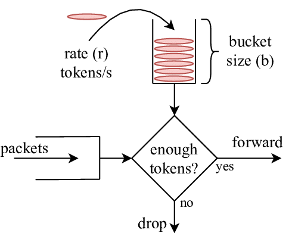
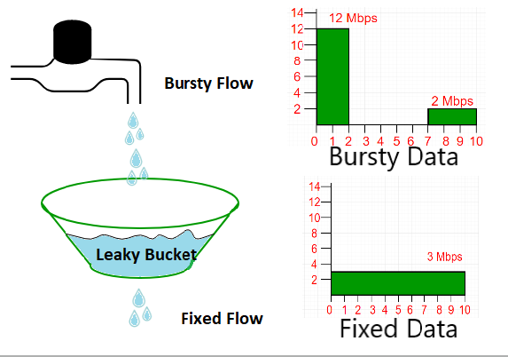
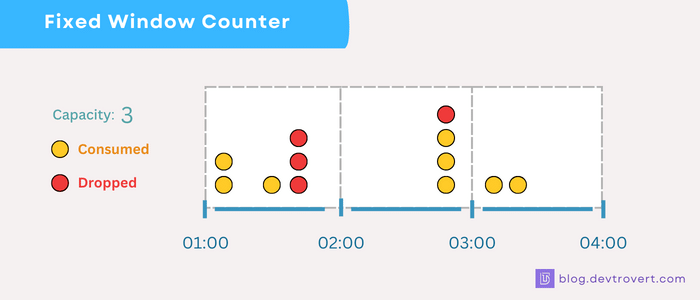
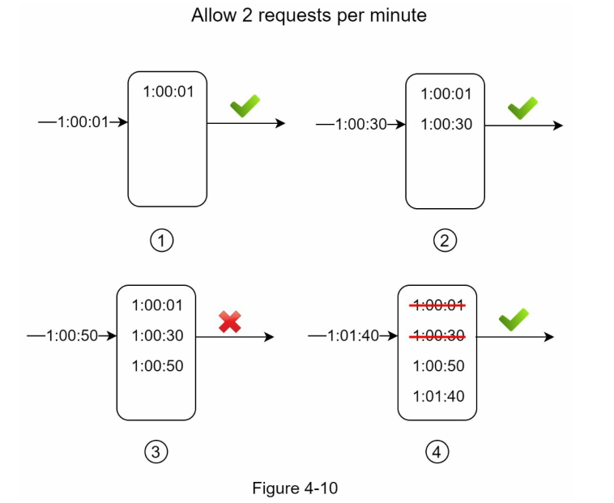
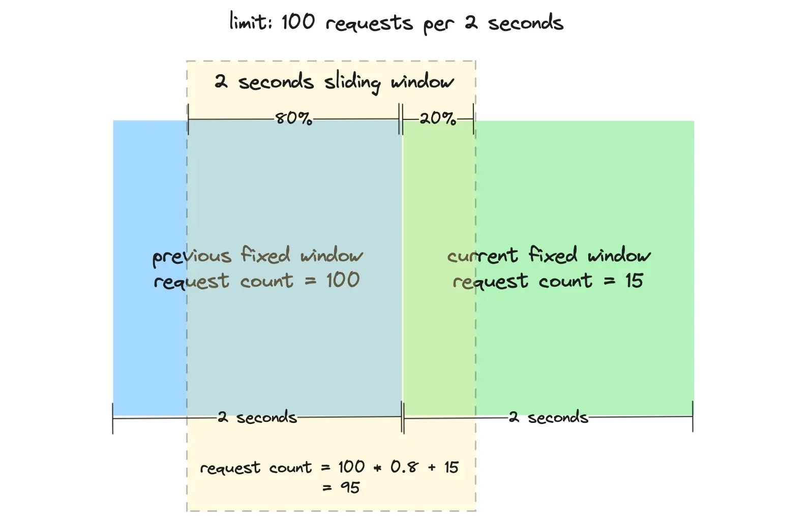

# 4장. 처리율 제한 장치의 설계
- 처리율 제한 장치 (rate limiter) : 클라이언트 혹은 서비스가 보내는 **트래픽의 처리율을 제어**하기 위한 장치
    > ❓ circuit breaker 랑 차이점?
    - HTTP 를 예로 들면 이 장치는 `특정 기간` 내에 전송되는 `클라이언트 요청 횟수`를 제한함
    - **API 요청 횟수**가 제한 장치에 **정의된 임계치를 넘어서면, 추가로 도달한 모든 호출은 처리가 중단**됨
- API 에 처리율 제한 장치를 두면 좋은 점
  - DoS 공격에 의한 자원 고갈 방지
  - 비용 절감
    - 우선순위가 높은 API에 더 많은 자원을 할당할 수 있음
  - 서버 과부하 
    - 봇에서 오는 트래픽이나 사용자의 잘못된 이용패턴으로 유발된 트래픽을 걸러내는 데 활용할 수 있음

## 1단계 : 문제 이해 및 설계 범위 확정
- 서버측 API를 위한 장치
- 다양한 형태의 제어규칙을 정의할 수 있는 유연한 시스템
  > ❓어떤 사례가 있을까?
- 대규모 요청 처리할 수 있어야 함
- 분산 환경에서 동작해야 함
- 한 서버에 대해 제어 규칙이 바뀔 수도 있다는 전제
- 독립된 서비스 or 애플리케이션 코드 포함할 것인가?
- 사용자의 요청이 걸러진 경우, 사용자에게 그 사실을 알려야 함

### 요구사항
- 낮은 응답시간
- 가능한 한 적은 메모리
- 분산형 처리율 제한 : 여러 서버나 프로세스에서 공유할 수 있어야 함
- 예외 처리
- 높은 결함 감내성 : 제한 장치에 장애가 생겨도 전체 시스템에 영향을 주어서는 안됨

## 2단계 : 개략적 설계안 제시 및 동의 구하기

### 처리율 제한 장치는 어디에 둘 것인가?
- 클라이언트 측에 둘 경우, 클라이언트 요청은 쉽게 위변조가 가능해서 모든 클라이언트의 구현을 통제하는 것이 어려울 수 있다
- 처리율 제한 장치를 API 서버에 두는 대신 처리율 제한 미들웨어를 만들어 처리할 수도 있다.
- 마이크로서비스의 경우, 처리율 제한 장치는 보통 API 게이트웨이에 구현된다.
  >❓ 마이크로서비스가 아닌 경우에는 보통 어디에 구현되는가?

### 처리율 제한 알고리즘
#### 토큰 버킷 알고리즘

- 간단하고, 인터넷 기업들이 보편적으로 사용하고 있다
- 아마존, 스트라이프가 API 요청을 통제하기 위해 이 알고리즘 사용한다
- 동작 원리
  - 토큰 버킷 : 지정된 용량을 갖는 컨테이너
  - 해당 버킷에 사전 설정된 양의 토큰이 주기적으로 채워짐 
  - 토큰이 꽉 찬 버킷에는 더이상 토큰이 추가되지 않음
  - 버킷이 가득차면 추가 공급된 토큰은 버려짐
  - 각 요청은 처리될 때마다 1개의 토큰 사용
    - 충분한 토큰이 있다면, 버킷에서 토큰을 꺼낸 후 요청을 시스템에 전달
    - 충분한 토큰이 없다면, 해당 요청은 버려짐
- 토큰 버킷 알고리즘은 2가지 인자를 받는다
  - 버킷 크기 : 버킷에 담을 수 있는 토큰 최대 갯수
  - 토큰 공급률 : 초당 몇 개의 토큰이 버킷에 공급되는지
  > ❓토큰 공급률이 결국 처리량과 관련있는 지표일텐데, 얘도 경계에 요청이 몰리는 문제는 해결 불가능한 건가?
- 통상적으로 API 엔드포인트마다 별도의 버킷을 둔다
- 장점
  - 구현이 쉽다
  - 메모리 사용 측면에서 효율적이다
    > 1. 단순한 데이터 구조 : 버킷 크기와 현재 토큰 수만 관리하면 됨 (레디스)
    > 2. 누출 버킷 알고리즘과 달리 개별 요청을 큐에 저장할 필요 없어 메모리 사용 줄일 수 있음
  - **짧은 시간에 집중되는 트래픽도 처리 가능**하다. 버킷에 남은 토킷만 있으면 요청은 시스템에 전달된다.
    > 단기간 집중되는 트래픽 처리 불가능한 알고리즘 == 누출 버킷 알고리즘  
    > 토큰 버킷 알고리즘은 초당 10만개의 토큰이 공급된다면 
    > - 0.1초만에 10만 개의 요청이 와도 처리가능. 
    > - 0.9초동안 온 5만개의 요청은 버려짐  
    >
    > 하지만 누출 버킷 알고리즘은 0.1초만에 10만개의 요청이 올 경우, (처리율이 어마어마하게 크다면 몰리는 요청을 모두 감당할 수 있겠지만) 
    시간당 5만개의 요청만 처리가능하도록 제한되어 있다면 나머지 5만개의 트래픽 요청을 버려지게 됨. 
- 단점
  - 버킷 크기, 토큰 공급률이라는 2가지 인자를 적절히 튜닝하는 것이 어렵다
    > 버킷 크기 : 머신 러닝이나 예측 알고리즘을 사용하여 감지된 패턴에 따라 버킷 크기 동적 조절 필요
    > - Akamai의 2023년 연구에 따르면, 동적 토큰 버킷 크기 조정은 전자상거래 애플리케이션의 피크 트래픽 기간 동안 지연 시간을 15% 감소시켜 고객 만족도를 향상시켰다고 함 
    >
    > 토큰 공급률 : 예상 평균 트래픽과 일치해야 함.
    > - 분당 100개의 요청이 예상되는 API는 분당 약 100개의 토큰을 허용하되, 약간 더 높은 버스트 허용치를 두어야 함
    > 
    > 실제 적용 사례
    > 1. Twitter의 API 관리
    > - 도전 과제: Twitter는 개발자들에게 관대한 API 한도를 제공하면서도 남용을 방지해야 함
    > - 해결책: 토큰 버킷 알고리즘을 구현하여 높은 API 트래픽을 관리하고 조용한 시간대에는 버스트를 허용. 사용자 행동에 따라 버킷 크기를 동적으로 조정하여 공정성과 성능의 균형을 맞춤
    > - 결과: Twitter는 정당한 개발자들의 원활한 경험을 유지하면서 API 남용 사건을 40% 줄임
    > 2. Zoom의 대역폭 관리
    > - 도전 과제: Zoom은 팬데믹 기간 동안 대규모 트래픽 급증을 경험했고, 이는 인프라에 부담을 주었음
    > - 해결책: 토큰 버킷 메커니즘으로 비디오 스트리밍 대역폭을 제어하여 고해상도 스트림을 위한 짧은 버스트를 허용하면서 피크 사용 시간 동안 지속적인 트래픽을 제한
    > - 결과: Zoom은 고트래픽 기간 동안 서비스 중단을 최소화하고 대역폭 관련 불만을 25% 줄임
    > 
    > Reference; https://medium.com/@keployio/the-importance-of-the-token-bucket-algorithm-key-strategies-and-best-practices-for-businesses-faeb52c597d2

#### 누출 버킷 알고리즘

- 누출 버킷 알고리즘은 토큰 버킷과 비슷하지만 **요청 처리율이 고정되어 있다**는 점이 다르다
  > 요청 처리율이 고정되어 있다 == 지정된 시간당 처리 가능한 양 (처리율) 이 고정되어 있어서 트래픽이 몰리더라도, 한번에 처리되지 않고 처리율에 따라 일정하게 출력된다
- 보통 **FIFO 큐**로 구현한다
- 동작 원리
  - 요청이 도착하면 큐가 가득 차 있는지 확인. 빈자리가 있는 경우에는 큐에 요청을 추가
  - 큐가 가득 차 있는 경우에는 새 요청은 버림
  - 지정된 시간마다 큐에서 요청을 꺼내어 처리 (처리율)
- 누출 버킷 알고리즘은 2가지 인자를 사용한다
  - 버킷 크기 : 큐 사이즈와 동일
  - 처리율 : 지정된 시간 당 몇 개의 항목을 처리할지 지정하는 값. 보통 초 단위로 표현
- 장점
  - 큐의 크기가 제한되어 있어서 **메모리 사용량 측면에서 효율적**
  - 고정된 처리율을 가지므로 **안정적 출력**이 필요한 경우가 적합하다.
- 단점
  - 단시간 트래픽이 몰릴 경우, **오랜 요청이 쌓여 최신 요청이 버려진다.**
  - 토큰 버킷과 마찬가지로 2개의 파라미터를 올바르게 튜닝하기 어렵다.
      
#### 고정 윈도 카운터 알고리즘

- 동작 원리 
  - 타임라인을 고정된 간격의 윈도로 나누고, 각 윈도마다 카운터를 붙임
  - 요청이 접수될 때마다 이 카운터의 값은 1씩 증가
  - 이 카운터의 값이 사전에 설정된 임계치에 도달하면 새로운 요청은 새 윈도가 열릴 때까지 버려짐
- 이 알고리즘의 가장 큰 문제는 **윈도의 경계 부근에 순간적으로 많은 트래픽이 집중될 경우, 윈도에 할당된 양보다 더 많은 요청이 처리될 수 있다**는 점이다.

- 장점
  - 메모리 효율이 좋다
    > 레디스를 활용해서 카운터 값만 저장하고 있으면 됨
  - 이해하기 쉽다
  - 윈도가 닫히는 시점에 카운터를 초기화하는 방식은 특정한 트래픽 패턴을 처리하기에 적합하다.
- 단점
  - 윈도 경계 부근에서 **일시적으로 많은 트래픽이 몰려드는 경우, 기대했던 시스템의 처리 한도보다 많은 양의 요청을 처리**하게 됨

#### 이동 윈도 로깅 알고리즘

- 이동 윈도 로깅 알고리즘은 **고정 윈도 카운터 알고리즘의 문제**인, 윈도 경계 부근에 트래픽이 집중되는 경우 시스템에 설정된 한도보다 많은 요청을 처리하는 것을 **해결한다.**
- 동작 원리
  - 요청의 타임스탬프를 추적한다. **타임스탬프 데이터는 보통 레디스의 정렬 집합 같은 캐시에 보관**한다.
  - 새 요청이 오면 만료된 타임스탬프는 제거 (만료된 타임스탬프 == 현재 윈도 시작 시점보다 오래된 타임스탬프)
    - ex. 1:01:40 에 새로운 요청이 오면 만료된 타임 스탬프 (== 1:01:40 요청의 현재 윈도 시작 시점인 1:00:40 이전 요청) 인 1:00:01, 1:00:30 제거
  - 새 요청의 타임스탬프를 로그에 추가
  > 그러면 1:01:31 에 요청이 들어온 순간 1:00:50 요청, 1:01:31 의 요청이 둘다 시스템에 전달됨  
  > 1:01:42 에 새 요청이 들어오면 1:00:42 ~ 1:01:42 사이의 로그가 3이니까 1:01:42 도 요청 거부됨
  - 로그의 크기가 허용치보다 같거나 작으면 요청을 시스템에 전달. 그렇지 않은 경우에는 처리 거부
- 장점
  - 어느 순간의 윈도를 보더라도, 허용되는 요청의 개수는 시스템 처리율 한도를 넘지 않음
- 단점
  - **거부된 요청의 타임스탬프도 보관하기 때문에 다량의 메모리를 사용**함. 
  > ❓개선 가능한 방법은 없을까? 

#### 이동 윈도 카운터 알고리즘

- **고정 윈도 카운터 알고리즘과 이동 윈도 로깅 알고리즘을 결합**한 것이다.
  > 고정 윈도 카운터 알고리즘의 
  > - 윈도 개념
  > - 카운터 사용
  > - 메모리 효율성  
  >
  > 이동 윈도 로깅 알고리즘의
  > - 윈도 경계에서 발생할 수 있는 트래픽 문제 해결
  > - 이전 윈도 데이터 활용
- 현재 윈도에 몇 개의 요청이 온 것인지 계산하는 방법
  - 현재 1분간의 요청 수 + 직전 1분간의 요청 수 x 이동 윈도와 직전 1분이 겹치는 비율
  - 반올림 혹은 내림하여 쓸 수 있음
- 장점
  - 이전 시간대의 평균 처리율에 따라 **현재 윈도의 상태를 계산하므로 짧은 시간에 몰리는 트래픽에도 잘 대응**한다.
  - 메모리 효율이 좋다.
  > ❓거부된 요청 타임스탬프를 보관하는 이동 윈도 로깅 알고리즘보다 좋다는 거겠지?  
  > 아니면 카운터를 사용하는 알고리즘 자체가 좋다는 건가? -> 이거 같긴 함. 고정 윈도 카운터 알고리즘에도 동일한 장점이 적혀 있음.
- 단점
  - 직전 시간대에 도착한 요청이 균등하게 분포되어 있다고 가정한 상태에서 추정치를 계산하기 때문에 다소 느슨하다.

### 개략적인 아키텍처
- 처리율 제한 알고리즘의 기본 아이디어
  - 얼마나 많은 요청이 접수되었는지 추적할 수 있는 카운터를, 
  - **추적 대상**별 (사용자별 / IP주소별 / API 엔드포인트나 서비스 단위) 로 두고, 
  - 카운터의 값이 **어떤 한도를 넘어서면 한도를 넘어 도착한 요청은 거부**하는 것이다
- 카운터를 보관하는 곳은 메모리상에서 동작하는 `캐시`가 바람직하다
  - 빠른데다 시간에 기반한 `만료 정책`을 지원하기 때문이다
- 동작 원리
  - 클라이언트 -> 처리율 제한 미들웨어에게 요청 전송
  - 처리율 제한 미들웨어는 레디스의 지정 버킷에서 카운터를 조회, 한도 도달 여부 검증
  - 도달하지 않았다면 요청을 API 서버로 전달, 미들웨어는 카운터 값을 증가시킨 후 다시 레디스에 저장