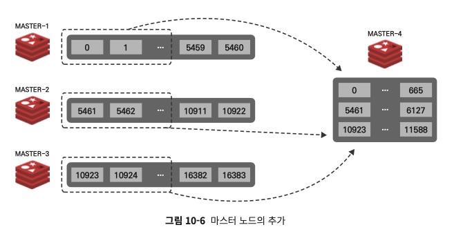

# 5장 안정 해시 설계

> 수평적 규모 확장에는 **요청, 데이터를 서버에 균등하게 분배하는 것**이 중요하다.


## 해시 키 재배치(refresh) 문제

N대의 캐시 서버(key-value 구조의 서버)에 데이터를 균등하게 저장하기 위해 다음과 같은 해시 함수를 사용하는 상황

```text
serverIndex(특정 서버를 지칭하는 값)= hashFunction(key) % N (N은 서버의 개수)
```
- 4대의 캐시서버에(N=4) 각각 serverIndex가 0~3까지 부여된다. 특정 키를 어떤 서버에 저장할지는 위의 식에 따라 결정된다.
- 모듈러 연산자를 사용하므로, 어떤 key를 넣어도 식의 결과는 serverIndex에 해당하는 0~3 까지만 나온다.
- e.g., hashFunction(key0) % 4 = 1 -> 1번 서버에 key0을 저장한다.

**문제점**
1. 데이터 분포가 균등하지 않으면 잘 동작하지 않는다.
2. 서버 수가 고정되어 있지 않을 때 (추가되거나 제거될 때), 동일한 key에 대해서도 식의 계산 결과가 달라지므로(e.g, N이 4 -> 3으로 바뀌면 연산 결과가 달라진다. == **키의 재분배**) 실제 key가 저장되어 있지 않은 다른 서버로 요청이 전달될 수 있다.
  - ❓이건 키의 균등 분배보다 sticky session 같이 특정 key에 대한 요청은 반드시 한 서버로만 전달되어야한다. 에 대한 문제 아닌가?
    - 모듈러 연산에 쓰이는 서버 수가 달라지면 캐시 미스가 다량 발생하는건 알겠는데, 서버 숫자 변경만으로 갑자기 특정 서버에만 배치가 몰리도록 키 재분배가 이루어지는 이유는 뭐지?

## 안정 해시 (consistent hash)

> 해시 테이블의 크기가 변할 때, 평균적으로 오직 k/n(키 개수/슬롯(서버) 개수)개의 키만 재배치하는 해시 기술
> 
> 대부분의 전통적인 해시 테이블은 슬롯 수가 바뀌면 거의 대부분 키를 재배치한다.

### 해시 공간과 해시 링

- 해시 함수가 SHA-1(Secure Hash Algorithm 1) 일 때
  - 해시 함수의 결과로 나올 수 있는 값의 범위: X0 ~ Xn
  - SHA-1의 해시 공간(hash space)는 0 ~ 2^160-1까지 이므로, X0=0, Xn=2^160-1이다.
  - 
    - ref: https://devocean.sk.com/community/detail.do?ID=166093&boardType=DEVOCEAN_STUDY&page=1
    - 해시링이라고 부른다.

### 해시 서버

해시 함수 f를 사용하면 특정 서버를 해시 스페이스의 어디에 대응시킬지 계산할 수 있다.
- 그냥 단순하게 서버 인덱스를 계산해서 그걸 해시링위에 표현해두는 것


### 해시 키

**안정 해시 함수는 모듈러 연산자를 사용하지 않는다.**

- 특정 key에 대해서도 SHA-1 해시 함수를 이용하여 해시값을 계산, 해시 스페이스에 둔다.


### 서버 조회

특정 키가 저장되는 서버는 해당 키의 위치로부터 시계 방향으로 탐색 시, 가장 먼저 만나는 서버다.


### 서버 추가

해시링에 서버가 추가되면, **신규 추가된 서버 ~ 반시계방향으로 가장 가까운 전 서버 사이에 있던 키**만 (신규 서버로) 재배치된다.
- k개의 키가 n개의 서버에 균등하게 분배되어있었다면, k/n개의 키가 재비치되는 것


### 서버 제거

해시링에서 서버가 제거되면, **제거된 서버 ~ 반시계방향으로 가장 가까운 전 서버 사이에 있던 키**만 재배치된다.
- k개의 키가 n개의 서버에 균등하게 분배되어있었다면, k/n개의 키가 재비치되는 것


### 기본 구현법의 두 가지 문제

**1. 위의 기본 해시 알고리즘에는 서버가 제거/추가될 경우, 파티션(서버와 서버 사이의 공간)을 균등하게 유지하기 어렵다.**
- 파티션 = 인접한 서버 사이 공간 = 키가 배치되는 공간 = 한 서버에 배치될 수 있는 키의 개수
- 서버가 제거되거나 추가되면 특정 서버의 파티션 크기가 지나치게 커지거나 작아질 수 있다.


**2. 키의 균등 분포 달성이 어렵다.**
- 서버 사이의 파티션이 균등하지 않다면 그만큼 키가 각 서버에도 균등하게 분포되지 않는다.


> 위 문제의 해결법으로 가상 노드(virtual node)/복제(replica) 기법이 쓰인다.

### 가상 노드

> 실제 노드/서버를 가리키는 노드로, 1 서버 - N 가상노드를 만들어서 특정 서버를 가리키는 가상 노드 여러개를 해시링 위에 분포시켜둔다. 
> 
> 실제 시스템에서는 가상 노드ㅌ로 많을 수를 두기도 한다.


- 가상 노드도 일반 서버 노드와 동일하게 **키에서 시계 방향으로 가장 가까운 위치의 서버 노드에 배정** 된다.
- 서버 노드 사이 간격이 줄어들고, 한 서버에 대한 가상 노드가 해시링 위에 균등하게 분포되어 있으므로 키도 더욱 균등하게 분포될 수 있다.
- 가상 노드 개수가 증가할 수록 키의 분포는 더 균등해진다.
  - 표준 편차(데이터가 어떻게 퍼져있는지를 보이는 척도)가 작아져서 데이터가 고르게 분포되기 때문
  - 100-200개의 가상노드를 쓰면, 표춘 편자는 평균 5% ~ 10%다.
- 가상노드를 저장할 공간이 늘어나므로, 트레이드 오프에 대한 고려가 필요하다. 


## 마치며

### 안정 해시의 이점

1. 서버 추가/삭제 시, 재배치되는 키 개수가 감소한다.
2. 데이터가 균등하게 분포되어 수평적 확장 달성에 도움이 된다.
3. 핫스팟 문제(특정 유명인사에 대한 데이터가 샤드(노드)에 몰리면서 해당 서버에 과부하가 발생하는 것) 가 감소한다. (데이터가 더 균등하게 분포되므로

### 안정 해시 사용처
- 아마존 dynamoDB 파티셔닝
- 아파치 카산드라 클러스터 데이터 파티셔닝
- 디스코트 채팅 어플리케이션
- 아카마이 CDN
- 매그레프 네트워크 부하 분산기

---

## 심화

> 레디스 클러스터(레디스 서버를 여러 노드로 분산시키는 것)에서는 어떤 해시 알고리즘을 쓰는가?

### 레디스 클러스터란?

레디스 노드를 스케일아웃(수평적 확장)해서 데이터 샤딩을 지원한다.
- 각 노드는 자기한테 할당된 범위의 key만 저장, 관리하게 된다.
- 샤딩에 대한 관리(키 저장, 키 조회)는 레디스 내부에서 모두 자체적으로 관리된다.
- 각 노드는 마스터-슬레이브 구조로 이루어져 있다. (replication)
  - 마스터 노드에 장애가 발생할 경우, 슬레이브 노드로 페일오버가 발생한다.
  - 평균적으로 3대의 마스터노드-3대의 슬레이브 노드로 구성

레디스 클러스터에서 각 노드는 "해시 슬롯"을 할당받게 된다.
- 슬롯: 데이터를 저장하기 위한 논리적 공간


- 레디스 클러스터는 해시 함수로 안정 해시가 아닌, CRC-16이라는 해시 함수를 사용한다.
  - hash_slot = CRC16(key) % 16384
  - 따라서, 총 0 ~ 16384의 해시 슬롯이 만들어지며, 이 해시 슬롯이 N개의 레디스 노드에 16384/N만큼 할당된다.
  - 특정 key를 저장하거나 접근할 때, 위의 해시 함수를 사용해 키를 담당하는 해시 슬롯을 관리하는 노드에 접근하게 된다.

### 왜 안정 해시가 아닌 CRC-16을 사용하는가?

1. CRC16을 사용해도 레디스 클러스터에 노드가 추가/제거될 때 재배치가 발생하는 키의 개수가 많지 않아, 안정 해시의 키 재분배 최소화가 크게 용이하지 않다. (?)



위의 그림 처럼, 4번 노드가 추가되면 4번 노드가 담당하게 되는 해시 슬롯에 해당하는 슬롯들만 기존 노드 -> 신규 노드로 이동하게 된다.
- 슬롯 단위로 이동이 발생
- 모든 키에 대해 재분배되지 않음

2. 단순함
해시 함수 구조가 단순하기 때문에 계산이 빠르고, 어떤 키가 어떤 노드에 저장될지 미리 예측이 가능하기 때문에 관리가 용이하다.

❓다만, 여전히 핫스팟 문제는 발생할 수 있는 것 같음. (키의 형태가 유사하여 해시 결과가 비슷하게 나오는 경우)

