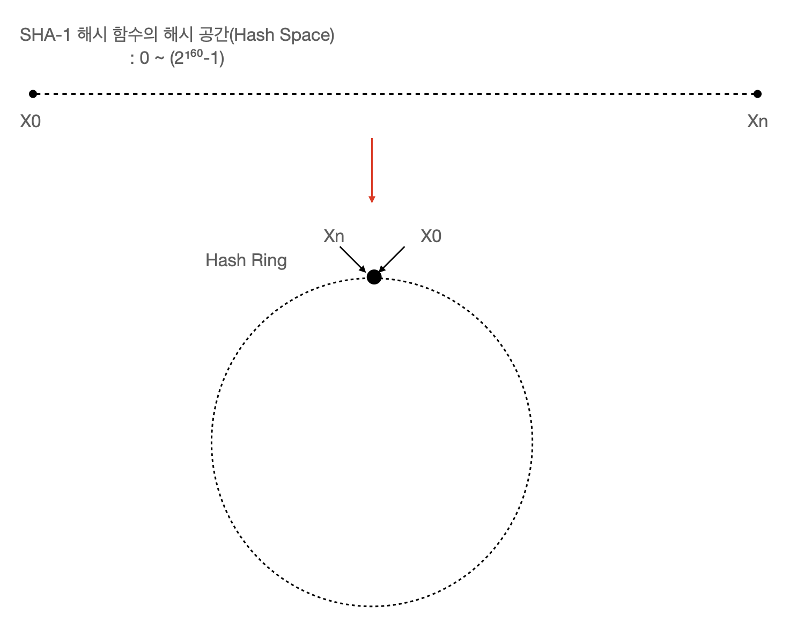
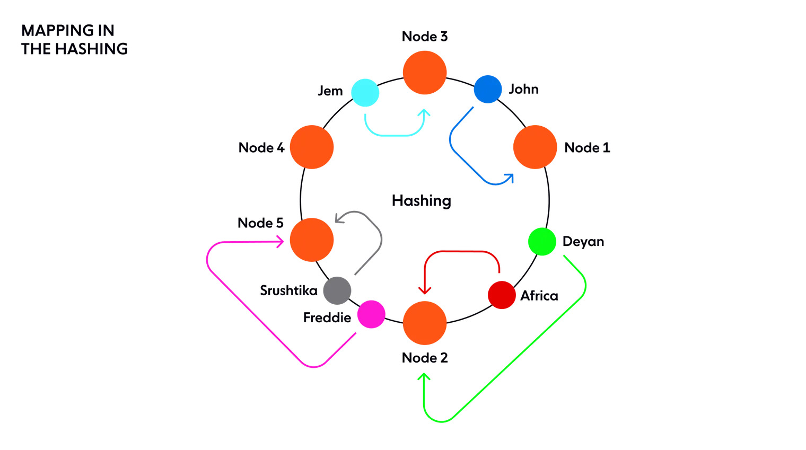
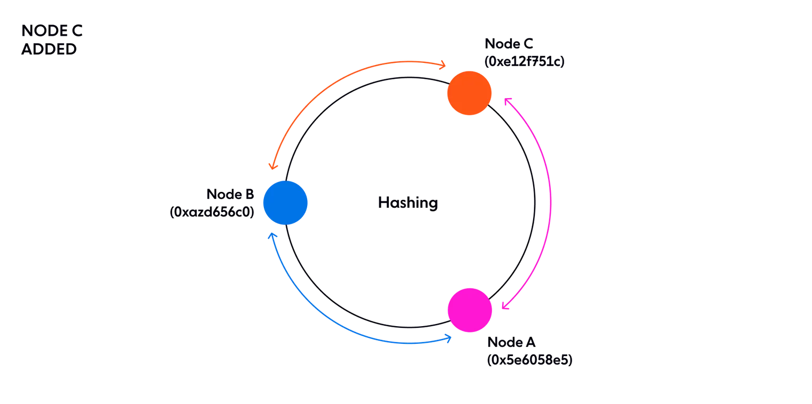
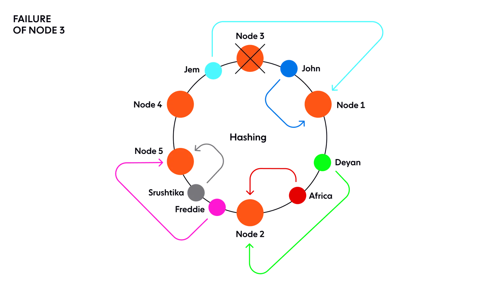
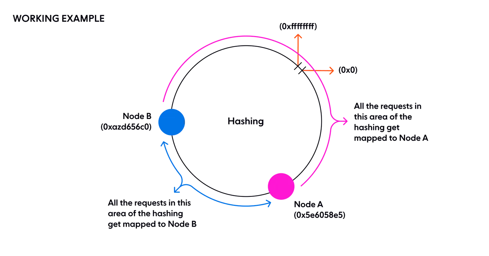
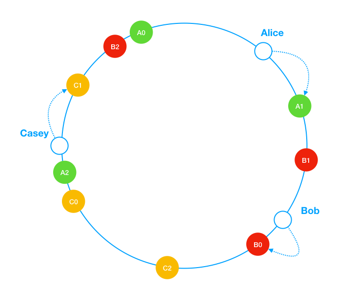

# 5장. 안정 해시 설계
- 수평적 규모 확장성을 달성하기 위해서는 **요청 또는 데이터를 서버에 균등하게 나누는 것이 중요**하다
    > ❓사용자의 요청을 고르게 분배하기 위해 사용되는 로드밸런서에서는 안정해시 기술을 사용안할까?
    > - 목적
    >   - 로드 밸런서: 네트워크 **트래픽을 여러 서버에 분산**시켜 서버 과부하를 방지하고 가용성을 높이는 데 사용
    >   - 안정 해시: 분산 시스템에서 **데이터를 균등하게 분배**하고 노드의 추가 및 제거 시 재분배를 최소화하는 데 사용
    >   - 즉, 주된 분산 대상이 다름 ! 로드밸런서는 주로 네트워크 요청이나 트래픽을 분산하며, 안정 해시는 주로 데이터를 분산함
    > - 알고리즘의 복잡성
    >   - 로드 밸런서: **일반적으로 간단한 분산 알고리즘**(예: 라운드 로빈, 최소 연결, IP 해시 등)을 사용하여 실시간으로 트래픽 분배
    >   - 안정 해시: **복잡한 해싱 기술을 사용**하여 데이터를 분배하며, 노드의 추가/제거 시에도 최소한의 재분배를 보장하는 알고리즘을 사용
    > - 하지만 로드밸런서에서도 안정해시 기술 도입할 수 있음! 
    >   - 구글에서 개발한 Maglev 네트워크 로드 밸런서는 안정 해시 기술을 활용하여 대규모 분산 시스템에서 효율적인 트래픽 분산을 실현
    >   - [NGINX](https://www.f5.com/go/faq/nginx-faq#:~:text=Consistent%20(ketama)%20Hash) 도 안정해시 알고리즘 지원 
## 해시 키 재배치 (rehash) 문제
- N개의 캐시 서버가 있을 때 이 서버들에 요청을 균등하게 나누는 보편적인 방법은 아래 해시 함수를 사용하는 것이다. 
  - 서버 인덱스 = hash(key) % N (서버의 개수)
- 이 방법은 서버 풀의 크기가 고정되어있고 키의 분포가 균등할 때는 잘 동작한다
  >❓ 서버 풀의 크기가 고정되어 있을 때는 무슨 상관이 있는거지?
  > - 재분배할 필요가 없으니까 hash % N 의 결과가 항상 일정하여 캐시 일관성이 유지됨.
- 서버가 추가되거나 기존 서버가 삭제된다면 키에 대한 해시값은 변하지 않아도 나머지 연산을 적용한 서버 인덱스 값이 달라질거고, 그러면 **캐시 클라이언트는 데이터가 없는 엉뚱한 서버에 접속하게 된다.**
  - 이것은 `대규모 캐시 미스`(cache miss)가 발생하게 되며 **안정 해시는 이 문제를 효과적으로 해결하는 기술이다**

## 안정 해시
- `안정해시`는 해시 테이블 크기가 조정될 때 평균적으로 오직 k/n 개의 키만 재배치하는 해시 기술
  - k : 키의 개수, n : 슬롯 (서버)의 개수 
  - 대부분의 **전통적 해시 테이블은 슬롯의 수가 바뀌면 거의 대부분의 키를 재배치**한다
해시 테이블의 크기가 조정되어도
평균적으로 오직 k/n 개의 키만 재배치 하는 해시 기술이다.

### 해시 공간과 해시 링

- 해시 공간의 양쪽을 구부려 붙여 만든 링이어서 해시 링이라고 한다

### 서버 조회

- 어떤 키가 저장되는 서버는, 해당 키의 위치로부터 **시계 방향으로 링을 탐색해나가면서 만나는 첫번째 서버**다

### 서버 추가

- 서버를 추가하더라도 키 가운데 일부만 추가해주면 된다. 
  - 새로 추가된 노드 C로부터 시계방향으로 가장 가까운 노드 A가 관리하던 키들 중, 노드 C 보다 시계 반대 방향에 있는 키들을 모두 C로 재배치한다.

### 서버 제거

- 하나의 서버가 제거될 때도 키 가운데 일부만 재배치 된다.

### 기본 구현법의 문제들
- 안정 해시의 기본적인 절차는 다음과 같다
  - 서버와 키를 **균등 분포 (uniform distribution) 해시 함수를 사용해 해시 링에 배치**한다.
    > ✅ 균등 분포 해시 함수 예시
    > - SHA-1 (Secure Hash Algorithm 1) : 0부터 2^160-1까지의 범위를 갖고 입력값을 해시 공간에 고르게 분포 시킴
    > - MD5 (Message Digest algorithm 5) : 128비트 해시값을 생성하며, 빠른 계산 속도를 제공
  - 키의 위치에서 링을 **시계 방향으로 탐색하다 만나는 최초의 서버가 키가 저장될 서버**다.
- 이 접근법에는 두가지 문제가 있다.
  - **파티션의 크기를 균등하게 유지하는 게 불가능**하다
    - 파티션 : 인접한 서버 사이의 해시 공간
    - C가 삭제되면 A의 파티션과 B의 파티션 크기가 균등하지 않게 된다.
   
  - **키의 균등 분포를 달성하기 어렵다**
- 이 두 문제를 해결하기 위해 제안된 기법이 `가상노드/복제` 라 불리는 기법이다.

### 가상 노드

- `가상 노드` : 실제 노드 또는 서버를 가리키는 노드로서, **하나의 서버는 링 위에 여러 개의 가상 노드를 가질 수 있다.**
  - 각 서버는 하나가 아닌 **여러 개 파티션을 관리**해야 한다
    > ❓실 사용 사례에서는 가상 노드의 개수를 어느정도로 가져가는가?
- 가상 노드의 개수가 늘어날 수록 **표준 편차가 작아져 데이터가 고르게 분포**된다.
- 하지만 **가상 노드 데이터를 저장할 공간은 더 많이 필요하게 된다**
    > ❓가상 노드는 실제 노드/서버랑 동일 스펙으로 구성되나?
    > - 가상 노드는 **실제 물리적인 서버가 아니라**, 해시 링 상에서 실제 서버를 여러 개로 나누어 표현하는 **논리적 개념**이다
    > - 따라서 실제 데이터를 저장하지 않고, 단지 **실제 서버로 데이터를 라우팅하는 역할**을 한다
    >   - 데이터 분산과 로드 밸런싱을 위한 메타데이터로 사용
    > - 가상 노드에서 실제 노드로의 데이터 전달 과정
    >   - 키 해싱: 데이터의 키가 해시되어 해시 링 상의 위치가 결정됨
    >   - 가상 노드 매핑: 해당 위치에서 시계 방향으로 가장 가까운 가상 노드를 찾음
    >   - 실제 서버 식별: 각 **가상 노드는 자신이 속한 실제 서버의 정보를 가지고 있으므로** 이 정보를 사용하여 해당 데이터가 어느 실제 서버로 가야 하는지 결정
    >   - 데이터 전송: 식별된 실제 서버로 데이터가 직접 전송
    >   - 저장 및 처리: 실제 서버에서 데이터를 저장하고 처리
    > - 메모리 내 데이터 구조
    >    - 가상 노드 정보는 주로 **해시 맵이나 배열과 같은 메모리 내 데이터 구조**에 저장됨
    >    - 이 구조는 가상 노드의 ID와 해당 실제 노드의 정보(예: IP 주소, 포트 번호)를 매핑함

## 마치며 
- 안정 해시의 이점
  - 서버가 추가되거나 삭제될 때 **재배치되는 키의 수가 최소화**된다.
  - 데이터가 보다 **균등하게 분포**하게 되므로 수평적 규모 확장성을 달성하기 쉽다.
  - **핫스팟 키 문제를 줄인다**. 특정한 샤드에 대한 접근이 지나치게 빈번하면 서버에 과부하 문제가 생길 수 있다.
- 안정 해시의 유명한 사례
  - [아마존 DynamoDB의 파티셔닝 관련 컴포넌트](https://docs.aws.amazon.com/ko_kr/amazondynamodb/latest/developerguide/HowItWorks.Partitions.html)
  - 아파치 카산드라 클러스터에서의 데이터 파티셔닝
  - [디스코드 채팅 어플리케이션](https://discord.com/blog/how-discord-scaled-elixir-to-5-000-000-concurrent-users)
  - 아카마이 CDN
  - 매그레프 네트워크 로드 밸런서
