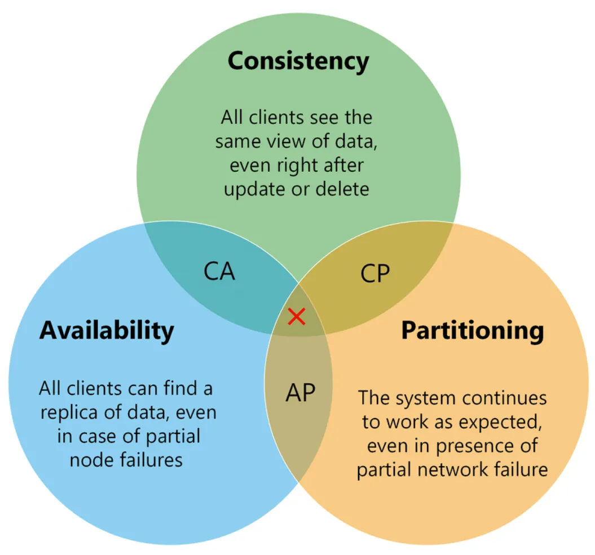
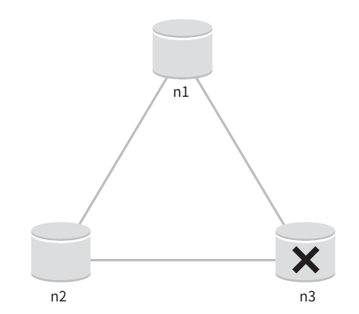
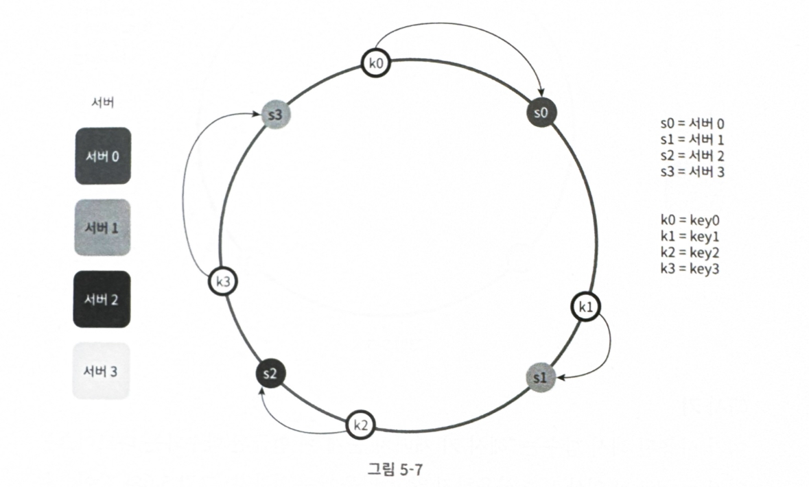

# 키-값 저장소(key-value)

키-값 데이터베이스라고도 부르는 비관계형 데이터베이스

고유 식별자인 key와 그에 대응되는 값(value)가 저장된다.

- 고유 식별자인 key는 유일하며, key를 통해서만 value에 접근할 수 있다.
- key는 해시값이나, 일반 텍스트
- 성능상 키는 짧을 수록 좋다.
- 값은 문자열, 리스트, 객체 모두 허용된다.→ 값으로 오는 타입에 제한이 없음

이를 키-값 쌍이라고 표현한다.

키-값 저장소 예시: 다이나모 DB, memcached, redis

> 구현 목표
> - put(key, value): 키-값 쌍을 저장소에 저장
> - get(key): 인자로 주어진 키에 대한 값을 조회

# 문제 이해 및 설계 범위 확정

설계 시 고려해야 할 트레이드오프

- 읽기, 쓰기, 메모리 사용량 사이에 균형
- 데이터 일관성과 가용성 사이에서 타협적 결정

## 요구사항

1. 키-값 쌍 크기는 10KB 이하

2. 큰 데이터를 저장할 수 있어야한다.

3. 높은 가용성을 제공해야한다. (즉, 장애가 있어도 서비스 응답은 내려져야한다.)

> ❓가용성은 단순히 서비스가 503 not available이 아닐 때를 의미하는건가? 500응답 같은 것이 내려져도 가용성이 높은 것인가?
> - 통상적으로 가용성은 “서버 업타임”을 기준으로 판단한다. 업타임은 보통 “서버가 실행되고 있어 응답을 내릴 수 있는 상태인 시간”을 의미한다.
> - 404, 200 같은 응답을 내리는거면 업타임으로 치는게 맞는데, 500은 모르겠네…. 응답을 내릴 수는 있는 상태라고 봐야하는건지, 아니면 장애 상황이므로 다운타임으로 보는게 맞을지?
>   - 500 응답이 내려가지만 장애가 아닌 경우는 (에를 들어 사용자가 잘못된 값을 입력하여 로직 수행 중 오류 발생, 500에러가 그대로 내려가는 경우) 업타임으로 볼 수 있을 것 같기도 하다.

4. 높은 규모의 확장성 제공 → 트래픽 양에 따른 오토스케일링이 가능해야한다.

5. 데이터 일관성 수준 조절이 가능해야한다.

> ❓데이터 일관성 수준이란? 강한 일관성(strong consistency), 최종 일관성(eventual consistency) 등 다양한 수준의 데이터 일관성을 의미한다.
> - 강한 일관성: 항상 최신 데이터를 보장해야하므로, 한 노드에 작성된 데이터가 다른 노드에 반영되기 전까지는 R/W가 멈춘다.
>   - 한 노드에 장애가 발생하여 일관성 보장이 불가한 상황이라면, 모든 노드의 R/W가 멈춘다. → 가용성 저하
> - 최종 일관성: 일정 시간 후에 데이터가 최종적으로 같은 데이터를 가지게 되는 것
>   - 항상 같은 데이터를 가지지는 않아도 되므로, 한 노드에 일시적으로 문제가 생기거나 데이터가 동기화 되지 않아도 다른 노드듣은 서비스를 지속한다. → 가용성 향상

6. 응답 레이턴시가 짧아야한다.

# 단일 서버 키-값 저장소 (한 대의 서버만 사용하는 경우)

**키-값 쌍을 전부 메모리에 해시 테이블로 저장할 수 있다.**

**장점**
- 빠른 접근 속도
- 간단한 구조

**단점**
- 모든 데이터를 메모리에 두는게 불가능할 수도 있다.
- 해결책 1. 데이터 압축
- 해결책 2. 자주 쓰는 데이터만 메모리에 저장하고 나머지는 디스크에 저장

> ❓서버의 메모리 크기 제한 때문인지? 그럼 레디스는 어떻게 구성되어 있는거지? 최대 얼마까지 저장이 가능한거지?
> - 레디스는 생성한 레디스가 실행되는 시스템이 제공하는 모든 메모리를 쓴다. (redis.conf d파일 또는 cli 명령어로 maxmemory 설정으로 메모리 사용량 제한도 가능)
>   - maxmemory 설정하지 않으면 OOM이 발생할 수 있음
> - 메모리 사용량이 한도에 도달하면, 데이터를 어떻게 삭제할 것인지에 대한 정책을 `maxmemory-policy`로 설정할 수 있다.
>   - `maxmemory-policy noeviction` → 과거 데이터는 삭제하지 않고, 새롭게 저장을 못한다
>   - `maxmemory-policy allkeys-lru` → 모든 키들 중 오래 사용되지 않은 키 삭제
>   - `maxmemory-policy allkeys-random` → 랜덤하게 삭제
>   - `allkeys` 대신 `volatile`이 붙으면, TTL이 설정된 키들 중에서 삭제한다.
> - RDB에 스냅샷을 남길 수도 있다.
>   - `save 900 1`
>
> 출처: https://jongsky.tistory.com/104

# 분산 키-값 저장소 (=분산 해시테이블)

단일 서버만으로는 수용할 수 없는 많은 양의 데이터를 저장해야할 때를 대비해 분산 설계가 필요하다.

> ❓왜 해시 테이블이지? 중복되지 않은 키를 기반으로 값을 저장하는 구조가 해시 테이블과 유사해서?
> - 분산 환경에서 해시를 사용해서 데이터를 저장할 노드를 결정하기 때문

**분산 시스템 설계를 위해서는 CAP 정리(Consistency, Availability, Partition Tolerance theorem)를 이해해야한다.**

## CAP 정리

아래 3가지를 모두 만족시키는 분산 시스템 설계는 불가하다는 정리

- 일관성(consistency)
- 가용성(availability)
- 파티션 감내(partition tolerance)

### 데이터 일관성

분산 시스템에 접속하는 클라이언트는 어떤 노드에 접속했는지와 관계없이 언제나 같은 데이터를 보게 해야한다.

> ❓ A 노드로 접속했을 때 자연스럽게 원하는 데이터가 저장된 B노드로 리다이렉션 시키는 것도 일관성 중 하나인지? 아니면 모든 노드에서 즉시 같은 데이터를 볼 수 있어야만 하는게 일관성인지. (즉 모든 노드에 샤딩 적용 없이 모두 동일한 데이터가 저장되어 있어야 하는 것인지)
> ❓ 일관성이 “시용자가 보는 데이터의 일관성”인지, 아니면 “데이터 저장 측면에서의 일관성”인지
> - (상황에 따라 다르게 의미할 수 있지만) 보통 “사용자가 보는 데이터의 일관성”을 의미한다.
>   - 샤딩 + 레플리케이션의 조합이라고 생각하면 될 듯

### 가용성

분산 시스템에 접속하는 모든 클라이언트는 일부 노드에 장애가 발생해도 항상 응답을 받을 수 있어야한다.

### 파티션 감내

- 파티션: 노드 사이의 통신에 장애가 발생한 상태. (노드 사이가 단절된 상태)

네트워크에 파티션이 생기더라도(노드 사이에 네트워크로 인한 통신 불가 이슈가 생기더라도) 시스템은 계속 동작해야한다.

> ❓파티션은 반드시 네트워크만이 원인이어야하는가?
> - 주로 네트워크로 인한 통신 단절을 의미하는 것은 맞지만, 파티션이 반드시 네트워크 문제로 발생하는 것은 아니다.
>   - 네트워크 장애
>   - 특정 노드의 장애, 부하로 인한 통신 지연 (노드가 요청을 제대로 처리하거나 응답하지 못하는 경우)
>   - etc

### CAP 중 두 가지만 동시에 만족시킬 수 있다는 정리에 따른 키-값 저장소 설계

#### CP 시스템
일관성과 파티션 감내를 지원. 가용성 희생

#### AP 시스템
가용성과 파티션 감내를 지원. 데이터 일관성을 희생

### CA 시스템
일관성과 가용성을 지원. 파티션 감내를 지원하지 않는다.

**통상적으로 네트워크로 인한 장애는 피할 수 없는 장애이므로, 분산 시스템은 반드시 파티션 문제를 감내할 수 있도록 설계되어야한다.**

**실세계에 CA 시스템은 존재하지 않는다.**

> ❓정말인가?
> - CA 시스템을 설계하기 위해서는 “파티션 문제가 절대 발생하지 않는다.”가 보장되어야한다.
> - 파티션 문제의 주요 원인인 네트워크 장애는 100% 발생하지 않을 것이라고 보장할 수 없다. (네트워크가 100% 완벽하다고 보장할 수 없음)
> - 따라서, 완벽한 CA 시스템(P가 문제가 애초에 절대 발생하지 않을)은 존재할 수 없다.

### 이상적인 설계

1. 파티션 감내 발생 X
2. 모든 노드가 동일한 데이터를 가진다. (데이터 일관성)
    - n1 노드에 기록 → n2, n3에 함께 저장
    - n2 노드에 기록 → n1, n3에 함께 저장
    - n3 노드에 기록 → n1, n2에 함께 저장
3. 높은 가용성 보장

### 실세계의 분산 시스템

분산 시스템은 파티션 문제를 피할 수 없다. (네트워크 장애는 피할 수 없음)

- 분산 시스템은 CAP 중 2개만 동시에 만족할 수 있으므로, 파티션 감내(Partition tolerance)를 반드시 제공해야한다면
- 가용성(Availability)와 일관성(Consistency) 중 하나만 만족할 수 있다.
    - CP, AP 중 하나만 만족 가능

> n3 노드 장애로 인해 n1 ↔ n3, n2↔ n3 사이에 파티션 발생.
> 
> P는 필수 선택사항이므로, “파티션이 발생했음에도 시스템이 계속 동작할 수 있는 상황을 만들기 위해(즉 장애가 발생했음에도 시스템이 멈추지 않게 하기 위해)” CP/AP 중 하나의 모델을 선택해야한다.
>
> 1. AP 시스템
>   - 파티션이 해결될 때 까지 n1, n2, n3 데이터 일관성을 포기한다. (사용자의 RW는 가능)
> 2. CP 시스템
>   - 파티션이 해결될 때 까지 n1, n2, n3의 W를 포기하여 데이터 일관성을 유지시킨다.

#### 1. 일관성을 선택했을 때(CP 모델)

세 노드 사이 데이터 불일치를 피하기 위해 n1, n2에 쓰기 연산을 중단시킨다.

- 가용성을 포기하게 된다.
    - 데이터 일관성이 중요한 시스템(e.g., 은행은 사용자가 어디에서 데이터를 읽어도 항상 동일한 잔고를 확인할 수 있어야한다.)에서는 일관성 보장이 필수
    - 상황이 해결되기 전까지 오류를 반환(가용성 저하)해야한다.

#### 2. 가용성을 선택했을 때(AP 모델)

동기화 되지 않은 데이터를 반환할 위험이 있어도 읽기 연산은 계속 지원한다. (즉 사용자에게 오류를 반환하지 않는다.)

- n1, n2는 계속 쓰기가 이루어진다. (n3에 동기화 되지 않아 n3에서는 최신이 아닌 데이터가 응답될 수 있음)
- 파티션 문제 해결 뒤에 새 데이터를 n3에 전송한다.
- 해결 전까지는 일관성을 포기한다.

---

## 시스템 컴포넌트

> 키-값 저장소 구현에 필요한 기술/컴포넌트

- 데이터 파티션
- 데이터 다중화(replication)
- 일관성(consistency)
- 일관성 불일치 해소(inconsistency resolution)
- 장애 처리
- 시스템 아키텍처 다이어그램
- 쓰기 경로(write path)
- 읽기 경로(read path)

### 데이터 파티션

대용량 데이터를 작은 파티션들로 분할하여 여러 서버에 분산 저장한다.

- 데이터를 서버에 고르게 분산할 수 있는가
- 노드가 추가/삭제될 때 데이터 이동을 최소화할 수 있는가

⇒ 이를 위해 안정 해시(5장)을 고려할 수 있다.

**장점**

1. 규모 확장 자동화(auto scaling)
- 시스템 부하에 따라 자동으로 서버가 추가/삭제되게 만들 수 있다.
    - 안정해시를 도입해서 자동으로 되는게 아니라, 안정해시이기 때문에 더 자유롭게 서버 추가/삭제가 가능하다는 의미
2. 다양성(heterogeneity)
- 각 서버 용량에 맞게 가상 노드를 추가/제거하여 서버에 저장되는 키-값 쌍의 양을 조정할 수 있다.

### 데이터 다중화

높은 가용성, 안정성을 위해서는 데이터를 **N개 서버에 비동기적으로 다중화**할 필요가 있다.
- 즉, 동일 데이터가 저장되는 replication 서버를 둔다.

**다중화 저장할 N개의 서버 결정하는 방법**

1. 키를 해시링에 배치한다.
2. 키가 있는 위치를 기점으로 시계방향으로 돌면서, 가장 가까운 첫 N개의 서버에 키를 저장한다.
3. 키가 저장되는 가상노드가 s1, s2, s3이라면 **s1, s2, s3은 같은 물리 노드면 안된다.**

> ❓그러면 가상 노드를 해시링에 배치할 때 물리 노드마다 한 대씩 순차 배치하는건가? 
> 
> s1-1, s2-1, s3-1, s1-2, s2-2, s3-2, s1-3, s2-3, s3-3 이런 식으로
> 
> 그러면 키가 어디에 저장되든 항상 만나게 되는 첫 N개의 가상노드는 서로 다른 물리노드에 대한 거니까?

4. 안정성을 위해 데이터 사본은 다른 데이터 센터에 위치한 서버에 보관한다.
