# 키-값 저장소(key-value)

키-값 데이터베이스라고도 부르는 비관계형 데이터베이스

고유 식별자인 key와 그에 대응되는 값(value)가 저장된다.

- 고유 식별자인 key는 유일하며, key를 통해서만 value에 접근할 수 있다.
- key는 해시값이나, 일반 텍스트
- 성능상 키는 짧을 수록 좋다.
- 값은 문자열, 리스트, 객체 모두 허용된다.→ 값으로 오는 타입에 제한이 없음

이를 키-값 쌍이라고 표현한다.

키-값 저장소 예시: 다이나모 DB, memcached, redis

> 구현 목표
> - put(key, value): 키-값 쌍을 저장소에 저장
> - get(key): 인자로 주어진 키에 대한 값을 조회

# 문제 이해 및 설계 범위 확정

설계 시 고려해야 할 트레이드오프

- 읽기, 쓰기, 메모리 사용량 사이에 균형
- 데이터 일관성과 가용성 사이에서 타협적 결정

## 요구사항

1. 키-값 쌍 크기는 10KB 이하

2. 큰 데이터를 저장할 수 있어야한다.

3. 높은 가용성을 제공해야한다. (즉, 장애가 있어도 서비스 응답은 내려져야한다.)

> ❓가용성은 단순히 서비스가 503 not available이 아닐 때를 의미하는건가? 500응답 같은 것이 내려져도 가용성이 높은 것인가?
> - 통상적으로 가용성은 “서버 업타임”을 기준으로 판단한다. 업타임은 보통 “서버가 실행되고 있어 응답을 내릴 수 있는 상태인 시간”을 의미한다.
> - 404, 200 같은 응답을 내리는거면 업타임으로 치는게 맞는데, 500은 모르겠네…. 응답을 내릴 수는 있는 상태라고 봐야하는건지, 아니면 장애 상황이므로 다운타임으로 보는게 맞을지?
>   - 500 응답이 내려가지만 장애가 아닌 경우는 (에를 들어 사용자가 잘못된 값을 입력하여 로직 수행 중 오류 발생, 500에러가 그대로 내려가는 경우) 업타임으로 볼 수 있을 것 같기도 하다.

4. 높은 규모의 확장성 제공 → 트래픽 양에 따른 오토스케일링이 가능해야한다.

5. 데이터 일관성 수준 조절이 가능해야한다.

> ❓데이터 일관성 수준이란? 강한 일관성(strong consistency), 최종 일관성(eventual consistency) 등 다양한 수준의 데이터 일관성을 의미한다.
> - 강한 일관성: 항상 최신 데이터를 보장해야하므로, 한 노드에 작성된 데이터가 다른 노드에 반영되기 전까지는 R/W가 멈춘다.
>   - 한 노드에 장애가 발생하여 일관성 보장이 불가한 상황이라면, 모든 노드의 R/W가 멈춘다. → 가용성 저하
> - 최종 일관성: 일정 시간 후에 데이터가 최종적으로 같은 데이터를 가지게 되는 것
>   - 항상 같은 데이터를 가지지는 않아도 되므로, 한 노드에 일시적으로 문제가 생기거나 데이터가 동기화 되지 않아도 다른 노드듣은 서비스를 지속한다. → 가용성 향상

6. 응답 레이턴시가 짧아야한다.

# 단일 서버 키-값 저장소 (한 대의 서버만 사용하는 경우)

**키-값 쌍을 전부 메모리에 해시 테이블로 저장할 수 있다.**

**장점**
- 빠른 접근 속도
- 간단한 구조

**단점**
- 모든 데이터를 메모리에 두는게 불가능할 수도 있다.
- 해결책 1. 데이터 압축
- 해결책 2. 자주 쓰는 데이터만 메모리에 저장하고 나머지는 디스크에 저장

> ❓서버의 메모리 크기 제한 때문인지? 그럼 레디스는 어떻게 구성되어 있는거지? 최대 얼마까지 저장이 가능한거지?
> - 레디스는 생성한 레디스가 실행되는 시스템이 제공하는 모든 메모리를 쓴다. (redis.conf d파일 또는 cli 명령어로 maxmemory 설정으로 메모리 사용량 제한도 가능)
>   - maxmemory 설정하지 않으면 OOM이 발생할 수 있음
> - 메모리 사용량이 한도에 도달하면, 데이터를 어떻게 삭제할 것인지에 대한 정책을 `maxmemory-policy`로 설정할 수 있다.
>   - `maxmemory-policy noeviction` → 과거 데이터는 삭제하지 않고, 새롭게 저장을 못한다
>   - `maxmemory-policy allkeys-lru` → 모든 키들 중 오래 사용되지 않은 키 삭제
>   - `maxmemory-policy allkeys-random` → 랜덤하게 삭제
>   - `allkeys` 대신 `volatile`이 붙으면, TTL이 설정된 키들 중에서 삭제한다.
> - RDB에 스냅샷을 남길 수도 있다.
>   - `save 900 1`
>
> 출처: https://jongsky.tistory.com/104

# 분산 키-값 저장소 (=분산 해시테이블)

단일 서버만으로는 수용할 수 없는 많은 양의 데이터를 저장해야할 때를 대비해 분산 설계가 필요하다.

> ❓왜 해시 테이블이지? 중복되지 않은 키를 기반으로 값을 저장하는 구조가 해시 테이블과 유사해서?
> - 분산 환경에서 해시를 사용해서 데이터를 저장할 노드를 결정하기 때문

**분산 시스템 설계를 위해서는 CAP 정리(Consistency, Availability, Partition Tolerance theorem)를 이해해야한다.**

## CAP 정리

아래 3가지를 모두 만족시키는 분산 시스템 설계는 불가하다는 정리

- 일관성(consistency)
- 가용성(availability)
- 파티션 감내(partition tolerance)

### 데이터 일관성

분산 시스템에 접속하는 클라이언트는 어떤 노드에 접속했는지와 관계없이 언제나 같은 데이터를 보게 해야한다.

> ❓ A 노드로 접속했을 때 자연스럽게 원하는 데이터가 저장된 B노드로 리다이렉션 시키는 것도 일관성 중 하나인지? 아니면 모든 노드에서 즉시 같은 데이터를 볼 수 있어야만 하는게 일관성인지. (즉 모든 노드에 샤딩 적용 없이 모두 동일한 데이터가 저장되어 있어야 하는 것인지)
> ❓ 일관성이 “시용자가 보는 데이터의 일관성”인지, 아니면 “데이터 저장 측면에서의 일관성”인지
> - (상황에 따라 다르게 의미할 수 있지만) 보통 “사용자가 보는 데이터의 일관성”을 의미한다.
>   - 샤딩 + 레플리케이션의 조합이라고 생각하면 될 듯

### 가용성

분산 시스템에 접속하는 모든 클라이언트는 일부 노드에 장애가 발생해도 항상 응답을 받을 수 있어야한다.

### 파티션 감내

- 파티션: 노드 사이의 통신에 장애가 발생한 상태. (노드 사이가 단절된 상태)

네트워크에 파티션이 생기더라도(노드 사이에 네트워크로 인한 통신 불가 이슈가 생기더라도) 시스템은 계속 동작해야한다.

> ❓파티션은 반드시 네트워크만이 원인이어야하는가?
> - 주로 네트워크로 인한 통신 단절을 의미하는 것은 맞지만, 파티션이 반드시 네트워크 문제로 발생하는 것은 아니다.
>   - 네트워크 장애
>   - 특정 노드의 장애, 부하로 인한 통신 지연 (노드가 요청을 제대로 처리하거나 응답하지 못하는 경우)
>   - etc

### CAP 중 두 가지만 동시에 만족시킬 수 있다는 정리에 따른 키-값 저장소 설계

#### CP 시스템
일관성과 파티션 감내를 지원. 가용성 희생

#### AP 시스템
가용성과 파티션 감내를 지원. 데이터 일관성을 희생

### CA 시스템
일관성과 가용성을 지원. 파티션 감내를 지원하지 않는다.

**통상적으로 네트워크로 인한 장애는 피할 수 없는 장애이므로, 분산 시스템은 반드시 파티션 문제를 감내할 수 있도록 설계되어야한다.**

**실세계에 CA 시스템은 존재하지 않는다.**

> ❓정말인가?
> - CA 시스템을 설계하기 위해서는 “파티션 문제가 절대 발생하지 않는다.”가 보장되어야한다.
> - 파티션 문제의 주요 원인인 네트워크 장애는 100% 발생하지 않을 것이라고 보장할 수 없다. (네트워크가 100% 완벽하다고 보장할 수 없음)
> - 따라서, 완벽한 CA 시스템(P가 문제가 애초에 절대 발생하지 않을)은 존재할 수 없다.

### 이상적인 설계

1. 파티션 감내 발생 X
2. 모든 노드가 동일한 데이터를 가진다. (데이터 일관성)
    - n1 노드에 기록 → n2, n3에 함께 저장
    - n2 노드에 기록 → n1, n3에 함께 저장
    - n3 노드에 기록 → n1, n2에 함께 저장
3. 높은 가용성 보장

### 실세계의 분산 시스템

분산 시스템은 파티션 문제를 피할 수 없다. (네트워크 장애는 피할 수 없음)

- 분산 시스템은 CAP 중 2개만 동시에 만족할 수 있으므로, 파티션 감내(Partition tolerance)를 반드시 제공해야한다면
- 가용성(Availability)와 일관성(Consistency) 중 하나만 만족할 수 있다.
    - CP, AP 중 하나만 만족 가능

> n3 노드 장애로 인해 n1 ↔ n3, n2↔ n3 사이에 파티션 발생.
> 
> P는 필수 선택사항이므로, “파티션이 발생했음에도 시스템이 계속 동작할 수 있는 상황을 만들기 위해(즉 장애가 발생했음에도 시스템이 멈추지 않게 하기 위해)” CP/AP 중 하나의 모델을 선택해야한다.
>
> 1. AP 시스템
>   - 파티션이 해결될 때 까지 n1, n2, n3 데이터 일관성을 포기한다. (사용자의 RW는 가능)
> 2. CP 시스템
>   - 파티션이 해결될 때 까지 n1, n2, n3의 W를 포기하여 데이터 일관성을 유지시킨다.

#### 1. 일관성을 선택했을 때(CP 모델)

세 노드 사이 데이터 불일치를 피하기 위해 n1, n2에 쓰기 연산을 중단시킨다.

- 가용성을 포기하게 된다.
    - 데이터 일관성이 중요한 시스템(e.g., 은행은 사용자가 어디에서 데이터를 읽어도 항상 동일한 잔고를 확인할 수 있어야한다.)에서는 일관성 보장이 필수
    - 상황이 해결되기 전까지 오류를 반환(가용성 저하)해야한다.

#### 2. 가용성을 선택했을 때(AP 모델)

동기화 되지 않은 데이터를 반환할 위험이 있어도 읽기 연산은 계속 지원한다. (즉 사용자에게 오류를 반환하지 않는다.)

- n1, n2는 계속 쓰기가 이루어진다. (n3에 동기화 되지 않아 n3에서는 최신이 아닌 데이터가 응답될 수 있음)
- 파티션 문제 해결 뒤에 새 데이터를 n3에 전송한다.
- 해결 전까지는 일관성을 포기한다.

---

## 시스템 컴포넌트

> 키-값 저장소 구현에 필요한 기술/컴포넌트

- 데이터 파티션
- 데이터 다중화(replication)
- 일관성(consistency)
- 일관성 불일치 해소(inconsistency resolution)
- 장애 처리
- 시스템 아키텍처 다이어그램
- 쓰기 경로(write path)
- 읽기 경로(read path)

### 데이터 파티션

대용량 데이터를 작은 파티션들로 분할하여 여러 서버에 분산 저장한다.

- 데이터를 서버에 고르게 분산할 수 있는가
- 노드가 추가/삭제될 때 데이터 이동을 최소화할 수 있는가

⇒ 이를 위해 안정 해시(5장)을 고려할 수 있다.

**장점**

1. 규모 확장 자동화(auto scaling)
- 시스템 부하에 따라 자동으로 서버가 추가/삭제되게 만들 수 있다.
    - 안정해시를 도입해서 자동으로 되는게 아니라, 안정해시이기 때문에 더 자유롭게 서버 추가/삭제가 가능하다는 의미
2. 다양성(heterogeneity)
- 각 서버 용량에 맞게 가상 노드를 추가/제거하여 서버에 저장되는 키-값 쌍의 양을 조정할 수 있다.

### 데이터 다중화

높은 가용성, 안정성을 위해서는 데이터를 **N개 서버에 비동기적으로 다중화**할 필요가 있다.
- 즉, 동일 데이터가 저장되는 replication 서버를 둔다.

**다중화 저장할 N개의 서버 결정하는 방법**

1. 키를 해시링에 배치한다.
2. 키가 있는 위치를 기점으로 시계방향으로 돌면서, 가장 가까운 첫 N개의 서버에 키를 저장한다.
3. 키가 저장되는 가상노드가 s1, s2, s3이라면 **s1, s2, s3은 같은 물리 노드면 안된다.**

> ❓그러면 가상 노드를 해시링에 배치할 때 물리 노드마다 한 대씩 순차 배치하는건가? 
> 
> s1-1, s2-1, s3-1, s1-2, s2-2, s3-2, s1-3, s2-3, s3-3 이런 식으로
> 
> 그러면 키가 어디에 저장되든 항상 만나게 되는 첫 N개의 가상노드는 서로 다른 물리노드에 대한 거니까?

4. 안정성을 위해 데이터 사본은 다른 데이터 센터에 위치한 서버에 보관한다.

### 데이터 일관성

> 여러 노드가 있는 분산 시스템 구조에서, 모든 노드들 사이에 데이터가 동기화되어있어야한다.  
> ⇒ 정족수 합의(Qurorum Consensus)를 통해서 R/W 작업에 일관성 부여 가능

- N → 사본 개수
  - 중재자 노드는 “클라이언트로부터 커맨드를 입력받아서 이걸 사본 노드들에게 전달하는 역할”
      - 즉, 클라이언트와 데이터가 저장된 노드들 사이의 proxy
  - 따라서, 중재자를 제외한 다른 W/R개의 노드들로부터 연산에 성공했음을 응답받아야한다.
- W → 쓰기 연산에 대한 **정족수**
  - 최소 W개 이상의 노드로부터 “Write연산에 성공했다.”라는 응답을 받아야 write 작업이 성공한 것으로 간주
- R  → 읽기 연산에 대한 **정족수**
  - 최소 R개 이상의 노드로부터 “Read 연산에 성공했다” 라는 응답을 받아야 read 작업이 성공한 것으로 간주

W/R개의 노드들로부터 “성공” 응답을 받으면, 그 외의 노드들의 응답을 기다릴 필요가 없다.

> W, R, N의 값을 정하는건 응답 지연과 데이터 일관성 사이의 타협점을 찾는 과정이다.
>

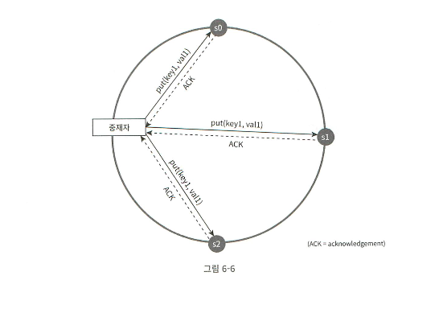

- W=1, R=1
  - 중재자는 항상 한 대의 서버만 응답하면 성공으로 간주한다.
  - 응답속도 향상
  - **단, 하나의 서버에서만 성공한다는 것은 아니다. 응답만 그 때 까지 기다린다는 의미**
- W> 1 OR R>1
  - 일관성 향상
  - 중재자의 응답속도: W=a, R=b 일 때 a, b개의 서버들 중 가장 응답이 느린 서버가 응답할 때 까지 기다려야한다.
    - 따라서, 노드의 응답 속도에 따라 응답 속도가 저하된다.
- W + R > N : **강한 일관성 보장**
  - 일관성을 보장할 수 있는 최신 데이터를 가진 노드가 최소 한 개는 겹친다.
  - W+R>N이면, W>N/2, R>N/2 이므로 최소 한 개의 노드에서는 W와 R가 모두 성공했음을 보장할 수 있다.

**정리**

- R=1, W=N: 빠른 읽기 연산에 최적화 된 시스템
- R=N, W=1: 빠른 쓰기 연산에 최적화 된 시스템
- W+R > N : 강한 일관성 보장
    - 보통 N=3, R=2
    - 적어도 하나의 노드에서는 W/R가 항상 최신 데이터임이 보장된다.
- W+R ≤ N : 강한 일관성 보장 X

### 일관성 모델

> 데이터 일관성 수준을 결정한다.

- **강한 일관성(strong consistency)**
  - 모든 Read 연산은 가장 최근에 갱신된 데이터를 반환
  - **클라이언트는 절대로 오래된 데이터를 보지 않는다.**
  - 모든 노드에 현재 쓰기 데이터가 반영되기 전까지 해당 데이터에 대한 R/W 금지
      - 고가용성에 적합하지 않다. (그 동안에는 R/W가 막히므로 가용성이 떨어짐)
- **약한 일관성(weak consistency)**
  - 가장 최근에 갱신된 결과를 반환하지 못할 수 있음
  - ❓강한 일관성이 아니면 다 약한 일관성인가?
- **최종 일관성 (eventual consistency)**
  - 약한 일관성의 한 형태
  - **갱신 결과가 최종적으로는 모든 사본에 동기화된다.**
      - 실시간 동기화가 아니어도 된다.
  - 다이나모, 카산드라가 최종 일관성 모델 채택
  - 쓰기 연산이 병렬적으로 발생하면 시스템에 저장된 값의 일관성이 깨질 수 있다.
    - A노드에 a데이터가 작성, B노드에 b데이터 작성이 동시에 발생하면 최종적으로 둘의 일관성이 맞춰지기 전까지는 A노드와 B노드의 데이터 일관성이 깨진다.
    - 클라이언트가 해당 문제 해결 필요 (데이터 버전 정보를 이용해서 일관성이 깨진 데이터를 읽지 않도록 해야함) → 데이터 버저닝
    > ❓왜 클라이언트가 이걸 해소해야하는가?
    >  - 키-값 저장소에서 충돌을 탐지하고 해소하는 로직까지 포함하게 되면 시스템 복잡성, 부담이 커진다.
    >  - 충돌이 발생한 데이터 중, 어떤 데이터를 보존해야할지에 대해서는 클라이언트 측에서 더 명확하게 이해하고 있음(도메인 이해도) → 따라서, 클라이언트 측에서 필요한 데이터를 판단하여 충돌을 해소하도록 한다.

### 비 일관성 해소 기법: 데이터 버저닝

> 버저닝, 벡터시계: 데터 다중화 시, 서버들 사이 데이터 일관성이 깨지는 문제를 해소하기 위한 기술
>

- 버저닝(versioning): 데이터를 변경할 때 마다 해당 데이터의 새로운 버전을 만든다
    - 각 버전의 데이터는 불변이다.

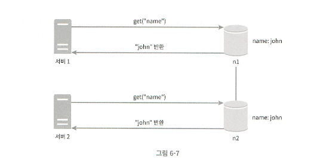

위 사진처럼 두 대의 서버가 서로 다른 사본(노드)에 동시에 write 작업을 하면 두 노드의 일관성이 깨진다. ⇒ 충돌하는 값을 가지게 된다.

n1과 n2에 있는 값의 충돌을 발견&자동 해소할 버저닝 시스템이 “벡터 시계(vector clock)”

**벡터 시계**

`데이터([데이터가 기록된 서버, 버전],[데이터가 기록된 서버, 버전])` 의 형태

- 선행 버전, 후행 버전, 충돌이 있는 버전을 식별하는데 사용
- `D([s1, v1], [s2, v2], ...[sn, vn])` 과 같이 표기
  - D: 데이터
  - vi: 버전 카운터 (순차 증가)
  - si: 서버 번호
  - 데이터(D) 기록 시 si로 기록된 라벨이 있다면, 새롭게 si에 작업된 내용은 vi+1로 버전을 기록한다.
  - D 기록 시 기존에 같은 si로 기록된 라벨이 없다면, 새롭게 [si, 1] 로 라벨을 추가한다.

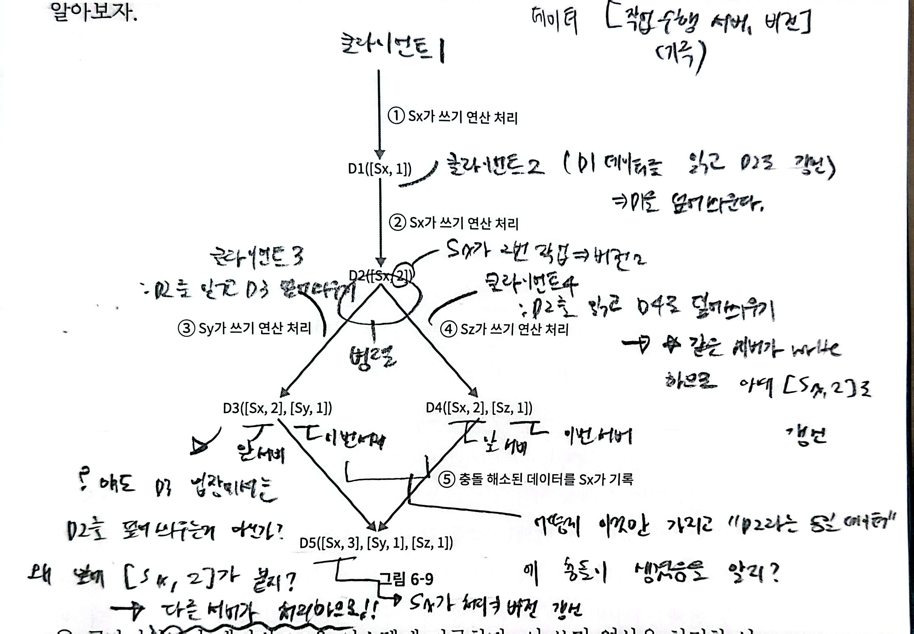

위 과정에서 5️⃣번 단계의 충돌 해소는 클라이언트가 해소한 후에 서버에 기록한다.

**충돌 확인 방법**

데이터 충돌을 확인하는 방법: 데이터에 붙은 버전 라벨의 선후관계를 통해 충돌 여부 확인

1. 충돌이 없는 경우

`버전X의 모든 라벨값 <= 버전 Y의 모든 라벨값` 이라면 `버전 Y는 버전 X의 후행 버전으로, 충돌은 없다.`

- 버전X: `D([sO, 1], [sl, 1])`  ≤ 버전Y: `D([s0, 1], [sl, 2])`
  - 같은 서버에 대해 버전X의 모든 버전값이 버전Y의 모든 버전값보다 작거나 같으므로, 충돌 없이 완전한 이전 버전

2. 충돌이 있는 경우

`버전X의 구성요소들 중 버전Y의 구성요소들보다 크거나 같은 값도 있고 작은 값도 있다면 충돌이 있다.`

- 버전X: `D([sO, 1], [sl , 2])` 버전Y: `D([s0, 2], [sl , 1])`
    - S0에 대해서는 버전 X < 버전Y
    - S1에 대해서는 버전X > 버전 Y
    - 따라서, 충돌이다.

따라서, 위의 그림에서도 5️⃣번 단계에서 읽는 데이터를 비교해보면 아래와 같이 충돌임을 확인할 수 있다.

- `D3([Sx,2], [Sy,1])` `D4([Sx,2], [Sz,1])`
  - 각각 없는 서버 버전에 대해서는 버전을 `0` 으로 기록한다.
  - ⇒ `D3([Sx,2], [Sy,1], [Sz, 0])`  `D4([Sx,2], [Sy, 0], [Sz,1])`
  - Sx: D3 ≤ D4
  - Sy: D3 > D4
  - Sz: D3 < D4
  - 따라서, 구성요소들 중에서 D3이 D4보다 큰 값도 있으나 작은 값도 있으므로 충돌이다.

> ❓어떻게 5번 단계에서 D3과 D4를 모두 읽고 충돌이 있음을 아는거지? 
> D3, D4 데이터의 버전 라벨을 통해서 충돌을 확인할 수 있다는건 알겠는데, 어떻게 5번 작업 시 Sy, Sz 서버로부터 D3, D4 데이터와 라벨을 확인해서 둘이 충돌이라는걸 아는거지?
- **D3, D4는 같은 key에 대해 변경이 이루어진 데이터다.**
  - 동일 key에 대해 데이터가 작성되면, 시스템은 해당 데이터와 함께 벡터 시계를 저장한다.
      - 벡터 시계는 메모리 상에 데이터와 함께 메타데이터로써 저장된다.
  - 클라이언트가 key를 조회했을 때, 저장소에서는 “최신 버전”을 모두 조회하여 응답한다.
      - 충돌이 난 데이터가 있다면, 충돌난 데이터를 모두 반환한다.
  - 클라이언트는 충돌난 데이터를 수신하여 “가장 최신 값”을 저장하거나, 혹은 필요에 따라 최종 데이터를 결정하여 덮어씌운다.
- 참고: https://velog.io/@jaquan1227/%EB%85%BC%EB%AC%B8-%EB%8C%80%EC%8B%A0-%EC%9D%BD%EA%B8%B0-%EC%95%84%EC%A7%81%EB%8F%84-DynamoDB-%EB%A7%8C%EB%93%9C%EB%8A%94-%EB%B2%95%EC%9D%84-%EB%AA%A8%EB%A5%B4%EC%8B%AD%EB%8B%88%EA%B9%8C#vector-clock

**벡터시계 단점**

1. 충돌 감지 및  해소 로직이 클라이언트에서 이루어지므로 클라이언트 구현이 복잡해진다.
2. [서버:버전] 의 순서쌍이 빠르게 늘어난다. (데이터 변경 시 마다 추가되므로)
   - 구성요소 길이에 임계치를 추가하여 해당 임계치 이상으로 길어지면 이전 버전들을 지운다.
     - 앞의 버전들이 지워지기 때문에 버전 간 선후 관계가 정확하게 결정 불가 ⇒ 충돌 해소 과정의 효율성이 낮아진다.
     - 다만, dynamo-db의 문헌에 다르면 AWS에서 실제 해당 문제가 발생한 적은 없다.

### 장애 처리: 장애 감지(failure detection)

보통 분산 시스템에서는 **두 대 이상의 서버가 동일하게 “서버 A에 문제가 있다.” 라고 보고해야** 서버A에 장애가 있다고 간주한다.

**장애 감지 방법**

1. 멀티캐스팅(multicasting) 채널 구축

서버 장애를 감지하는 쉬운 방법이나, 서버가 많을 때 비효율적

> ❓멀티캐스팅이란?
>   한 노드에 write 작업이 생기면 작업의 내용이 모든 노드에 공유되어야한다. (방법은 여러가지)
> 
> - Centralized
>     - 한 노드가 책임지고 나머지 노드들에 작업 결과를 분산시킨다.
>     - 중앙 노드에 장애가 발생할 경우 전체 시스템이 다운된다고 생각할 수 있다. (SPOF)
>     - 중앙 노드 하나가 모든 노드들과 통신하므로 중앙 노드에 O(N) 만큼의 통신 부하가 발생한다.
> - Tree-based
>     - 노드들을 가지고 spanning-tree(순환이 없는 트리 구조)를 만든다.
>     - 루트 노드를 기점으로 자식 노드에게 메시지를 보내고, 그럼 그 메시지를 수신한 자식 노드는 자신의 자식 노드에게 메시지를 보내는 top-down 방식
>     - leaf node 근처에서 발생하는 장애는 해당 노드에만 발생하기 때문에 영향도가 낮으나, 루트 노드 근처에서 발생하는 장애는 그 하위의 모든 자식 노드들에게 영향을 준다.
>     - 이론상 하나의 노드는 부모 노드로부터 메시지를 수신, 자신의 자식 노드들에게만 메시지를 보내므로 통신 부하가 적다.
> - Full-mesh
>     - 책에 나온 구조가 풀 메쉬 구조이다.
>     - 모든 노드들이 서로 연결되어 있기 때문에 하나의 노드에 문제가 생겨도 다른 노드를 통해 메시지를 주고받을 수 있다.
>     - 다만, 잘못된 경로로 메시지가 전달되면 무한 순회하는 구조가 생길 수 있다.
>   참고:  https://maneesh-chaturvedi.medium.com/multicast-and-the-gossip-protocol-6bdb78d1053e> 

2. 가십 프로토콜(gossip-protocol): 분산형 장애 감지 솔루션

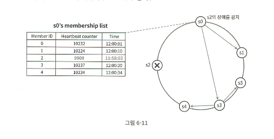

- 각 노드는 멤버십 리스트를 가진다.
  - 멤버 ID(노드 식별자)
  - 노드의 하트비트 개수를 저장하는 카운터
  - 노드가 하트비트를 마지막으로 감지한 시간
- 각 노드는 주기적으로 자신의 하트비트 카운터를 증가시킨다.
- 각 노드는 무작위 선정된 다른 노드들에게 “자신이 가지고 있는 멤버 리스트를 모두 보낸다.”
- 멤버 리스트를 받은 노드는 자기가 보유한 멤버 리스트를 최신화시킨다.
  - 자신이 가지고 있지 않은 멤버에 대한 정보를 추가하거나, 최신화시킨다.
- 노드들이 서로 리스트를 주고 받으면서 어떤 멤버의 하트비트 시간이 일정 시간동안 갱신되지 않으면 해당 멤버는 장애 상태인 것으로 간주한다.

> ❗꼭 “모든 노드에 대한 멤버십 리스트”를 가지고 있어야만 하는 것은 아니다.  
>
> - 예를 들어, 위 그림에서 S0 노드는 S5 노드에 대해서는 아예 리스트를 가지고 있지 않다.  
> - 따라서, S5 노드의 존재 여부를 알지 못하기 때문에 S5 노드를 장애라고 인식하지 않는다. 
> - 만약 다른 노드로부터 멤버십 리스트를 받았을 때 S5 정보가 포함되어 있다면, 그 때 S5 노드를 자신의 멤버십 리스트로 갱신시킨다.

### 장애 처리: 일시적 장애 처리

가십 프로토콜을 통해 특정 노드가 장애라고 판단되었다면 가용성 보장을 위한 조치를 취해야한다.

1. **엄격한 정족수(strict quorum)**

정해진 수(R, W) 만큼의 노드로부터 성공 응답이 오기 전까지 시스템의 Read, Write를 멈춘다. ⇒ 가용성 저하

2. **느슨한 정족수(sloppy quorum) → 근데 이거는 왜 가용성이 엄격한 정족수에 비해 높아지는거지?**

정족수 조건을 완환하여 가용성을 높인다.

1. 쓰기 연산을 수행할 W개의 건강한 서버와 읽기를 수행할 R개의 건강한 서버를 해시링에서 고른다.
    - 장애 상태인 서버는 제외한다.
2. 장애 서버로 가는 요청은 다른 서버가 대신 처리한다.(일시적으로)
   - 변경사항은 장애 서버가 복구된 후에 일괄 반영해서 일관성을 보존한다.
   - 임시로 쓰기 연산을 처리한 서버가 그에 대한 단서(hint)를 남긴다. ⇒ **단서 후 임시 위탁(hinted handoff) 기법**
   > ❓힌트가 뭔지? 어떤 형태인지?
   > - 다른 노드에 데이터를 임시 저장했음을 나타내는 **메타데이터**
   >  - 원래 저장되어야하는 노드의 ID
   >  - 저장된 키
   >  - 데이터 버전 정보(벡터 시계)
   >  - 저장된 값
   >  - 힌트가 생성된 시점(타임스탬프)
   > - 힌트는 주로 디스크에 저장된다.
   > - 참고: https://velog.io/@jaquan1227/%EB%85%BC%EB%AC%B8-%EB%8C%80%EC%8B%A0-%EC%9D%BD%EA%B8%B0-%EC%95%84%EC%A7%81%EB%8F%84-DynamoDB-%EB%A7%8C%EB%93%9C%EB%8A%94-%EB%B2%95%EC%9D%84-%EB%AA%A8%EB%A5%B4%EC%8B%AD%EB%8B%88%EA%B9%8C#sloopy-consensus%EB%8A%90%EC%8A%A8%ED%95%9C-%EC%A0%95%EC%A1%B1%EC%88%98-%EA%B7%B8%EB%A6%AC%EA%B3%A0-hinted-handoff%EC%9E%84%EC%8B%9C-%EC%9C%84%ED%83%81

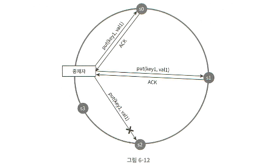

> ❗느슨한 정족수의 가용성이 더 높은 이유
>
> **안정 해시를 적용한 해시링 구조인 경우 ⇒ 특정 key가 저장되어야하는 노드가 정해져있다.**
> 
> - 이 특정 key를 저장해야 하는 노드가 대상 노드 N개이다.
> - 해시링에 A,B,C,D,E,F,G 6개의 노드가 있다고 가정
> - 대상 key를 저장해야하는 노드는 A,B,C,D 4개의 노드
> - 이 중 A,B 노드에 장애 발생
> - W=3 (즉 3개 이상의 노드로부터 성공 응답을 받아야함)
> 
> **엄격한 정족수일 때**
> 
> - A,B,C,D 4개 중 A,B에 장애가 있으므로 3개의 노드로부터 성공 응답을 받을 수 없다. (장애 없는 노드가 2개뿐)
> - ⇒ 장애 복구되기 전까지 대기해야한다.
> 
> **느슨한 정족수 일 때**
> 
> - A,B,C,D 4개 중 A,B에 장애가 있으므로 A,B를 제외하고 C,D,E,F,G(장애 없는 노드들)에서 건강한 노드 W개를 선택한다.
> - C,D,E가 선택되었다면, E는 원래 대상 key를 저장해야할 노드가 아니지만 **hint를 남겨서 A,B대신에 작업을 수행한다.**
>     - A,B가 복구된 후에 힌트를 통해 데이터를 A,B로 전달한다.

### 장애 처리: 영구적 장애 처리

**반-엔트로피(aniti-entropy) 프로토콜**

사본들을 비교하여 최신 버전으로 갱신한다.

- 사본 간 일관성이 깨진 상태를 탐지하고 전송 데이터 양을 줄이기 위해 **머클(Merkle) 트리 사용**

**머클 트리**

- 해시 트리라고도 불린다.
- 각 노드에 아래 값을 라벨로 붙여두는 트리
    - 자식 노드가 종단(leaf)노드인 경우: 자식 노드들에 보관된 값의 해시
    - 그 외: 자식 노들의 라벨로부터 계산된 해시
- 대규모 자료구조의 내용을 효과적이고 보안상 안전하게 검증할 수 있다.

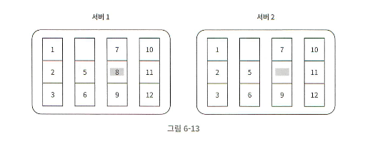

1단계

- 키 공간이 1~12일 때, 키 공간을 버킷으로 나눈다. (예제에서는 버킷이 4개)

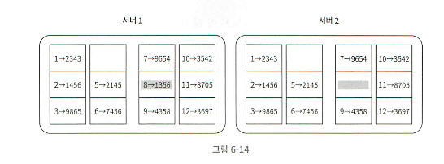

2단계

- 버킷에 호담된 각각의 키에 균등 분포 해시 함수를 적용해서 해시값을 계산한다.
    - 키 공간의 인덱스(번호)에 적용하는건가? 아니면 버킷에 있는 모든 키를 합해서 해시값 계산?

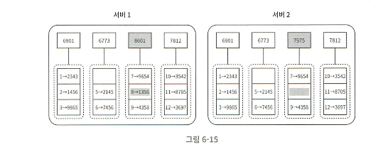

3단계

- 버킷별로 해시값을 계산한 후, 계산 결과를 라벨로 가지는 노드를 만든다.
    - 앞의 머클트리 설명에서 자식 노드가 leaf node인 경우에 해당한다.
    - 따라서, 하나의 버킷도 노드라고 본다. (자식노드로 취급)

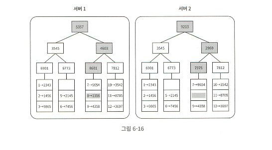

4단계

- 자식 노드의 라벨로부터 새로운 해시값을 계산 → 이진 트리를 상향식으로 구성한다.

**머클 트리를 통해 일관성이 깨진 버킷을 찾는 방법**

루트 노드부터 시작해서 하향식으로 해시값을 비교한다.

- 해시값 == 해당 노드의 라벨값
1. 루트 노드의 해시값이 동일하면 이 트리는 동일한 것이므로, 자식 노드를 검사할 필요가 없다.
2. 루트 노드의 해시값이 다르면 자식 노드로 내려가서, 좌 → 우 방향으로 노드들의 해시값을 비교한다.
    - 다른 해시값을 가지는 노드만 찾을 수 있으므로, 이에 대해서만 버킷을 동기화한다.
- 실제 대규모 시스템에서는 버킷의 크기가 크다는 것을 염두에 두어야한다.

### 장애 처리: 데이터 센터 장애 처리

데이터 센터 장애에 대응하기 위해서는 여러 데이터 센터에 데이터를 다중화하여 저장해야한다.

### 시스템 아키텍처 다이어그램

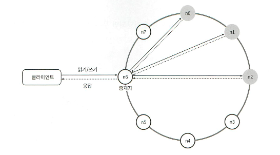

- 클라이언트: 키-값 저장소에 put, get API로 접근 가능
- 중재자: 분산된 키-값 저장소에 대한 proxy 역할 (클라이언트는 proxy와 통신하게된다.)
- 노드: 안정해시의 해시 링 위에 분포
    - 노드는 완전 분산
    - 데이터는 여러 노드에 다중화
    - 모든 노드가 동일한 책임을 지므로, SPOF가 없다.

### 분산 시스템에서의 R/W 요청 처리

> 카산드라의 예시
>

**쓰기**

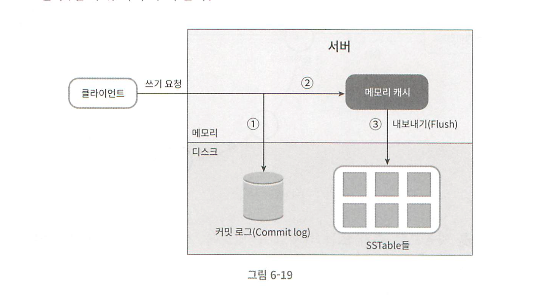

1. 쓰기 요청이 커밋 로그에 기록

> ❓커밋 로그란?
>
> - 디스크에 데이터가 저장되기 전에 커밋 로그를 남기는걸 WAL(Write Ahead Log)라고 부른다.
> - 주로 데이터를 저장하기 전에 저장소가 비정상 종료되는 상황에서 데이터를 복구하는 용도로 사용한다. (RDS와 유사한듯) ⇒ 디스크에 저장
> - 메모리에 있는 데이터가 모두 디스크로 flush 되면, 그 시점에 커밋 로그도 함께 비워진다.

2. 데이터가 메모리 캐시에 기록
3. 메모리 캐시가 가득차거나, 메모리 캐시에 쓸 수 있는 양 임계치에 도달하면 **디스크에 있는 SSTable에 기록**
   - SSTable: Sorted-String Table
   - <키-값> 순서쌍을 정렬된 리스트 형태로 관리한다.
   - ❓메모리에 있는 데이터를 디스크로 보내는 규칙?

**읽기**

1. 요청된 데이터가 메모리에 있는지 확인한다.
    1. 캐시 hit인 경우, 메모리에서 반환한다.
    2. 캐시 miss인 경우, 2번 과정을 진행한다.
2. 블룸 필터(Bloom Filter)를 검사하여 찾는 키가 어느 SSTable에 있는지 확인한다.
    1. 블룸 필터는 디스크에 위치한다.
    - ❓어떤 원리지?
3. SSTable에서 데이터를 조회한다.
4. 데이터를 클라이언트에게 반환한다.
    > - ❓조회한 데이터를 메모리에 저장하진 않는지?
    > - 카산드라는 **Write 데이터만 메모리에 저장하고, read 데이터는 따로 메모리에 저장하지 않는다.**
    > - 따로 LRU, LFU 같은 정책이 적용되는 구조가 아니기 때문에 read 데이터를 굳이 메모리에 올리지 않는다고 생각하면 될듯