# 6장. 키-값 저장소 설계
- 성능상의 이유로, 키는 짧을수록 좋다
- 키-값 저장소는 보통 값은 무엇이 오든 크게 상관 없다.
- 키-값 저장소로 널리 알려진 것으로는 아마존 다이나모, memcached, 레디스 같은 것들이 있다
  - ❓ 대표적인 차이점이 무엇일까?

## 문제 이해 및 설계 범위 확정
- 키-값 쌍의 크기는 10KB 이하이다.
  > 10KB = 10000 Byte <br>
  > UTF-8 인코딩: 1~4바이트/문자 → 2,500~10,000자
- 큰 데이터를 저장할 수 있어야 한다.
- 높은 가용성을 제공해야 한다. 따라서 시스템은 설사 장애가 있더라도 빨리 응답해야 한다.
- 높은 규모 확장성을 제공해야 한다. 따라서 트래픽 양에 따라 자동적으로 서버 증설/삭제가 이루어져야 한다.
- 데이터 일관성 수준은 조정이 가능해야 한다.
- 응답 지연시간이 짧아야 한다.

## 단일 서버 키-값 저장소
- 한 대 서버만 사용하는 키-값 저장소 설계로 가장 직관적인 방법은 키-값 쌍 전부를 **메모리에 해시 테이블로 저장하는 것**이다.

    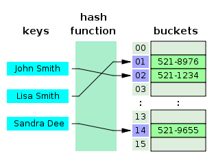
    - 이는 빠른 속도를 보장하기는 하지만 모든 데이터를 메모리 안에 두는 것이 불가능할 수도 있다
- 해결책으로는 1) 데이터 압축 / 2) 자주 쓰이는 데이터만 메모리에 두고 나머지는 디스크에 저장
  > ✅ 데이터 압축
  > - 압축 알고리즘 적용: **LZF, LZ4, Zstandard 등 고속 압축 알고리즘**을 사용하여 데이터 크기 감소

## 분산 키-값 저장소
### CAP정리
- 데이터 일관성 (Consistency), 가용성 (Availability), 파티션 감내 (Partition Tolerance) 라는 **세 가지 요구사항을 동시에 만족하는 분산 시스템을 설계하는 것은 불가능하다**는 정리
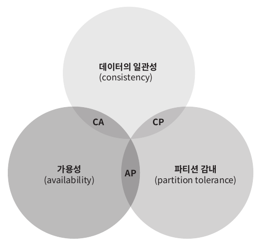
- 데이터 일관성
  - 분산 시스템에 접속하는 모든 클라이언트는 어떤 노드에 접속했느냐와 관계 없이 **언제나 같은 데이터**를 보게 되어야 한다.
- 가용성
  - 분산 시스템에 접속하는 클라이언트는 **일부 노드에 장애가 발생하더라도 항상 응답을 받을 수 있어야** 한다.
- 파티션 감내
  - 파티션은 두 노드 사이에 통신 장애가 발생하였음을 의미한다. 
  - 즉, 파티션 감내는 **네트워크에 파티션이 생기더라도 시스템이 계속 동작해야 한다**는 것을 뜻한다.
- 3가지 요구사항 중 어떤 두 가지를 만족하냐에 따라 다음과 같이 분류할 수 있다.
  - CP시스템
  - AP시스템
  - CA시스템
- 다만 통상 네트워크 장애는 피할 수 없는 것으로 여겨지기 때문에 **분산시스템은 반드시 파티션 문제를 감내할 수 있도록 설계되어야 한다.** 따라서 CA시스템은 실질 존재하지 않는다.
> ✅ **CP, AP 시스템 추가 예시**
> - MongoDB (CP 시스템)
> 
>   - 비동기 복제를 사용하여 데이터의 여러 복사본을 분산시킨다
>   - 주요 구성 요소
>     - **프라이머리: 모든 쓰기 작업을 처리하는 마스터 노드**
>     - 세컨더리: 프라이머리로부터 데이터를 복제받아 동일한 데이터 세트를 유지하는 노드
>    - 기본적으로 프라이머리가 모든 읽기와 쓰기를 처리하는데, 프라이머리 실패 시 새로운 프라이머리 선출에 최대 12초가 소요됨
>    - **선출 과정 동안 모든 쓰기 작업이 중단됨**
> - Cassandra (AP 시스템)
> 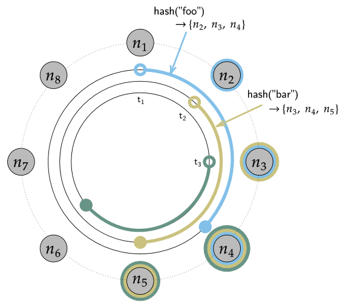
>   - 카산드라는 Peer-to-peer 시스템
>     - 즉, 카산드라는 프라이머리 노드 없이 **모든 노드가 읽기 작업과 쓰기 작업을 수행할 수 있고 복제본을 분리된 다른 노드에 저장**
>   - 프라이머리 노드 없이 모든 노드가 같은 작업을 수행하므로 SPOF가 없다는 장점이 있음
>   - 데이터는 복제 팩터 (데이터 복제본의 수) 에 따라 복제되며, 안정해시 기반 데이터 파티셔닝 제공
>   - 파티션이 발생해서 복제본이 업데이트된 데이터 사본을 받지 못하는 상황이 발생할 수 있으나, 다른 노드들은 여전히 사용자가 사용할 수 있으므로 데이터 일관성이 깨짐
>   - 그러나 Cassandra는 **최종 일관성(eventual consistency)** 제공
>     - 즉, 모든 노드간 데이터가 동기화되기 전까지 각 노드는 서로 다른 버전의 데이터를 가지고 있을 수 있음
>     - 카산드라가 최종 일관성을 보장하는 방법
>       - 복제 팩터: 데이터의 복제본 수를 결정하여 여러 노드에 데이터를 분산 저장
>       - [일관성 수준 설정](https://devlog-wjdrbs96.tistory.com/444): 읽기/쓰기 작업에 대한 일관성 수준 조절 가능
>       - 읽기 복구: 일관성이 맞지 않는 데이터를 발견하면 자동으로 최신 데이터로 업데이트
>       - 가십 프로토콜: 노드 간 주기적인 데이터 동기화를 통해 일관성 유지 (Cassandra의 모든 노드는 데이터 및 노드 상태에 대한 정보를 브로드캐스트하는 가십 프로토콜이라는 피어 투 피어 통신 프로토콜을 통해 서로 통신)
> - Reference
>   - https://www.instaclustr.com/blog/cassandra-vs-mongodb/
>   - https://www.analyticsvidhya.com/blog/2020/08/a-beginners-guide-to-cap-theorem-for-data-engineering/#h-understanding-cp-with-mongodb

#### 이상적 상태
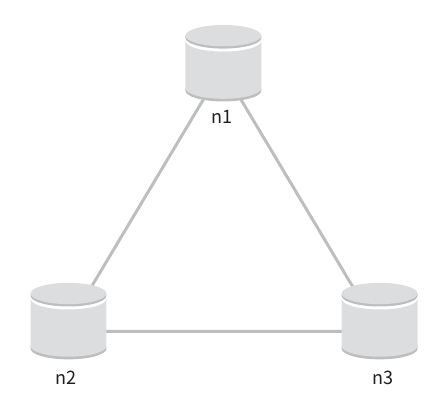
- 이상적 환경이라면 네트워크가 파티션되는 상황은 절대로 일어나지 않을 것이다.

#### 실세계의 분산 시스템
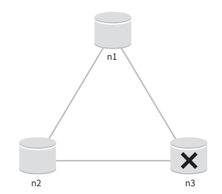
- 분산 시스템은 파티션 문제를 피할 수 없다.
- n3에 장애가 발생하여 n1및 n2와 통신할 수 없으면 클라이언트가 n1, n2에 기록한 데이터가 n3에 전달되지 않는다. 또한 n3에 기록되었으나 아직 n1, n2로 전달되지 않은 데이터가 있다면 n1와 n2는 오래된 사본을 갖고 있을 것이다.
- 가용성 대신 일관성을 선택했다면(CP시스템) 세 서버 사이에 생길 수 있는 **데이터 불일치 문제를 피하기 위해 n1과 n2에 대해 쓰기 연산을 중단시켜야 하는데**, 그렇게 하면 가용성이 깨진다.
  - **은행권의 경우 데이터 일관성을 양보하지 않는다** ex. 온라인 뱅킹 시스템이 계좌 최신 정보를 출력하지 못한다면 큰 문제일 것이다.
  - 이와 같이 만약에 일관성이 깨질 수 있는 상황이 발생하면 이런 시스템은 **상황이 해결될 때 까지는 오류를 반환해야 한다.**
- 반대로 일관성 대신 가용성을 선택한다면(AP시스템) 낡은 데이터를 반환할 위험이 있다고 해도 계속 읽기 연산을 허용해야 한다. 그리고 n1과 n2에서는 계속 쓰기 연산을 허용할 것이고, 파티션 문제가 해결된 후에 새 데이터를 n3에 전송할 것이다.


### 시스템 컴포넌트
- 키-값 저장소 구현에 사용될 핵심 컴포넌트들 및 기술들을 살펴본다.
  - 데이터 파티션
  - 데이터 다중화
  - 일관성
  - 일관성 불일치 해소
  - 장애 처리
  - 시스템 아케텍처 다이어그램
  - 쓰기 경로
  - 읽기 경로
  - 데이터 파티션

#### 데이터 파티션
- 대규모 어플리케이션에서 전체 데이터를 한 대 서버에 욱여넣는 것은 불가능하므로, 가장 단순한 해결책은 **데이터를 작은 파티션들로 분할한 다음 여러 대의 서버에 저장하는 것**이다.
- 데이터를 파티션 단위로 나눌 때는 다음 두 가지 문제를 중요하게 살펴보아야 한다.
  - 데이터를 여러 서버에 고르게 분산할 수 있는가
  - 노드가 추가되거나 삭제될 때 데이터의 이동을 최소화 할 수 있는가
- 이전 장에 배운 안정 해시가 이런 문제를 푸는 데 적합한 기술이다.
- 안정해시를 사용하여 데이터를 파티셔닝하면 좋은 점
  - **규모 확장 자동화**
    - 시스템 부하에 따라 서버가 자동으로 추가되거나 삭제 가능 -> ➕ 하지만 안정해시만으로는 서버 자동 추가/삭제가 가능하지 않음. 왜냐하면 안정해시는 서버 추가/삭제 시 데이터 재배치를 최소화하기 위한 기술일 뿐이므로 자동화된 서버 관리를 위해선 추가구현 필요.
  - **다양성**
    - 각 서버의 용량에 맞게 가상 노드의 수를 조정할 수 있다.
    - 즉, 고성능 서버는 더 많은 가상 노드를 갖도록 설정할 수 있다. -> ➕ s1,s2,s3 서버가 있을 때 s1 이 고성능 서버라면 s2,s3 와 다른 개수의 가상 노드 설정 가능.

#### 데이터 다중화
- 높은 가용성과 안정성을 확보하기 위해서는 **데이터를 N개 서버에 비동기적으로 다중화**할 필요가 있다.
  - 여기서 N은 튜닝 가능한 값
- N개 서버를 선정하는 방법은 어떤 키를 해시 링 위에 배치한 후, 그 지점으로부터 시계 방향으로 **링을 순회하면서 만나는 첫 N개 서버에 데이터 사본을 보관하는 것**이다
- 가상 노드를 사용한다면 위와 같이 선택한 N개의 노드가 대응될 실제 물리 서버의 개수가 N보다 작아질 수 있다.
이를 해결하기 위해서는 **같은 물리 서버를 중복 선택하지 않도록 해야 한다.**
  - ➕ N=3 인데 해시 링을 순회하며 3개의 가상 노드 선택 시 s1_2, s1_3, s2_1 일 경우에는 3개의 가상 노드를 선택했지만 실제 물리서버 대수가 2인 상황이 됨.
- 같은 데이터 센터에 속한 노드는 정전, 네트워크 이슈 등의 문제를 동시에 겪을 가능성이 있다. 따라서 안정성을 담보하기 위해 **데이터의 사본은 다른 센터의 서버에 보관하고, 센터들은 고속 네트워크로 연결한다.**
  > ✅ 안정 해시 구현 시 사용할 수 있는 방법
  > - 데이터 센터 인식 파티셔닝: 해시 링에 노드를 배치할 때 각 데이터 센터의 노드를 번갈아가며 배치
  >   - 가상 노드 식별자 생성: 각 물리적 서버에 대해 여러 개의 가상 노드를 생성할 때, 데이터 센터 ID를 포함시킴. ex) "DC1-Server1-VNode1", "DC2-Server1-VNode1" 등의 형식으로 식별자 생성
  >   - 해시 함수 수정: 가상 노드의 해시 값을 계산할 때, 데이터 센터 ID를 고려하는 해시 함수 사용. 이를 통해 같은 데이터 센터의 노드들이 해시 링에서 연속적으로 배치되는 것을 방지 가능
  > - 복제 전략 수립: 데이터의 복제본을 다른 데이터 센터의 노드에 저장하도록 설정
  > - 고속 네트워크 연결: 데이터 센터 간 고속 네트워크를 구축하여 효율적인 데이터 복제와 동기화를 가능하게 함

#### 데이터 일관성
- **여러 노드에 다중화된 데이터는 적절히 동기화가 되어야 한다.**
- 정족수 합의(Quorum Consensus) 프로토콜을 사용하면 읽기/쓰기 연산 모두에 일관성을 보장할 수 있다.
  - N=사본 개수
  - W=쓰기 연산에 대한 정족수. 쓰기 연산이 성공한 것으로 간주되려면 **적어도 W개의 서버로부터 쓰기 연산이 성공했다**는 응답을 받아야 한다.
  - R=읽기 연산에 대한 정족수. 읽기 연산이 성공한 것으로 간주되려면 **적어도 R개의 서버로부터 응답**을 받아야 한다.
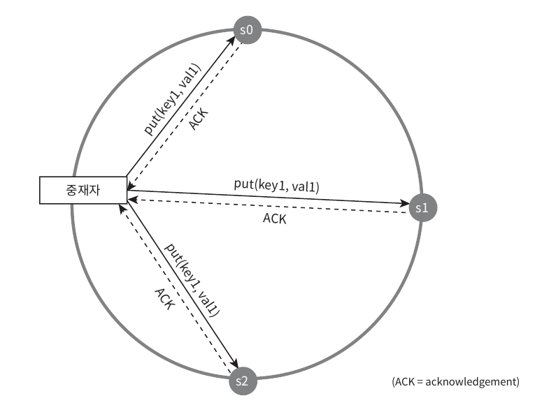
- 중재자는 클라이언트와 노드 사이에서 프록시 역할을 한다
  > ❓ 중재자는 보통 어떤 컴포넌트로 구현되는지?
  > <br>= 어떠한 컴포넌트들이 클라이언트 <-> 노드 사이의 프록시 역할을 하면서, 정족수 합의 프로토콜을 구현할 수 있는지?
  > 
  > - Kubernetes 의 etcd (모든 클러스터 데이터를 백업하는 Key-value 저장소)
  >   - Etcd는 Replicated state machine(이하 RSM) 으로, RSM 은 분산 컴퓨팅 환경에서 서버가 몇 개 다운되어도 잘 동작하는 시스템을 만들고자 할 때 선택하는 방법의 하나이다.
    >   - etcd는 하나의 write 요청을 받았을 때, 쿼럼 숫자만큼의 서버에 데이터 복제가 일어나면 작업이 완료된 것으로 간주하고 다음 작업을 받아들일 수 있는 상태가 됨

  >   - ex. RSM을 구성하는 서버의 숫자가 3대인 경우 쿼럼 값은 2(3/2+1) 
  >     - 여기서 쿼럼 수식이 N(서버 수)/2+1 인 이유는 다수의 합의 요청이 가능하기 위함이다
  >     - 보통 클러스터 수는 홀수 개의 노드로 구성한다고 함. ref; [반드시 클러스터 노드의 수가 짝수가 되면 안 되는 건가?](https://judo0179.tistory.com/entry/Apache-Kafka-%ED%81%B4%EB%9F%AC%EC%8A%A4%ED%84%B0-%EA%B5%AC%EC%84%B1%EC%9D%84-%ED%99%80%EC%88%98%EB%A1%9C-%ED%95%98%EB%8A%94-%EC%9D%B4%EC%9C%A0#:~:text=%EB%B0%98%EB%93%9C%EC%8B%9C%20%ED%81%B4%EB%9F%AC%EC%8A%A4%ED%84%B0%20%EB%85%B8%EB%93%9C%EC%9D%98%20%EC%88%98%EA%B0%80%20%EC%A7%9D%EC%88%98%EA%B0%80%20%EB%90%98%EB%A9%B4%20%EC%95%88%20%EB%90%98%EB%8A%94%20%EA%B1%B4%EA%B0%80%3F)
  
- W, R, N의 값을 정하는 것은 `응답 지연`과 `데이터 일관성` 사이의 타협점을 찾는 전형적인 과정이다.
  - W=1 또는 R=1의 구성인 경우, 중재자는 한 대의 서버로부터의 응답만을 받으면 되기 때문에 응답속도는 빠를 것이다.
  - 만약 W, R 의 값이 이보다 큰 경우 데이터 일관성의 수준은 향상되지만 응답 속도는 느려질 것이다.
  - W+N > N의 경우에는 강한 일관성이 보장된다.
    - 일관성을 보증할 최신 데이터를 가진 노드가 최소 하나는 겹칠 것이기 때문이다.
- 가능한 W, R, N 의 구성
  - R=1, W=N : **빠른 읽기 연산**에 최적화된 시스템
  - W=1, R=N : **빠른 쓰기 연산**에 최적화된 시스템
  - W+R > N : **강한 일관성 보장** (보통 N=3, W=R=2)
  - W+R <= N : 강한 일관성이 보장되지 않는다.
  > ❓ 일관성을 보장하게 되는 최종 시점도 중요하지 않은지? 왜 시간에 대한 언급이 없나.. 
  > <br> ex. 1분에 1회씩은 W+R>N 을 보장한다거나.. 무작정 W+R>N 이 될때까지 기다리진 않을테니까.. 
  > - cassandra 예시 https://cassandra.apache.org/doc/3.11/cassandra/configuration/cass_yaml_file.html
  >   - write_request_timeout_in_ms
  >   - read_request_timeout_in_ms
  > - 타임아웃 설정을 통해서 보장 가능. 실제 타임아웃에 걸리면 `(ReadTimeoutException): Cassandra timeout during read query at consistency QUORUM (2 responses were required but only 1 replica responded) after nodetool cleanup` 이런식으로 에러가 발생함

#### 일관성 모델
- 일관성 모델은 데이터 일관성의 수준을 결정하는데, 종류가 다양하다.
- **강한 일관성**
  - 모든 읽기 연산은 가장 최근에 갱신된 결과를 반환한다.
  - 다시 말해서 클라이언트는 **절대로 낡은 데이터를 보지 못한다.**
- **약한 일관성**
  - 읽기 연산은 가장 **최근에 갱신된 결과를 반환하지 못할 수 있다.**
- **결과적 일관성**
  - 약한 일관성의 한 형태로, **갱신 결과가 결국에는 모든 사본에 반영(즉, 동기화) 되는 모델**이다.
- 강한 일관성을 달성하는 일반적인 방법은, **모든 사본에 현재 쓰기 연산의 결과가 반영될 때까지 해당 데이터에 대한 읽기/쓰기를 금지하는 것**이다.
  - 이 방법은 고가용성 시스템에는 적합하지 않다
- 결과적 일관성 모델을 따를 경우 쓰기 연산이 병렬적으로 발생하면 시스템에 저장된 값의 일관성이 깨어질 수 있는데, 이 문제는 클라이언트가 해결해야 한다.

#### 비 일관성 해소 기법 : 데이터 버저닝
- 데이터를 다중화하면 가용성은 높아지지만 사본 간 일관성이 깨질 가능성이 높이진다.
  - `버저닝` 과 `벡터 시계` 는 이 문제를 해소하기 위해 등장한 기술이다.
- 버저닝 : **데이터를 변경할 때마다 해당 데이터의 새로운 버전을 만드는 것**
  - 따라서 각 버전의 데이터는 변경 불가능

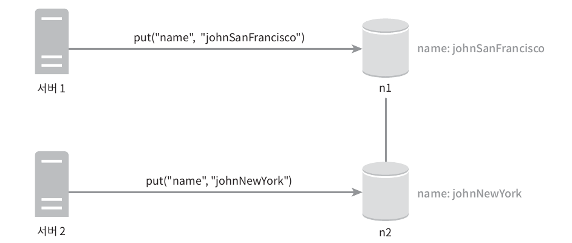
- 이 변경이 이루어진 이후에 원래 값은 무시할 수 있는데, 변경이 끝난 옛날 값이어서이다.
- 두 버전 v1, v2사이의 충돌을 해결하려면, **충돌을 발견하고 자동으로 해결해 낼 버저닝 시스템**이 필요하다.
  - 벡터 시계는 이런 문제 해결에 보편적으로 사용되는 기술이다.
- 벡터 시계는 [서버, 버전]의 순서쌍을 데이터에 매단 것이다.
  - 벡터 시계는 D([S1, v1], [S2, v2] ... [Sn, vn])와 같이 표현한다고 가정하자.
  - D는 데이터, vi는 카운터, si는 서버 번호이다.
- 만일 데이터 D를 서버 Si에 기록하면, 시스템은 아래 작업 가운데 하나를 수행해야 한다.
  - [Si, vi]가 있다면 vi를 증가시킨다.
  - 그렇지 않으면 새 항목[Si, 1]를 만든다.

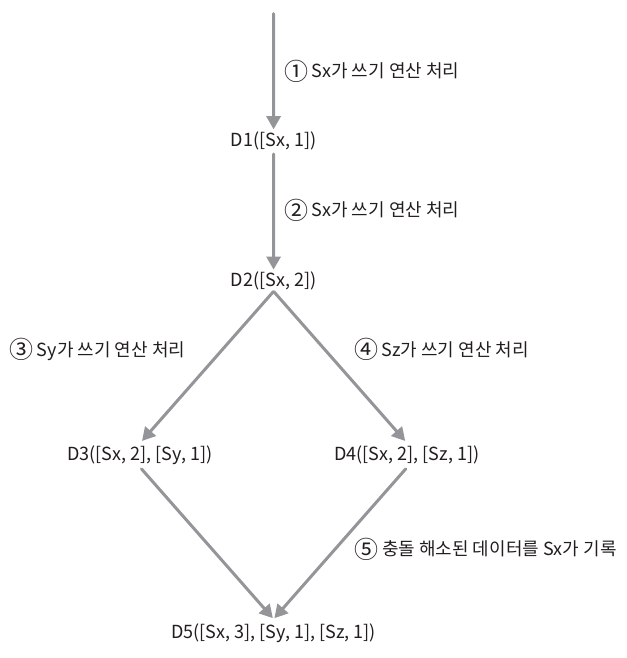

1. 클라이언트가 데이터 D1을 시스템에 기록한다.
<br>이 쓰기 연산을 처리한 서버는 Sx이므로 벡터 시계는 `D1[(Sx, 1)]`으로 변한다.
2. 다른 클라이언트가 데이터 D1을 읽고 D2로 업데이트 한 다음 기록한다. <br>D2는 D1에 대한 변경이므로 D1을 덮어쓴다. <br>이 때 쓰기 연산은 같은 서버 Sx가 처리한다고 가정하면 벡터 시계는 `D2([Sx, 2])`로 바뀔 것이다.
3. 다른 클라이언트가 D2를 읽어 D3로 갱신한 다음 기록한다. <br>이 쓰기 연산은 Sy가 처리한다고 가정하면 벡터 시계 상태는 `D3([Sx, 2], [Sy, 1]])`로 바뀐다.
4. 또 다른 클라이언트가 D2를 읽고 D4로 갱신한 다음 기록한다. <br>이 때 쓰기 연산은 서버 Sz가 처리한다고 가정하면 벡터 시계는 `D4([Sx, 2], [Sz, 1])`일 것이다.
5. 어떤 클라이언트가 D3와 D4를 읽으면 데이터 간 충돌이 있다는 것을 알게 된다. (두 버전 모두 D2([Sx, 2])를 기반으로 함. 이는 D2에서 분기가 발생했음을 의미)<br>D2를 Sy와 Sz가 각기 다른 값으로 바꾸었기 때문이다. 이 충돌은 클라이언트가 해소한 후에 서버에 기록한다. <br>이 쓰기 연산을 처리한 서버는 Sx였다고 하면 벡터 시계는 `D5([Sx, 3], [Sy, 1], [Sz, 1])`로 바뀐다. 

- 벡터 시계를 사용하면 어떤 버전 X가 버전 Y의 이전 버전인지(따라서 충돌이 없는지) 쉽게 판단할 수 있다.
  - **버전 Y에 포함된 모든 구성요소의 값이 X에 포함된 모든 구성요소 값보다 같거나 큰지만** 보면 된다.
- 버전 X와 Y사이에 충돌이 있는지 보려면 **Y의 벡터 시계 구성요소 가운데 X의 벡터 시계 동일 서버 구성요소보다 작은 값을 갖는 것이 있는지 확인해 보면 된다.**
- 벡터 시계를 사용해 충돌을 감지하고 해소하는 방법의 2가지 단점
  - 충돌 감지 및 해소 로직이 클라이언트에 들어가야 하므로, 클라이언트 구현이 복잡해진다.
  - [서버:버전] 의 순서쌍 개수가 굉장히 빨리 늘어난다
    - 따라서 길이에 임계치를 정하고, 임계치 이상으로 길이가 길어지면 오래된 순서쌍을 벡터 시계에서 제거하도록 해야 한다
> - 위에서 말하는 클라이언트 == 저장소 시스템과 상호작용하는 소프트웨어 컴포넌트
> - 애플리케이션 서버, 데이터베이스 클라이언트 라이브러리 일 수 있음.
> - 애플리케이션 서버가 클라이언트라고 가정한다면, 아래와 같은 코드를 짤 수 있음
```java
  public class VectorClockClient {
    // 벡터 시계를 저장하는 맵. 키는 서버 ID, 값은 해당 서버의 버전
    private Map<String, Integer> vectorClock;

    // 생성자: 빈 벡터 시계로 초기화
    public VectorClockClient() {
        this.vectorClock = new HashMap<>();
    }

    // 특정 서버의 버전을 업데이트하는 메소드
    public void update(String server, int version) {
        // 현재 저장된 버전과 새 버전 중 더 큰 값을 선택하여 저장
        vectorClock.put(server, Math.max(vectorClock.getOrDefault(server, 0), version));
    }

    // 다른 벡터 시계와 충돌을 감지하는 메소드
    public boolean detectConflict(Map<String, Integer> otherClock) {
        // 현재 벡터 시계의 각 서버에 대해
        for (String server : vectorClock.keySet()) {
            if (otherClock.containsKey(server)) {
                // 현재 벡터 시계의 버전이 더 크면 충돌
                if (vectorClock.get(server) > otherClock.get(server)) {
                    return true;
                }
            }
        }
        // 다른 벡터 시계의 각 서버에 대해
        for (String server : otherClock.keySet()) {
            if (vectorClock.containsKey(server)) {
                // 다른 벡터 시계의 버전이 더 크면 충돌
                if (otherClock.get(server) > vectorClock.get(server)) {
                    return true;
                }
            }
        }
        // 충돌이 없으면 false 반환
        return false;
    }

    // 충돌을 해결하고 병합된 벡터 시계를 반환하는 메소드
    public Map<String, Integer> resolveConflict(Map<String, Integer> otherClock) {
        // 현재 벡터 시계를 복사하여 새로운 맵 생성
        Map<String, Integer> resolvedClock = new HashMap<>(vectorClock);
        // 다른 벡터 시계의 각 항목에 대해
        for (Map.Entry<String, Integer> entry : otherClock.entrySet()) {
            // 두 벡터 시계 중 더 큰 버전을 선택하여 병합된 시계에 저장
            resolvedClock.put(entry.getKey(), Math.max(resolvedClock.getOrDefault(entry.getKey(), 0), entry.getValue()));
        }
        // 병합된 벡터 시계 반환
        return resolvedClock;
    }
}

// 그래서 데이터를 읽을 때 충돌 발생한 것을 클라이언트 (애플리케이션 서버) 가 감지하고 해소
public Data read(String key) {
    ServerResponse response = server.read(key);
    Data data = response.getData();
    Map<String, Integer> serverClock = response.getVectorClock();

    if (vectorClockClient.detectConflict(serverClock)) {
        // 충돌 발생, 해결 로직 실행
        resolveConflict(key, data, serverClock);
    } else {
        // 충돌 없음, 로컬 벡터 시계 업데이트
        vectorClockClient.update(serverId, serverClock.get(serverId));
    }

    return data;
}
```

#### 장애 감지
- 보통 **두 대 이상의 서버가 똑같이 서버 A의 장애를 보고해야** 실제로 해당 서버에 장애가 발생했다고 간주한다

  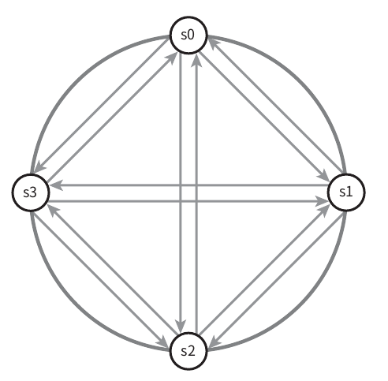
  - 모든 노드 사이에 멀티캐스팅 채널을 구축하는 것이 서버 장애를 감지하는 가장 손쉬운 방법이지만 이 방식은 서버가 많을 때에는 비효율적이다
- `가십 프로토콜` 같은 **분산형 장애 감지 솔루션을 채택**하는 편이 더 효율적이다.
  - 각 노드는 멤버십 목록 (각 멤버 ID 와 그 박동 카운터 쌍의 목록) 을 유지한다
  - 각 노드는 주기적으로 자신의 박동 카운터를 증가시킨다.
  - 각 노드는 무작위로 선정된 노드들에게 주기적으로 자기 박동 카운터 목록을 보낸다.
  - 박동 카운터 목록을 받은 노드는 멤버십 목록을 최신 값으로 갱신한다.
  - 어떤 멤버의 박동 카운터 값이 지정된 시간 동안 갱신되지 않으면, 해당 멤버는 장애 상태인 것으로 간주한다.

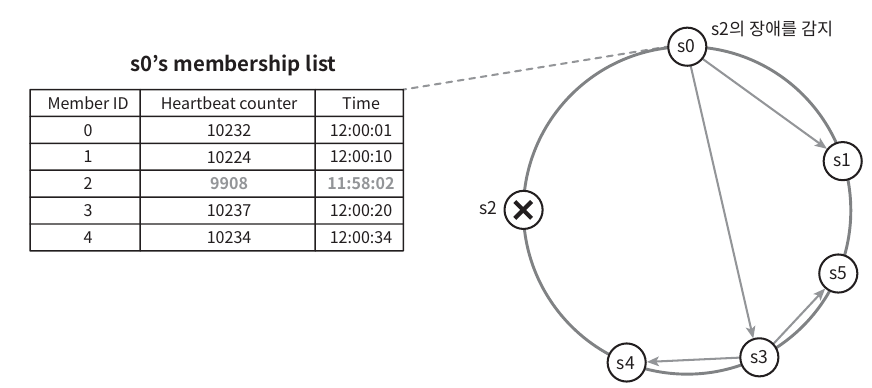
- 노드 s0은 그림 좌측의 테이블과 같은 멤버십 목록을 가진 상태이다.
- 노드 s0은 노드 s2 (멤버ID=2)의 박동 카운터가 오랫동안 증가되지 않았다는 것을 발견한다.
- 노드 s0은 노드 s2를 포함하는 박동 카운터 목록을 무작위로 선택된 다른 노드에게 전달한다.
- 노드 s2의 박동 카운터가 오랫동안 증가되지 않았음을 발견한 모든 노드는 해당 노드를 장애 노드로 표시한다.

#### 일시적 장애 처리
- 가십 프로토콜로 장애를 감지한 시스템은 가용성을 보장하기 위해 필요한 조치를 해야 한다
  - 엄격한 정족수 접근법 사용 : 읽기와 쓰기 연산 금지
  - 느슨한 정족수 접근법 사용 : 이 조건을 완화하여 가용성을 높인다.
    - 장애 상태인 서버로 가는 요청은 다른 서버가 잠시 맡아 처리한다.
      - 장애 서버로 향하는 요청을 감지하면, 시스템은 해시 링에서 다음으로 가까운 정상 서버로 요청을 리다이렉션
    - 그동안의 변경사항은 해당 서버 복구 시 일괄로 반영하여 데이터 일관성을 보존한다.
    - 이를 위해 임시로 쓰기 연산을 처리한 서버에는 그에 관한 단서 (hint) 를 남긴다.
    - 이런 장애 처리 방안을 **단서 후 임시 위탁 기법** (hinted handoff) 라고 부른다.

> ✅ **hinted handoff 실제 예시**
> - 카산드라가 노드 장애시에도 fault tolerance (결함 내성) 을 유지하는 주요 방법 중 하나는 hinted handoff 메커니즘이다
> - cassandra.yaml에서 hinted_handoff_enabled이 true로 설정되어 있으면(기본 설정) 복제 노드 중 하나에 도달 할 수 없을 때 카산드라는 coordinator 노드에 hint를 저장
>   - [coordinator](https://nosqldb.tistory.com/entry/%EC%B9%B4%EC%82%B0%EB%93%9C%EB%9D%BC%EC%9D%98-%EB%85%B8%EB%93%9CNode%EC%97%90-%EC%A0%91%EA%B7%BC-%EC%BD%94%EB%94%94%EB%84%A4%EC%9D%B4%ED%84%B0)
>   - 해당 힌트는 클러스터에 속한 위치에 대한 정보를 포함한다. 
>   - 힌트는 코디네이터 노드의 $CASSANDRA_HOME/data/hints 디렉터리에 있는 플랫 파일에 저장됨. 힌트에는 **힌트 ID**, 변경 사항을 저장할 대상 **복제본 노드**, 복제본 노드로 전달할 수 없는 직렬화된 **변경 사항**(blob으로 저장), **변경 사항 타임스탬프** 및 변경 사항을 직렬화하는 데 사용된 **Cassandra 버전**이 포함됨
>     - Cassandra의 이전 버전에서는 힌트를 힌트 테이블에 저장했는데, 최신 Cassandra 릴리스는 힌트를 저장하기 위해 디스크의 플랫 파일을 사용
> - coordinator가 복제 노드가 다시 정상화되는 것을 알아차리게 되면 hint 정보를 복제 노드에서 replay (코디네이터 노드가 저장해 둔 힌트(hint) 정보를 복구된 복제 노드에 적용하는 과정) 시킨다. 
> - 기본적으로 Cassandra는 hint 대기열이 너무 길어지는 것을 방지하기 위해 최대 3시간 동안 hint를 저장한다. 
>   - cassandra.yaml의 max_hint_window_in_ms 속성(기본 3시간)이 해당 hint가 저장되는 시간을 의미한다. 
>   - max_hin_window_in_ms 시간이 지나면 일관성을 복원하기 위해서 노드가 다시 정상화되었을 때 수동으로 node repair를 실행해야 한다.
> 
> +) AWS DynamoDB 도 hinted handoff 사용한다고 함.
> 
> ref; https://cassandra.apache.org/doc/4.0/cassandra/operating/hints.html

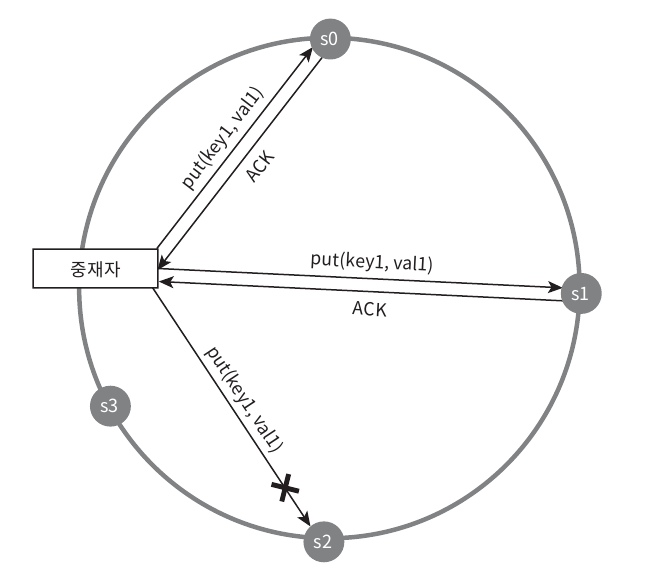

#### 영구 장애 처리
- 단서 후 임시 위탁 기법은 일시적 장애를 처리하기 위한 것이므로 영구적 노드 장애 상태는 다른 처리 방안이 필요하다
- `반-엔트로피 프로토콜`을 구현해서 사본들을 동기화해야 한다.
  - 반-엔트로피 프로토콜은 **사본들을 비교하여 최신 버전으로 갱신하는 과정**을 포함한다.
- 사본 간의 일관성이 망가진 상태를 탐지하고 전송 데이터의 양을 줄이기 위해서는 `머클 트리`를 사용할 것이다.
- 머클 트리 : 해시 트리라고도 불리며 각 노드에 그 자식 노드들에 보관된 값의 해시, 또는 자식 노드들의 레이블로부터 계산된 해시 값을 레이블로 붙여두는 트리

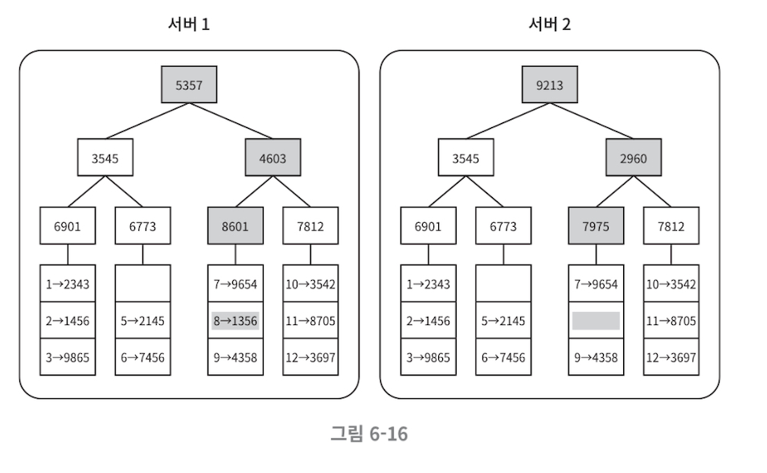
- 루트 노드의 해시 값이 일치하면 두 서버는 같은 데이터를 갖는 것이다
- 그 값이 다를 경우 왼쪽, 오른쪽 자식노드의 해시값을 비교하면서 아래쪽으로 탐색하다보면 다른 데이터를 갖는 버킷을 찾을 수 있으므로 그 버킷들만 동기화하면 된다

#### 데이터 센터 장애 처리
- 데이터 센터 장애는 정전, 네트워크 장애, 자연재해 등 다양한 이유로 발생할 수 있다.
- 데이터 센터 장애에 대응할 수 있는 시스템을 만들려면 데이터를 여러 데이터 센터에 다중화하는 것이 중요하다.

### 쓰기 경로
- 아래 구조는 카산드라의 사례를 참고한 것이다
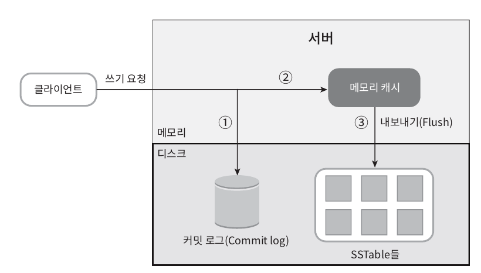
1. 쓰기 요청이 커밋 로그 파일에 기록된다.
2. 데이터가 메모리 캐시에 기록된다.
3. 메모리 캐시가 가득차거나 사전에 정의된 어떤 임계치에 도달하면 데이터는 디스크에 있는 SSTable에 기록된다. 
   - SSTable은 Sorted-String Table의 약어로, <키, 값>의 순서쌍을 정렬된 리스트 형태로 관리하는 테이블

### 읽기 경로
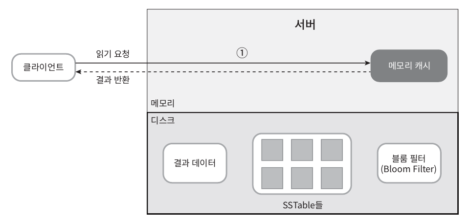
- 데이터가 메모리에 없는 경우에는 디스크에서 가져와야 하며, **어느 SSTable에 찾는 키가 있는지 알아낼 효율적인 방법**으로 `블룸 필터`가 흔히 사용된다.

> ➕ Cassandra
> - 카산드라는 일반적인 DB에서 쓰이는 B-Tree 대신 Log-Structured Merge Tree (LSM Tree) 사용
> - 블룸 필터 : Bloom Filter는 어떤 원소 x가 어떤 집합 A 의 원소인지 확률적으로 판단하는 표시함수 
>  <br>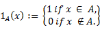
> - 블룸 필러를 이용한 membership query (어떤 집합 A와 어떤 원소 x가 'x가 A에 포함된' 관계인지 묻는 것) 의 결과 값은 '아마도 해당 집합의 원소인 것 같다', 또는 '확실히 해당 집합에 포함된 원소가 아니다'를 뜻한다. <br> 이런 특성 때문에 블룸 필터는 단독으로 사용하는 것보다는 확률적인 방법이 아닌 다른 방법을 보조하는 역할로 사용하는 것이 적합하다

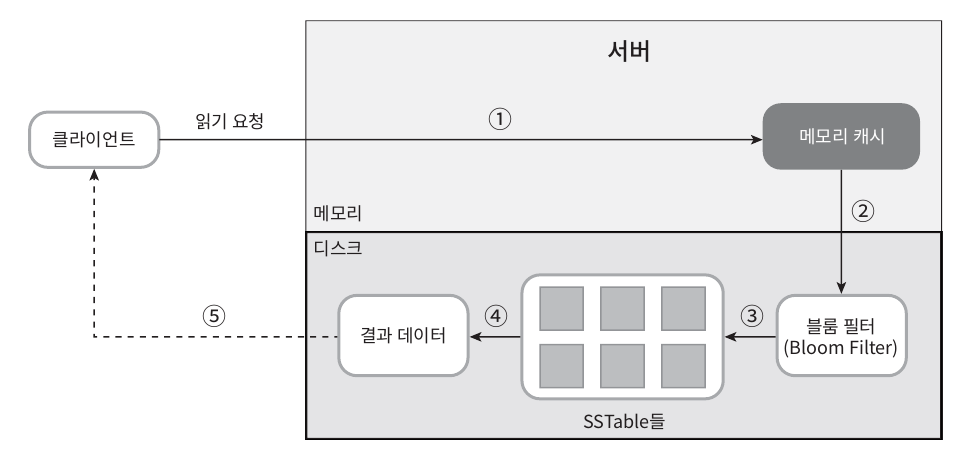
1. 데이터가 메모리 있는지 검사한다. 
2. 데이터가 메모리에 없으므로 블룸 필터를 검사한다.
3. 블룸 필터를 통해 어떤 SSTable에 키가 보관되어 있는지 알아낸다.
4. SSTable에서 데이터를 가져온다.
5. 해당 데이터를 클라이언트에 반환한다.