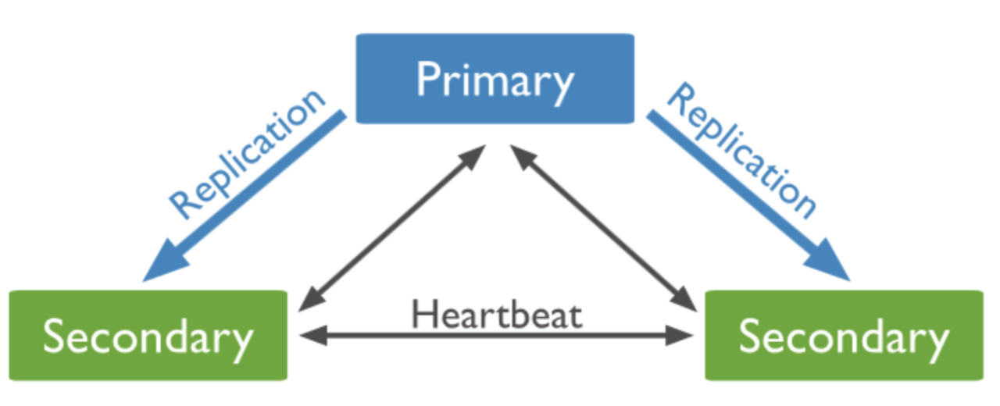

# 6장. 키-값 저장소 설계
- 성능상의 이유로, 키는 짧을수록 좋다
- 키-값 저장소는 보통 값은 무엇이 오든 크게 상관 없다.
- 키-값 저장소로 널리 알려진 것으로는 아마존 다이나모, memcached, 레디스 같은 것들이 있다
  - ❓ 대표적인 차이점이 무엇일까?

## 문제 이해 및 설계 범위 확정
- 키-값 쌍의 크기는 10KB 이하이다.
  > 10KB = 10000 Byte  
  > UTF-8 인코딩: 1~4바이트/문자 → 2,500~10,000자
- 큰 데이터를 저장할 수 있어야 한다.
- 높은 가용성을 제공해야 한다. 따라서 시스템은 설사 장애가 있더라도 빨리 응답해야 한다.
- 높은 규모 확장성을 제공해야 한다. 따라서 트래픽 양에 따라 자동적으로 서버 증설/삭제가 이루어져야 한다.
- 데이터 일관성 수준은 조정이 가능해야 한다.
- 응답 지연시간이 짧아야 한다.

## 단일 서버 키-값 저장소
- 한 대 서버만 사용하는 키-값 저장소 설계로 가장 직관적인 방법은 키-값 쌍 전부를 **메모리에 해시 테이블로 저장하는 것**이다.

    
    - 이는 빠른 속도를 보장하기는 하지만 모든 데이터를 메모리 안에 두는 것이 불가능할 수도 있다
- 해결책으로는 1) 데이터 압축 / 2) 자주 쓰이는 데이터만 메모리에 두고 나머지는 디스크에 저장
  > ✅ 데이터 압축
  > - 압축 알고리즘 적용: **LZF, LZ4, Zstandard 등 고속 압축 알고리즘**을 사용하여 데이터 크기 감소

## 분산 키-값 저장소
### CAP정리
- 데이터 일관성 (Consistency), 가용성 (Availability), 파티션 감내 (Partition Tolerance) 라는 **세 가지 요구사항을 동시에 만족하는 분산 시스템을 설계하는 것은 불가능하다**는 정리

- 데이터 일관성
  - 분산 시스템에 접속하는 모든 클라이언트는 어떤 노드에 접속했느냐와 관계 없이 **언제나 같은 데이터**를 보게 되어야 한다.
- 가용성
  - 분산 시스템에 접속하는 클라이언트는 **일부 노드에 장애가 발생하더라도 항상 응답을 받을 수 있어야** 한다.
- 파티션 감내
  - 파티션은 두 노드 사이에 통신 장애가 발생하였음을 의미한다. 
  - 즉, 파티션 감내는 **네트워크에 파티션이 생기더라도 시스템이 계속 동작해야 한다**는 것을 뜻한다.
- 3가지 요구사항 중 어떤 두 가지를 만족하냐에 따라 다음과 같이 분류할 수 있다.
  - CP시스템
  - AP시스템
  - CA시스템
- 다만 통상 네트워크 장애는 피할 수 없는 것으로 여겨지기 때문에 **분산시스템은 반드시 파티션 문제를 감내할 수 있도록 설계되어야 한다.** 따라서 CA시스템은 실질 존재하지 않는다.
> ✅ **CP, AP 시스템 추가 예시**
> - MongoDB (CP 시스템)
> 
>   - 비동기 복제를 사용하여 데이터의 여러 복사본을 분산시킨다
>   - 주요 구성 요소
>     - **프라이머리: 모든 쓰기 작업을 처리하는 마스터 노드**
>     - 세컨더리: 프라이머리로부터 데이터를 복제받아 동일한 데이터 세트를 유지하는 노드
>    - 기본적으로 프라이머리가 모든 읽기와 쓰기를 처리하는데, 프라이머리 실패 시 새로운 프라이머리 선출에 최대 12초가 소요됨
>    - **선출 과정 동안 모든 쓰기 작업이 중단됨**
> - Cassandra (AP 시스템)
> 
>   - 카산드라는 Peer-to-peer 시스템
>     - 즉, 카산드라는 프라이머리 노드 없이 **모든 노드가 읽기 작업과 쓰기 작업을 수행할 수 있고 복제본을 분리된 다른 노드에 저장**
>   - 프라이머리 노드 없이 모든 노드가 같은 작업을 수행하므로 SPOF가 없다는 장점이 있음
>   - 데이터는 복제 팩터 (데이터 복제본의 수) 에 따라 복제되며, 안정해시 기반 데이터 파티셔닝 제공
>   - 파티션이 발생해서 복제본이 업데이트된 데이터 사본을 받지 못하는 상황이 발생할 수 있으나, 다른 노드들은 여전히 사용자가 사용할 수 있으므로 데이터 일관성이 깨짐
>   - 그러나 Cassandra는 **최종 일관성(eventual consistency)** 제공
>     - 즉, 모든 노드간 데이터가 동기화되기 전까지 각 노드는 서로 다른 버전의 데이터를 가지고 있을 수 있음
>     - 카산드라가 최종 일관성을 보장하는 방법
>       - 복제 팩터: 데이터의 복제본 수를 결정하여 여러 노드에 데이터를 분산 저장
>       - [일관성 수준 설정](https://devlog-wjdrbs96.tistory.com/444): 읽기/쓰기 작업에 대한 일관성 수준 조절 가능
>       - 읽기 복구: 일관성이 맞지 않는 데이터를 발견하면 자동으로 최신 데이터로 업데이트
>       - 가십 프로토콜: 노드 간 주기적인 데이터 동기화를 통해 일관성 유지 (Cassandra의 모든 노드는 데이터 및 노드 상태에 대한 정보를 브로드캐스트하는 가십 프로토콜이라는 피어 투 피어 통신 프로토콜을 통해 서로 통신)
> - Reference
>   - https://www.instaclustr.com/blog/cassandra-vs-mongodb/
>   - https://www.analyticsvidhya.com/blog/2020/08/a-beginners-guide-to-cap-theorem-for-data-engineering/#h-understanding-cp-with-mongodb

#### 이상적 상태

- 이상적 환경이라면 네트워크가 파티션되는 상황은 절대로 일어나지 않을 것이다.

#### 실세계의 분산 시스템

- 분산 시스템은 파티션 문제를 피할 수 없다.
- n3에 장애가 발생하여 n1및 n2와 통신할 수 없으면 클라이언트가 n1, n2에 기록한 데이터가 n3에 전달되지 않는다. 또한 n3에 기록되었으나 아직 n1, n2로 전달되지 않은 데이터가 있다면 n1와 n2는 오래된 사본을 갖고 있을 것이다.
- 가용성 대신 일관성을 선택했다면(CP시스템) 세 서버 사이에 생길 수 있는 **데이터 불일치 문제를 피하기 위해 n1과 n2에 대해 쓰기 연산을 중단시켜야 하는데**, 그렇게 하면 가용성이 깨진다.
  - **은행권의 경우 데이터 일관성을 양보하지 않는다** ex. 온라인 뱅킹 시스템이 계좌 최신 정보를 출력하지 못한다면 큰 문제일 것이다.
  - 이와 같이 만약에 일관성이 깨질 수 있는 상황이 발생하면 이런 시스템은 **상황이 해결될 때 까지는 오류를 반환해야 한다.**
- 반대로 일관성 대신 가용성을 선택한다면(AP시스템) 낡은 데이터를 반환할 위험이 있다고 해도 계속 읽기 연산을 허용해야 한다. 그리고 n1과 n2에서는 계속 쓰기 연산을 허용할 것이고, 파티션 문제가 해결된 후에 새 데이터를 n3에 전송할 것이다.

### 시스템 컴포넌트
- 키-값 저장소 구현에 사용될 핵심 컴포넌트들 및 기술들을 살펴본다.
  - 데이터 파티션
  - 데이터 다중화
  - 일관성
  - 일관성 불일치 해소
  - 장애 처리
  - 시스템 아케텍처 다이어그램
  - 쓰기 경로
  - 읽기 경로
  - 데이터 파티션

#### 데이터 파티션
- 대규모 어플리케이션에서 전체 데이터를 한 대 서버에 욱여넣는 것은 불가능하므로, 가장 단순한 해결책은 **데이터를 작은 파티션들로 분할한 다음 여러 대의 서버에 저장하는 것**이다.
- 데이터를 파티션 단위로 나눌 때는 다음 두 가지 문제를 중요하게 살펴보아야 한다.
  - 데이터를 여러 서버에 고르게 분산할 수 있는가
  - 노드가 추가되거나 삭제될 때 데이터의 이동을 최소화 할 수 있는가
- 이전 장에 배운 안정 해시가 이런 문제를 푸는 데 적합한 기술이다.
- 안정해시를 사용하여 데이터를 파티셔닝하면 좋은 점
  - **규모 확장 자동화**
    - 시스템 부하에 따라 서버가 자동으로 추가되거나 삭제 가능 -> ➕ 하지만 안정해시만으로는 서버 자동 추가/삭제가 가능하지 않음. 왜냐하면 안정해시는 서버 추가/삭제 시 데이터 재배치를 최소화하기 위한 기술일 뿐이므로 자동화된 서버 관리를 위해선 추가구현 필요.
  - **다양성**
    - 각 서버의 용량에 맞게 가상 노드의 수를 조정할 수 있다.
    - 즉, 고성능 서버는 더 많은 가상 노드를 갖도록 설정할 수 있다. -> ➕ s1,s2,s3 서버가 있을 때 s1 이 고성능 서버라면 s2,s3 와 다른 개수의 가상 노드 설정 가능.

#### 데이터 다중화
- 높은 가용성과 안정성을 확보하기 위해서는 **데이터를 N개 서버에 비동기적으로 다중화**할 필요가 있다.
  - 여기서 N은 튜닝 가능한 값
- N개 서버를 선정하는 방법은 어떤 키를 해시 링 위에 배치한 후, 그 지점으로부터 시계 방향으로 **링을 순회하면서 만나는 첫 N개 서버에 데이터 사본을 보관하는 것**이다
- 가상 노드를 사용한다면 위와 같이 선택한 N개의 노드가 대응될 실제 물리 서버의 개수가 N보다 작아질 수 있다.
이를 해결하기 위해서는 **같은 물리 서버를 중복 선택하지 않도록 해야 한다.**
  - ➕ N=3 인데 해시 링을 순회하며 3개의 가상 노드 선택 시 s1_2, s1_3, s2_1 일 경우에는 3개의 가상 노드를 선택했지만 실제 물리서버 대수가 2인 상황이 됨.
- 같은 데이터 센터에 속한 노드는 정전, 네트워크 이슈 등의 문제를 동시에 겪을 가능성이 있다. 따라서 안정성을 담보하기 위해 **데이터의 사본은 다른 센터의 서버에 보관하고, 센터들은 고속 네트워크로 연결한다.**
  > ✅ 안정 해시 구현 시 사용할 수 있는 방법
  > - 데이터 센터 인식 파티셔닝: 해시 링에 노드를 배치할 때 각 데이터 센터의 노드를 번갈아가며 배치
  >   - 가상 노드 식별자 생성: 각 물리적 서버에 대해 여러 개의 가상 노드를 생성할 때, 데이터 센터 ID를 포함시킴. ex) "DC1-Server1-VNode1", "DC2-Server1-VNode1" 등의 형식으로 식별자 생성
  >   - 해시 함수 수정: 가상 노드의 해시 값을 계산할 때, 데이터 센터 ID를 고려하는 해시 함수 사용. 이를 통해 같은 데이터 센터의 노드들이 해시 링에서 연속적으로 배치되는 것을 방지 가능
  > - 복제 전략 수립: 데이터의 복제본을 다른 데이터 센터의 노드에 저장하도록 설정
  > - 고속 네트워크 연결: 데이터 센터 간 고속 네트워크를 구축하여 효율적인 데이터 복제와 동기화를 가능하게 함

#### 데이터 일관성
- **여러 노드에 다중화된 데이터는 적절히 동기화가 되어야 한다.**
- 정족수 합의(Quorum Consensus) 프로토콜을 사용하면 읽기/쓰기 연산 모두에 일관성을 보장할 수 있다.
  - N=사본 개수
  - W=쓰기 연산에 대한 정족수. 쓰기 연산이 성공한 것으로 간주되려면 **적어도 W개의 서버로부터 쓰기 연산이 성공했다**는 응답을 받아야 한다.
  - R=읽기 연산에 대한 정족수. 읽기 연산이 성공한 것으로 간주되려면 **적어도 R개의 서버로부터 응답**을 받아야 한다.

- 중재자는 클라이언트와 노드 사이에서 프록시 역할을 한다
  - ❓ 중재자는 보통 어떤 컴포넌트로 구현되는지?
- W, R, N의 값을 정하는 것은 `응답 지연`과 `데이터 일관성` 사이의 타협점을 찾는 전형적인 과정이다.
  - W=1 또는 R=1의 구성인 경우, 중재자는 한 대의 서버로부터의 응답만을 받으면 되기 때문에 응답속도는 빠를 것이다.
  - 만약 W, R 의 값이 이보다 큰 경우 데이터 일관성의 수준은 향상되지만 응답 속도는 느려질 것이다.
  - W+N > N의 경우에는 강한 일관성이 보장된다.
    - 일관성을 보증할 최신 데이터를 가진 노드가 최소 하나는 겹칠 것이기 때문이다.
- 가능한 W, R, N 의 구성
  - R=1, W=N : **빠른 읽기 연산**에 최적화된 시스템s
  - W=1, R=N : **빠른 쓰기 연산**에 최적화된 시스템
  - W+R > N : **강한 일관성 보장** (보통 N=3, W=R=2)
  - W+R <= N : 강한 일관성이 보장되지 않는다.
❓ 동기화 시점도 중요하지 않는지? 