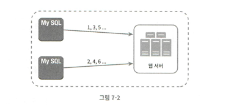
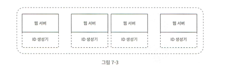
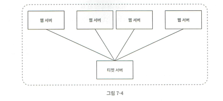
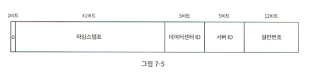
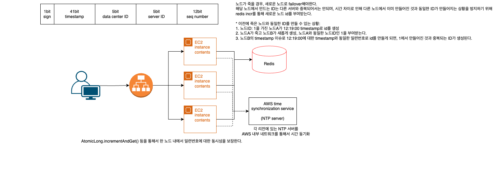

# 7장 - 분산 시스템을 위한 유일 ID 생성기 설계

분산 시스템에서는 한 대의 DB(auto_increment)만으로는 모든 서버의 ID 요청을 감당하기 힘들다.

## 1단계: 문제 이해 및 설계 범위 확정

### 요구사항

1. 시간 순 정렬이 가능해야한다.
2. 숫자로만 구성되어있어야한다.
3. ID는 고유한 값이어야한다.
4. 64비트로 표현 가능해야한다. 
   - 왜 64비트?
5. 초당 10,000개의 ID를 만들 수 있어야한다.

## 2단계: 개략적 설계안 제시 및 동의 구하기

### 1. 다중 마스터 복제(multi-cluster replication)

MySQL을 k대의 여러 마스터로 다중화하여 각 서버의 auto_increment를 유일 ID로 활용한다.

- 단, 한 서버에서 auto_increment 증가는 1만큼이 아니라 k만큼 증가시킨다.
  - 서버A: 1,3,5,7
  - 서버B: 2,4,5,8
- 서로 ID가 겹치지 않도록 하기 위함

**장점**

- ID를 생성하는 DB가 여러대이므로 초당 생산 가능 ID 수를 늘릴 수 있다.

**단점**

- 여러 데이터 센터에 걸쳐 규모를 늘리기 어렵다. ❓왜?
- ID 유일성은 보장되나, 시간 흐름에 맞춰 커지는걸 보장할 수 없다.
    - 서버A에서 1,3이 먼저 만들어지고 이후에 서버B에서 2가 만들어지면 시간 상으로는 2가 더 늦게 만들어진 값으로 정렬되어야함
- 서버 추가, 삭제 시 동작이 어려워진다.

### 2. UUID

컴퓨터 시스템에 저장되는 정보를 유일하게 식별하기 위한 128비트 수

**장점**
- 충돌 가능성이 지극히 낮다.
- 서버간 조율 없이 독립적으로 생성 가능
  - 각 서버에서 따로 생성해도 충돌 가능성이 지극히 낮으므로
    - 따라서, 서버 스케일아웃도 간단하다.

**단점**
- 알파벳 소문자+숫자로 구성(숫자로만 구성되어야한다는 요구사항 미충족)
- ID를 시간순으로 정렬할 수 없다.
- 128비트로 크기가 크다. (64비트 요구사항 미충족)

### 3. 티켓 서버

유일성이 보장되는 ID를 만들어내는 단독 서버

Flicker에서 분산 기본 키(primary key)를 만들기 위해 해당 방법을 사용한다.

즉, 중앙 집중 서버 한 대가 auto_increment 기능을 갖추고 있는 것

**장점**
- 유일성이 보장되는 오직 숫자로만 구성된 ID를 쉽게 만들 수 있다.
- 구현이 간단하다.

**단점**
- 티켓 서버가 SPOF가 된다.
  - 이를 피하기위해 서버를 다중화할 경우, 서버들 사이의 동기화를 고려해야하기 때문에 티켓 서버의 장점이 사라진다.

### 4. 트위터 스노우플레이크(snowflake) 접근법

생성해야하는 ID를 다음과 같이 나누어 64비트 고유 ID를 생성한다.

- sign 비트: 1비트, 음수와 양수를 구분하는 용도로 사용
- timestamp: 41비트, epoch시간 이후로 몇 밀리초 경과했는지를 나타낸다.
  - 트위터에서는 epoch 시간으로 1288834974를 사용한다.
- 데이터센터 ID: 5비트
  - 총 2^5개의 데이터 센터를 사용가능
- 서버 ID: 5비트
  - 데이터센터당 2^5개의 서버 운영 가능
- 일련번호: 12비트
  - 각 서버에서 ID를 생성할 떄 마다 일련번호를 1씩 증가시킨다.
  - 1밀리초가 경과할 때 마다 0으로 리셋된다.
  - 같은 밀리초에 여러 ID가 생성될 때, 이 사이의 중복을 피하고 정렬하기 위함

## 3단계: 상세 설계

- 데이터센터ID, 서버 ID: 시스템이 시작될 때 결정된다.
  - 운영중에는 바뀌지 않는 불변값
- 타임스탬프
  - 시간순에 따라 큰 값을 가진다. → ID 시간 순 정렬 가능
  - UTC시간 → 타임스탬프로 변환하여 사용할 수 있다.
  - 41비트 타임스태프로는 최대 69년을 표현할 수 있다.
  - **기원 시작(epoch time)을 시스템의 최초 시작 시간에 맞춰 가깝게 설정해두면, 가능한 오랜 시간 활용할 수 있다.**
- 일련번호
  - 2^12=4096개의 값을 가질 수 있다.
  - 어떤 서버가 같은 밀리초동안 하나 이상의 ID를 만든 경우에 0보다 큰 값을 가진다.

## 4단계: 마무리

추가로 고려할 수 있는 부분

- 시계 동기화(clock synchronization): 서버들 마다 시간 차이가 있을 수 있다. 이를 해결하기 위해서 NTP(Network Time Protocol)을 사용할 수 있다.
- 스노우플레이크 각 부분(절)의 최적화: 동시성이 낮은 시스템이라면, 한 밀리초 내에 여러 개의 ID가 생성될 케이스가 줄어들기 때문에 일련번호 비트를 작게 가져갈 수 있다.
  - 타임스탬프 등 다른 부분을 길게 설정하여 활용 가능
- 고가용성: ID 생성기는 가용성이 높아야한다.

---

## 설계

