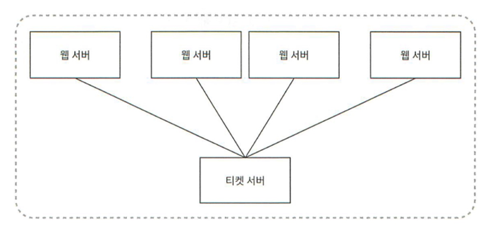
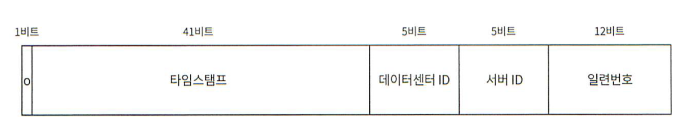

# 7장. 분산 시스템을 위한 유일 ID 생성기 설계
## 1단계. 문제 이해 및 설계 범위 확정
- ID는 유일해야 한다. 
- 언제나 1씩 증가한다고 말할 수 없지만, 시간의 흐름에 따라 ID가 커진다.
- ID는 숫자로만 구성된다
- ID는 발급 날짜에 따라 정렬 가능 해야한다.
- ID는 64비트로 표현될 수 있는 값이어야한다.
- 초당 10,000개의 ID를 만들 수 있어야 한다.

## 2단계. 개략적 설계안 제시 및 동의 구하기
- 분산 시스템에서 유일성이 보장되는 ID를 만드는 방법
  - 다중 마스터 복제
  - UUID
  - 티켓 서버
  - 트위터 스노플레이크 접근법

### 다중 마스터 복제
- **다음 ID 값을 구할 때 이전 키에서 k 만큼 더해주는 방법**이다.
    - k: 현재 사용 중인 데이터베이스 서버의 수
- 장점
  - 데이터베이스 수를 늘리면 초당 생산 가능 ID 수도 늘어난다,
- 단점
  - 여러 데이터 센터에 걸쳐 규모를 늘리기 어렵다.
  - ID의 유일성은 보장되겠지만 그 값이 시간 흐름에 맞추어 커지도록 보장할 수는 없다.
  - 서버를 추가하거나 삭제할 때도 잘 동작하도록 만들기 어렵다.

### UUID
- UUID : 컴퓨터 시스템에 저장되는 **정보를 유일하게 식별하기 위한 128비트 짜리 수**
- 장점
    - UUID를 만드는 것은 단순하다.
    - 서버 간의 조율이 필요 없으므로 동기화 이슈도 없다.
    - 각 서버가 자기가 쓸 ID를 알아서 만드는 구조이므로 규모 확장이 쉽다.
- 단점
    - ID가 128비트로 길기 때문에 요구사항 불만족
    - ID를 시간순으로 정렬할 수 없다.
    - ID에 숫자가 아닌 값이 포함될 수 있다.

### 티켓 서버

- **auto_increment 기능을 갖춘 데이터베이스 서버를 티켓서버로 하고, 중앙 집중형으로 하나만 사용**하는 것이다.
- 장점
    - 숫자로만 구성된 ID를 쉽게 만들 수 있다.
    - 구현하기 쉽고, 중소 규모 애플리케이션에 적합하다.
- 단점
  - **티켓서버가 SPOF** 가 된다. 이 이슈를 해결하기 위해 티켓 서버를 여러 대 준비해야 하는데, 그렇게 하면 데이터 동기화같은 새로운 문제가 발생한다.

### 트위터 스노플레이크 접근법
- 트위터에서 사용하는 스노플레이크라는 ID 생성 기법은 이번 문제의 요구사항을 만족할 수 있다.

- 생성해야 하는 ID를 여러 섹션으로 분할하는 것이다.
    - sign bit : 1비트, 음수와 양수를 구별하는데 사용
    - timestamp : 41비트, 기원 시각(epoch) 이후로 몇 밀리초가 경과했는지를 나타내는 값
    - 데이터센터 ID : 5비트, 2^5=32개의 데이터센터 지원 가능
    - 서버 ID : 5비트, 데이터 센터 당 32개의 서버 사용 가능
    - 일련번호(sequence) : 12비트, 각 서버에서는 ID를 생성할 때마다 이 일련번호를 1만큼 증가시킨다. 이 값은 1밀리초가 경과할 때마다 0으로 초기화
- ➕ 스노플레이크는 어플리케이션 레이어에서 구현 가능
  - https://www.catsriding.com/posts/implementing-unique-id-generator-based-on-snowflake-algorithm-in-java#implementing-unique-id-generator

## 3단계. 상세 설계
- 데이터 센터 ID와 서버 ID 는 시스템이 시작될 때 결정되고, 일반적으로 시스템 운영 중에는 바뀌지 않는다.

### 타임스탬프
- 타임스탬프는 시간이 흐름에 따라 점점 큰 값을 갖게 되므로, 결국 아이디는 시간순으로 정렬 가능하게 된다.
- 41비트로 표현할 수 있는 타임스탬프의 최댓값은 2^41−1=2199023255551 밀리초이다. (약 69년)
- 69년이 지나면 기원 시각을 바꾸거나 ID 체계를 다른 것으로 이전해야한다.

### 일련번호
- 일련번호는 12비트 이므로 2^12 = 4096개의 값을 가질 수 있다. 어떤 서버가 같은 밀리초 동안 하나 이상의 ID를 만들어 낸 경우에만 0보다 큰 값을 갖게 된다.

## 4단계. 마무리
- 시계 동기화
  - 우리는 ID 생성 서버들이 전부 같은 시계를 사용한다고 가정하였으나 이런 가정은 하나의 서버가 여러 코어에서 실행될 경우 유효하지 않을 수 있다. (여러 서버가 물리적으로 독립된 여러 장비에서 실행되는 경우에도 해당)
  - NTP(Network Time Protocol)는 이 문제를 해결하는 가장 보편적 수단이다
    - 네트워크 상에서 시간을 정확히 맞춰주는 서버
- 각 섹션의 길이 최적화 : 예를 들어 동시성이 낮고 **수명이 긴** 애플리케이션이라면 일련번호 절의 길이를 줄이고 **타임스탬프 절의 길이를 늘리는** 것이 효과적일 수 있다.
- 고가용성 : ID 생성기는 필수 불가결(mission critical) 컴포넌트 이므로 **아주 높은 가용성을 제공해야** 할 것이다.

## 설계
