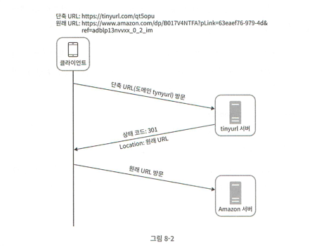
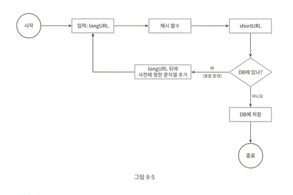
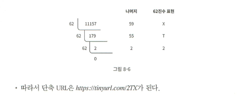
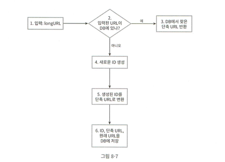
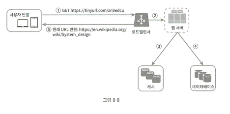
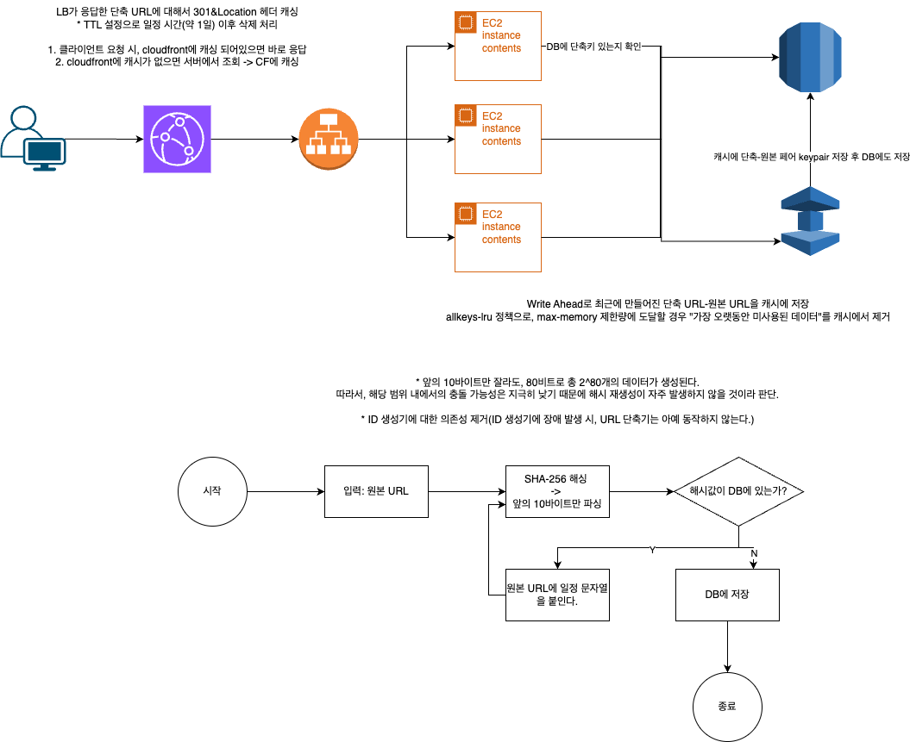

# 8장 - URL 단축기 설계

## 1단계: 문제 이해 및 설계 범위 확정

### 요구사항

1. URL 단축: 사용자가 입력한 URL을 짧게 줄인다.
2. URL 리디렉션: 단축 URL에 접속했을 때, 원본 URL의 위치로 리다이렉션 시킬 수 있어야한다.
3. HA, 규모 확장성, 장애 감내가 가능해야한다.

### 개략적 추정

- 쓰기 연산: 매일 1억개의 단축 URL을 생성할 수 있어야한다.
- 초당 쓰기 연산: 1160개 (24시간 동안 1억개를 만들 수 있어야하므로, 1억/24/3600)
- 읽기 연산: 쓰기연산의 10만큼 수행된다고 가정한다. 따라서, 초당 1160*10 = 11,600
- URL 단축 서비스를 10년간 운영하면, (1일 생산량) 10억 * 365(1년) * 10 = 3650억개의 레코드를 보관할 수 있어야한다.
- 단축 전 URL 평균 길이는 100이다.
    - 10년 동안 필요한 저장 용량은 3650억*100바이트(1바이트 길이가 100) = 36.5TB

## 2단계: 개략적 설계안 제시 및 동의 구하기

### API 엔드포인트 → RESTful

URL 단축기 서버에서는 아래 두 가지 API 호출에 대응할 수 있어야한다.

1. 단축용 엔드포인트(POST /path/to/url/shorten)
    1. req body: 단축할 url
    2. resp body: 단축된 url
2. 단축된 URL 엔드포인트 (GET /shorten/url)
    1. redirect to origin url

### URL 리디렉션

사용자가 단축 URL 엔드포인트를 호출했을 때, 서버에서 해당 API의 응답을 활용하여 원본 URL로 리다이렉션 시킬 수 있어야한다.

1. 301 Moved Permanently
    1. Location 헤더에 원본 URL을 담아 응답하면, 브라우저가 해당 값을 캐싱한다.
    2. 따라서, 첫 요청 이후에는 단축기 서버를 거치지않고 바로 원본 URL로 이동 가능하다.
    3. **단축기 서버 부하를 줄일 수 있으며, 원본 URL로 이동하는 속도를 줄일 수 있다.**
2. 302 Found
    1. URL이 일시적으로 Location 헤더에 지정된 URL로 리다이렉션 되어야한다는 의미
    2. 클라이언트 요청은 항상 단축기 서버를 거친 후에 원본 URL로 리다이렉션된다.
        1. 브라우저에서 항상 단축 URL이 원본 URL로 리다이렉션 되어야한다는 것을 모르는 상태
    3. 트래픽에 대한 기록이 필요하다면(트래픽 분석), 단축 URL이 호출될 때 마다 이를 서버에서 확인할 수 있어야하므로 302를 쓰는 것이 유리하다.

일반적으로 단축 URL은 해시 테이블 형태로 `<단축 URL, 원본 URL>` 로 구성할 수 있다.

- hashTable.get(단축 URL)

### URL 단축

단축 URL 형태: `domain.com/short-url/{hashValueOfOriginUrl}`

**해싱에 사용할 함수의 요구사항**

1. 입력으로 주어지는 URL이 다르면 단축 URL도 달라져야한다.
2. 계산된 해시값은 원본 URL로 복원될 수 있어야한다.

## 3단계: 상세 설계

### 데이터 모델

해시테이블: 메모리 사용량 제한으로 다량 데이터를 저장하기에 적합하지 않다.

⇒ <단축 URL, 원본 URL>을 RDS에 저장할 수 있다.

| PK | id |
| --- | --- |
|  | shortURL |
|  | longURL |

### 해시 함수

- 원본으로 복원 가능해야함
- 입력값이 하나라도 달라지면 다른 결과값이 나와야함

#### 해시값(단축값 = hashValue) 길이

hashValue는 [0-9, a-z, A-Z] 문자들로 구성되어야한다.

- 따라서, 10 + 26 + 26 = 62개의 문자 사용 가능
- hashValue의 각 자리에 62개의 문자가 올 수 있으므로
    - `62^n(n=hashValue의 길이) ≥ 3650억(1단계에서 계산한 10년 동안 저장할 수 있어야하는 단축된 URL 개수)` 인 n을 계산해야한다.
    - n=7이면 3.5조개를 만들 수 있으므로, **hashValue의 길이=7**

해시 함수 구현 기술

#### 1. 해시 후 충돌 해소

원본 URL을 길이가 7인 해시값으로 변경하기 위해서 이미 제공되는 해시함수(e.g., SHA-1, MD5)를 쓸 수 있다.

다만, 위 함수들은 길이가 7보다 크므로 앞의 7글자를 잘라서 사용할 수 있다.

- 문제점: 길이를 줄여버린다면 서로 다른 문자열을 넣었을 때도 같은 7글자의 해시값이 나올 수 있다. (해시 충돌 가능성이 높아진다.)
- 해결책: 충돌이 해소될 때 까지 특정 문자열(사전에 정의)를 원본 URL에 계속 덧붙여서 해싱한다.

**단점**

1. 단축 URL을 생성할 때 마다 DB 쿼리가 발생한다.
    1. 만든 해시값이 DB에 없는 값인지 검증해야하므로
2. 충돌이 없는 URL을 만들기까지의 시간 소모가 늘어난다.

**⇒ 해결책으로 블룸 필터(어떤 집합에 특정 원소가 있는지 검사)를 활용하면 성능을 높일 수 있다.**

#### 2. base-62 변환

> 수의 표현 방식이 다른 두 시스템에서 같은 수를 공유해야하는 경우에 유용하게 쓸 수 있다.
>

base-”62” 인 이유

- hashValue에 쓸 수 있는 문자 개수가 62개([0-9, a-z, A-Z]) 이므로

방법

1. 원본 URL에 대해 해당 URL을 식별할 수 있는 고유 ID(숫자로만 구성된 10진수값)를 생성한다.
    - 이를 위해 고유 ID 생성기가 필요해진다.
2. 1에서 얻은 고유 ID를 62진수로 변환한다.
    1. 0→0, 1→1, …, 9→9, 10 →a, 11→b, …, 35→z, 36→A, …, 61→Z로 변환
    2. 원본 숫자를 62의 거듭제곱으로 구성되도록 변경하여, **거듭제곱의 계수를 a의 규칙에 따라 변환한다.**
    3. 
3. 2의 결과를 URL에 활용하여 → `https://domain.com/{62진수}` 로 활용한다.

#### 두 접근법 비교

| 해시 후 충돌 해소 전략 | base-62 변환 |
| --- | --- |
| 단축 URL 길이 고정됨(7글자로 고정) | 단축 URL 길이가 가변적이다.
→ 원본 URL의 ID 길이가 길어지면, 62진수도 길어질 수 있다. |
| 유일성 보장 ID 생성기 불필요 | 유일성 보장 ID 생성기 필요 |
| 충돌 해소 전략 필요 | 충돌 발생 X
→ 원본 자체가 고유한 값이므로 |
| 매번 인입되는 URL을 즉시 변환하기 때문에, 다음에 만들어질 단축 URL을 예측할 수 없다. | ID 증가폭에 따라 다음 단축 URL을 예상할 수 있다.
→ 보안상 문제가 될 수 있음 |

#### URL 단축기 상세 설계

#### URL 리디렉션 상세 설계

- 조회가 자주 발생하므로, 캐시 서버에 데이터를 저장해서 쓸 수 있다.

로드 밸런서의 역할

- 사용자가 단축 URL 클릭
- LB가 해당 요청을 웹서버에 전달
- 단춛 URl이 캐시에 있다면 캐시에서 바로 응답
- 캐시 서버에 단축 URL이 없다면 DB에서 꺼내서 응답
- DB에서 꺼낸 데이터는 캐시 서버에 넣은 후 반환

## 4단계: 마무리

- 처리율 제한 장치: 처리율 제한 장치를 적용하여 요청이 다량 인입될 경우, 서비스가 다운되는 상태를 방지할 수 있다.
- 웹 서버 규모 확장: URL 단축기 서버는 무상태성이므로, 확장이 가능하다.
- DB 규모 확장: DB 다중화, 샤딩으로 확장할 수 있다.
- 데이터 분석 솔루션: 데이터 분석 솔루션을 단축기 서버에 포함시키면 특정 링크 클릭에 대한 분석이 가능하다.
- 가용성, 데이터 일관성, 안전성: 대규모 시스템의 안정적인 운영을 위한 필수 요소를 고려해야한다.

---

## 설계

1. cloudfront로 캐시 사용
    1. 가장 최근에 응답된건 cloudfront 캐시로 저장한다.
    2. 가장 오래 사용되지 않은 값은 제거한다.
    3. 캐시 hit에실패하면 원본 서버로 전달된다.
2. 원본서버 캐시서버
    1. write ahead로 캐시에 저장한다.
    2. 캐시에 데이터가 저장된 시간 이후로 가장 오랫동안 접근이 안된 데이터부터 삭제한다.
3. 구현은 해시(앞의 10바이트를 잘라서 사용)로 설정한다.
    1. 이유: 10바이트=80비트면 2^80개의 결과가 나온다.
    2. 해시 충돌이 발생하면 원본 문자열에 값을 덧붙여 재해싱을 하지만, 2^80개 자체가 충돌이 날 가능성이 매우 낮기 때문에 재해싱이 필요할 상황은 지극히 적을 것으로 생각
    3. 7바이트 이상이기만 하면 되므로, 차라리 길이를 크게 설정하여 충돌 가능성을 낮추고자 함
    4. ID생성기를 거쳐야하는 네트워크 비용&타 서비스에 대한 의존성을 제거하고자 함

