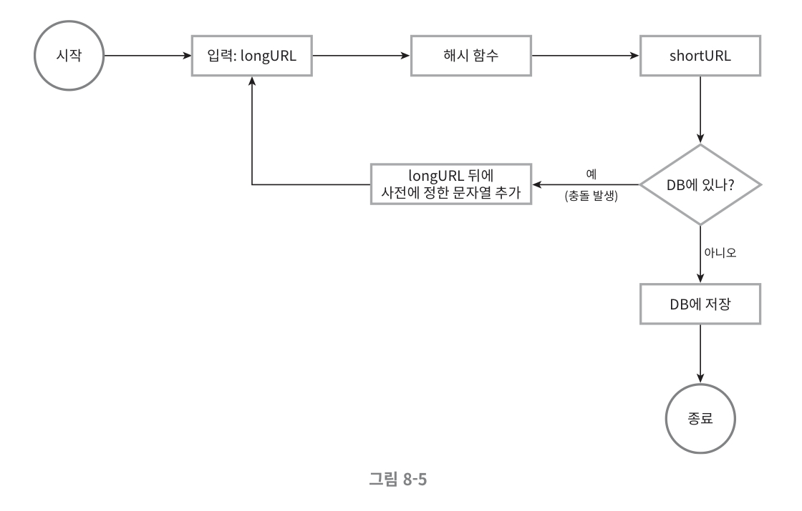

# 8장. URL 단축기 설계
## 1단계. 문제 이해 및 설계 범위 확정
- 매일 1억 개의 단축 URL 생성 가능해야 한다
- 짧으면 짧을수록 좋다
- 단축 URL에는 숫자와 영문자만 사용 가능하다

### 개략적 추정
- 쓰기 연산 : 매일 1억 개의 단축 URL 생성
- 초당 쓰기 연산 : 1억 / 24 / 3600 = 1160회
- 읽기 연산 : 읽기 연산과 쓰기 연산의 비율이 10:1 이라고 가정하면, 읽기 연산은 초당 11,600회 발생
- URL 단축기 서비스를 10년간 운영한다고 가정하면, 1억*365*10 = 3650억 개의 레코드 보관 필요
- 축약 전 URL의 평균 길이는 100이라고 가정
- 따라서 10년 동안 필요한 저장 용량은 3650억 * 100바이트 = 36.5TB

## 2단계. 개략적 설계안 제시 및 동의 구하기
### URL 리다이렉션

- 301 Permanently Moved
  - 해당 URL에 대한 HTTP 요청의 처리 책임이 **`영구적`으로 Location 헤더에 반환된 URL로 이전**되었다는 응답이다
  - 영구적으로 이전되었으므로, 브라우저는 이 응답을 캐시하여 추후 단축 URL로 요청을 보낼 때 **캐시된 원래 URL 로 요청을 보내게 된다**
    - ➕ 브라우저 캐시는 클라이언트 측에 저장되며, 서버와는 독립적으로 동작
  - 서버 부하를 줄이는 것이 중요할 때 사용한다
    - 1번째 요청만 단축 URL 서버로 전송될 것이므로!
- 302 Found
  - 해당 URL 요청이 **`일시적`으로 Location 헤더가 지정하는 URL에 의해 처리되어야 한다**는 응답이다
  - 언제나 단축 URL 서버에 먼저 보내진 후에 원래 URL로 리다이렉션 되어야 한다
  - 트래픽 분석이 중요할 때 유리하다
    - 클릭 발생률이나 발생 위치를 추적하는데 좀 더 유리하기 때문!
- URL 리다이렉션을 구현하는 가장 직관적인 방법은 `해시 테이블` 을 사용하여 <단축 URL, 원래 URL> 형태로 저장하는 것이다
  - 원래 URL = hashTable.get(단축 URL)
  - 301 또는 302 응답 Location 헤더에 원래 URL을 넣은 후 전송

### URL 단축
- 결국 중요한 것은 원래의 긴 URL을 해시 값으로 대응시킬 `해시 함수`를 찾는 것!
- 해시 함수 요구사항
  - 입력으로 주어지는 긴 URL이 다른 값이면 해시 값도 달라야 한다.
  - 계산된 해시 값은 원래 입력으로 주어졌던 긴 URL로 복원될 수 있어야 한다.

## 3단계. 상세 설계
### 데이터 모델
- 메모리는 유한하고 비싸기 때문에 <단축 URL, 원래 URL>의 순서쌍을 `관계형 데이터베이스`에 저장하는 것이 더 나은 방법이다

### 해시 함수
#### 해시 값 길이
- 이 시스템은 3650억 개의 URL을 생성해야 하고 단축 URL의 길이는 최대한 짧은것이 좋으므로 요구사항을 만족하는 n의 최솟값은 7이 된다 
  - 62^7 = 3.5조, 62^6 = 568억

#### 해시 후 충돌 해소
- 원래 URL을 7글자 문자열로 줄이는 해시 함수가 필요한데, 손 쉬운 방법은 **CRC32, MD5, SHA-1** 같이 잘 알려진 해시 함수를 이용하는 것이다.
- 해시 함수가 계산한 해시 결과가 7자리보다 길 경우 처음 7개 글자만 이용하면 되는데, 이런 경우 해시 결과가 서로 충돌할 확률이 높아진다.

- 충돌 발생 시, 충돌이 해소될 때 까지 사전에 정한 문자열을 해시값에 덧붙인다
- 이 방법은 충돌을 해소할 수는 있으나, 단축 URL 을 생성할 때마다 **1번 이상 데이터베이스 질의를 해야 하므로 오버헤드가 크다**
  - 데이터베이스 대신 블룸 필터를 사용하면 성능을 높일 수 있다

### base-62 변환
- 진법 변환은 URL 단축기를 구현할 때 흔히 사용되는 접근법 중 하나이다
- hashValue에 사용할 수 있는 문자가 62개이므로 62진법을 사용한다

### 두 접근법 비교
| 해시 후 충돌 해소 전략 | base-62 변환 |
|-------------------------|--------------|
| 단축 URL의 길이가 고정됨 | 단축 URL의 길이가 가변적. ID값이 커지면 같이 길어짐 |
| 유일성이 보장되는 ID 생성기 불필요 | **유일성 보장 ID 생성기** 필요 |
| 충돌이 가능해서 해소 전략이 필요 | ID의 유일성이 보장된 후에야 적용 가능한 전략이라 충돌은 아예 불가능 |
| ID로부터 단축 URL을 계산하는 방식이 아니라서 다음에 쓸 수 있는 URL을 알아내는 것이 불가능 | ID가 1씩 증가하는 값이라고 가정하면 다음에 쓸 수 있는 단축 URL이 무엇인지 쉽게 알아낼 수 있어서 **보안상 문제가 될 소지가 있음** |

### URL 단축기 상세 설계

1. 입력으로 긴 URL을 받음
2. 데이터베이스에 해당 URL이 있는지 검사
3. 데이터베이스에 있다면 해당 URL에 대한 단축 URL을 만든 적이 있는 것이므로, 데이터베이스에서 해당 단축 URL을 가져와서 클라이언트에게 반환
4. 데이터베이스에 없는 경우에는 해당 URL은 새로 접수된 것이므로 유일한 ID (데이터베이스의 기본 키로 사용) 를 생성한다. 
5. 62진법 변환을 적용하여 ID를 단축 URL로 만듦
6. ID, 단축 UR, 원래 URL로 새 데이터베이스 레코드를 만든 후 단축 URL을 클라이언트에게 전달

### URL 리다이렉션 상세 설계

- 쓰기보다 **읽기를 더 자주 하는** 시스템이므로 <단축 URL, 원래 URL>의 쌍을 `캐시`에 저장하여 성능을 높인다.
1. 사용자가 단축 URL 클릭
2. 로드밸런서가 해당 클릭으로 발생한 요청을 웹 서버에 전달
3. 단축 URL이 이미 캐시에 있는 경우에는 원래 URL을 바로 꺼내서 클라이언트에게 전달
4. 캐시에 해당 단축 URL이 없는 경우에는 데이터베이스에서 꺼냄
5. 데이터베이스 꺼낸 URL을 캐시에 넣은 후 사용자에게 반환 (Cache-Aside)

## 4단계. 마무리
- **처리율 제한 장치** : IP 주소를 비롯한 필터링 규칙들을 이용해 요청을 걸러낼 수 있다
- 웹 서버의 규모 확장 : 본 설계에 포함된 웹 계층은 무상태 계층이므로, 웹 서버를 자유롭게 증설하거나 삭제할 수 있다
- 데이터베이스의 규모 확장 : 데이터베이스를 다중화하거나 샤딩하여 규모 확장성을 달성할 수 있다
- 데이터 분석 솔루션(analytics) : URL 단축기에 데이터 분석 솔루션을 통합해 두면 어떤 링크를 얼마나 많은 사용자가 클릭했는지, 언제 주로 클릭했는지 등 중요한 정보를 알아낼 수 있다
- 가용성, 데이터 일관성, 안정성 : 대규모 시스템이 성공적으로 운영되기 위해서는 반드시 갖추어야 할 속성들이다

## 설계
