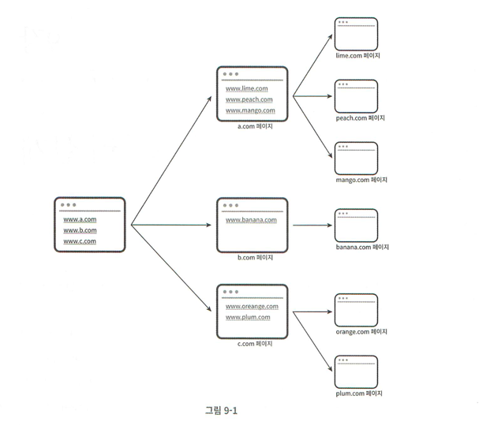
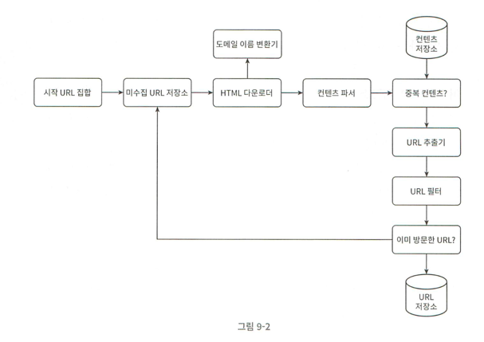
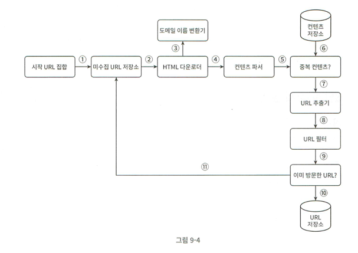
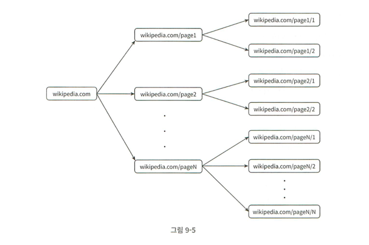
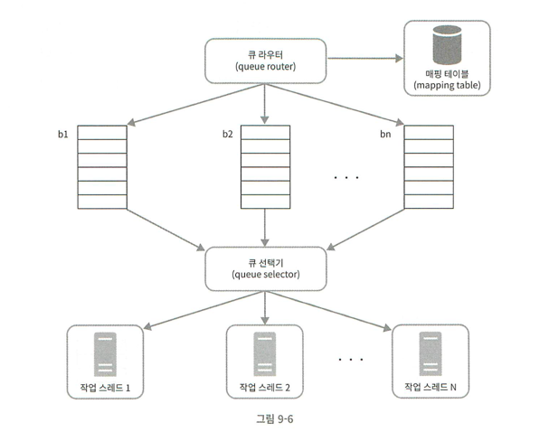
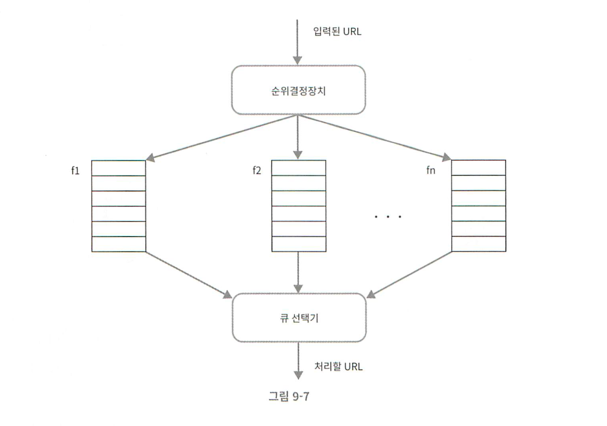
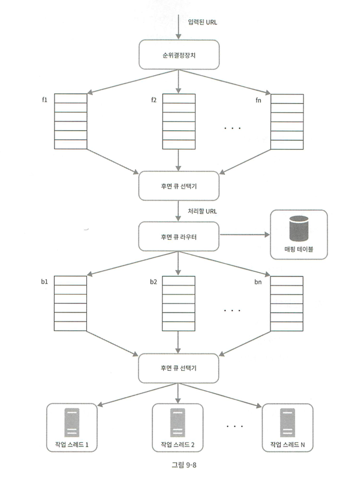
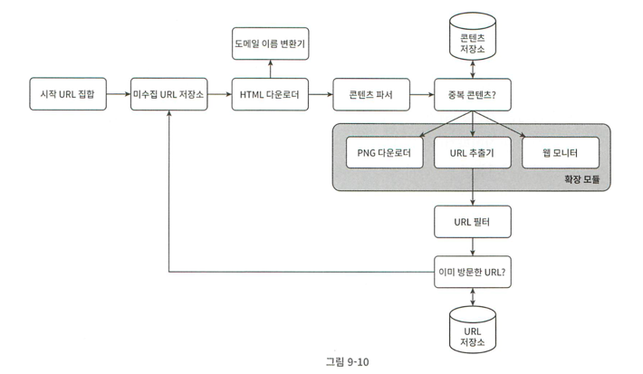

# 9장 - 웹 크롤러 설계

> 웹 크롤러 = 로봇(robot) = 스파이더(spider)
> 
> 검색 엔진에서 널리 쓰이는 기술로, 웹에 새로 올라오거나 갱신된 콘텐츠를 찾아내는 것이 주목적
> - 콘텐츠: 웹 페이지, 이미지, 비디오, PDF 파일 등등

N개의 웹 페이지 → 링크를 따라나가며 새로운 콘텐츠를 수집한다.

### 크롤러 이용 사례

- 검색 엔진 인덱싱
    - 크롤러가 웹 페이지를 모아서 검색 엔진을 위한 로컬 인덱스를 만든다.
    - googlebot: 구글 검색 엔진이 사용하는 웹 크롤러
- 웹 아카이빙
    - 나중에 사용할 목적으로 장기보관하기 위해 웹에서 정보를 모으는 절차
    - 국립 도서관에서 크롤러를 통해 웹 사이트를 아카이빙한다.
- 웹 마이닝(mining)
    - 인터넷에서 유요한 지식을 웹 마이닝을 통해 도출해 낼 수 있다.
    - e.g., 일부 금융 기업에서는 크롤러를 사용해 주주총회 자료나 ㅇ녀차 보고서를 다운받아 기업의 핵심 사업 방향을 알아낸다.
- 웹 모니터링
    - 크롤러를 통해 인터넷에서 저작권이나 상표권이 침해되는 사례를 모니터링할 수 있다.

웹 크롤러가 처리해야하는 데이터의 규모에 따라 크롤러의 복잡도가 달라진다.

## 1단계: 문제 이해 및 설계 범위 확정

### 웹 크롤러의 기본 알고리즘

1. URL 집합이 입력으로 주어지면, 해당 URL들이 가리키는 모든 웹 페이지를 다운로드한다.
2. 다운로드 받은 웹 페이지에서 URL들을 추출한다.
3. 추출된 URL들을 다운로드 할 URL 목록에 추가, 1의 과정을 처음부터 반복한다.

### 요구사항

1. 검색 엔진 인덱싱을 위한 크롤러
2. 한 달에 10억개의 웹 페이지를 수집할 수 있어야한다.
3. 새로 만들어진 웹 페이지나 수정된 웹 페이지도 수집할 수 있어야한다.
4. 수집한 페이지는 5년간 저장해야한다.
5. 중복 컨텐츠를 가지는 페이지는 제외해도 된다.

### 웹 크롤러의 속성

1. 규모 확장성
    - 웹에 수십억개의 페이지가 존재하므로, 크롤러의 수집 성능을 위해 병행성(parallelism)을 활용할 수 있다.
2. 안정성(robustness)
    - 잘못 작성된 HTML, 장애, 악성 코드가 있는 링크 등 비정상적 URL에 대해 대응할 수 있어야한다.
3. 예절(politeness)
    - 수집 대상 웹 사이트에 크롤러가 짧은 시간 동안 너무 많은 요청을 보내면 안된다.
4. 확장성(extensibility)
    - 새로운 형태의 콘텐츠를 지원하기 쉬워야한다.
    - e.g., 이미지 파일도 크롤링을 해야할 때 작은 변경사항으로도 수집이 가능하게 확장시킬 수 있어야한다.

### 개략적 규모 추정

- 매달 10억개의 웹 페이지를 다운로드 할 수 있어야한다.
- QPS = 10억/30일/24시간/3600초 = 400페이지/초
    - peak QPS = 2*400QPS = 800QPS
- 웹 페이지의 크기는 평균 500k라고 가정
    - 10억개의 페이지이므로, 한 달에 총 500TB를 저장할 수 있어야한다.
    - 5년 동안 보관이 가능해야하므로, 500TB*12*5 = 30PB의 저장용량 필요

## 2단계: 개략적 설계안 제시 및 동의 구하기

### 시작 URL 집합

크롤링을 처음 시작할 때 주어지는 초기 URL 집합.

- e.g., 어떤 대학의 웹 사이트로부터 크롤링을 한다면 해당 대학 도메인 이름이 붙은 모든 페이지의 URL을 시작 URL로 쓸 수 있다.
- 전체 웹을 크롤링한다면, 가능한 많은 링크를 탐색할 수 있도록 웹 상의 모든 URL들을 부분 집합으로 나누어 선택할 수 있다.
    - 지역적인 특색(e.g., 나라별로 인기있는 도메인)으로 웹 상의 URL을 나누어 시작 URL을 선택할 수 있다.
        - 한국 대상:  `naver.com`, `daum.net` 같은 사이트 등
    - 주제별로 웹 상의 URL을 나눌 수도 있다.
        - 스포츠, 건강, 쇼핑 등의 카테고리로 나누고 각 카테코리에 맞는 각기 다른 시작 URL 사용

### 미수집 URL 저장소

크롤러에서 URL은 1. 다운로드 해야하는 URL 2. 이미 다운로드 된 URL로 나뉜다.

미수집 URL 저장소(URL frontier): 1번(다운로드 해야하는 URL)을 저장, 관리하는 컴포넌트

- FIFO 구조이다.

### HTML 다운로더

인터넷 상의 웹 페이지를 다운로드 하는 컴포넌트. (URL은 미수집 URL 저장소로부터 가져온다.)

### 도메인 이름 변환기

웹 페이지를 다운로드 받기 위한 URL → IP 변환 절차를 담당한다.

### 콘텐츠 파서

웹 페이지 다운로드를 위해서는 파싱(parsing) 하여 올바른 형식을 갖춘 페이지인지 검증한다.

- 이상한 웹 페이지를 다운로드하여 저장 공간 낭비, 다운로드 중 문제 발생을 차단하기 위함
- 별도 독립된 컴포넌트로 분리하여 크롤링 과정 자체가 느려지는 것을 방지

### 중복 콘텐츠 판별

동일한 내용의 콘텐츠를 중복 다운로드 받는 상황을 방지하기 위해 중복 콘텐츠 판별 자료구조를 거친다. (콘텐츠 저장소를 옹해 이미 저장소에 있는지 확인)

- 데이터 중복 줄이기
- 데이터 처리에 소모되는 시간 줄이기

**전체 HTML 문서를 문자열로 비교하지 않고, 웹 페이지 해시값을 비교할 수 있다.**

### 콘텐츠 저장소

다운로드 된 HTML 문서를 저장하는 시스템

**저장소 구현을 위한 기술을 선택할 때 고려할 요소**

- 저장할 데이터 유형
- 크기
- 저장소 접근 빈도
- 데이터의 유효기간

저장 용량과 접근 시간이 모두 중요하다면, 다음과 같이 설계할 수 있다.

- 데이터 양이 많으면 대부분의 콘텐츠는 디스크에 저장
- 자주 조회되는 콘텐츠는 메모리에 두어 접근 시간 감소

### URL 추출기

HTML 페이지를 파싱하여 링크를 골라내는 역할

- 상대 경로는 모두 앞에 특정 도메인(해당 HTML의 링크의 도메인)을 붙여 절대 경로로 변환한다.

### URL 필터

아래 URL들을 식별하여 크롤링 대상에서 제외한다.

- 특정 콘텐츠 타입이나 파일 확장자를 가지는 URL
- 접속 시 오류가 발생하는 URL
- 접근 제외 목록(deny list)에 있는 URL

### 이미 방문한 URL(중복 URL 판별)

이미 방문했거나(URL 저장소에 저장되어 있는 값), 미수집 URL 저장소에 이미 보관어 있는 URL을 추적하기 위한 자료구조 사용 → 일을 여러번 처리하는 상황 방지

자주 사용되는 자료구조

- 블룸 필터
- 해시 테이블

### URL 저장소

이미 방문한 URL을 저장하는 저장소

### 웹 크롤러 작업 흐름

## 3단계: 상세 설계

### 링크 탐색: DFS VS BFS

웹은 directed graph 구조로 비교해볼 수 있다.

- 노드: 웹 페이지
- 엣지: 링크(URL)

> 크롤링은 그래프를 따라 페이지를 탐색해나가는 과정

#### DFS를 사용한다면?

- 그래프 크기가 클 경우, 어느 정도로 깊숙이 탐색할지 예측이 안된다.

#### BFS

- 일반적으로 웹 크롤러는 FIFO 큐를 사용하여 BFS로 구현한다.
    - 큐 input: 탐색할 URL
    - 큐 output: 이번에 다운로드 할 URL
- 문제점
    - 한 페이지에서 나오는 링크는 상당수가 같은 서버로 되돌아간다. (즉, 같은 도메인에 대한 다른 URL이 대부분)
        - 크롤러가 해당 URL에 모두 요청을 보내게 되면, 한 도메인(서버)에 수많은 요청으로 과부하가 걸릴 수 있다. ⇒ 예의 없는 크롤러
        - 
    - 표준 BFS 알고리즘은 탐색할 노드/엣지에 우선순위를 두지 않기 때문에, 중요한 페이지를 우선 탐색할 수 있도록 우선순위를 둘 수 있다.
        - 우선순위 기준: 페이지 순위, 사용자 트래픽 양, 업데이트 빈도 등

### 미수집 URL 저장소

다운로드 할 URL을 저장하는 보관소 → 해당 보관소의 구현 방법으로 예의 있는/우선순위를 구별할 수 있는 크롤러를 구현할 수 있다.

#### 1. 예의있는 크롤러

한 서버에 단시간에 많은 요청을 보내는건 예의 없는(Dos 공격) 크롤러로 간주된다.

⇒ 한 서버에는 한 번에 하나의 페이지만 요청하는 것이 원칙

- 한 서버에 대해서는 페이지를 다운받는 작업에 시간차를 두고 실행하면 된다.
- 웹사이트의 호스트-다운로드 수행 작업 스레드의 관계를 유지
    - 각 다운로드 스레드는 별도로 큐를 가지고 있어, 해당 큐에서 꺼낸 URL만 다운로드한다.
    - 즉 한 호스트 - 한 큐 - 한 다운로드 스레드의 구조로 한 도메인에 대해서는 한 번에 하나의 작업만 수행하는 것

- 큐 라우터: 한 호스트에 대한 URL은 항상 같은 큐로 들어가도록 보장
- 매핑 테이블: 호스트-큐의 매핑 정보를 보관
- 큐(b1 ~ bn): 한 호스트에 대한 URL은 항상 같은 큐에 보관
- 큐 선택기: 큐를 순회하면서 각 큐에서 URL을 조회 → 해당 도메인을 처리하는 작업 스레드(특정 큐(즉, 도메인)을 담당하는 작업 스레드)에 URL 전달
- 작업 스레드: 큐와 일대일 대응, 전달된 URL을 순차 처리하며 작업 시간 사이에 delay를 둘 수 있다.

#### 2. 우선순위를 판별하는 크롤러

동일한 정보에 대한 페이지라도, 공식 페이지 VS 커뮤니티로 비교하면 공식 페이지의 우선순위가 더 높다. ⇒ 우선순위가 높은 페이지를 우선 수집하는 방향을 고려할 수 있어야한다.

- 페이지 순위, 트래픽 양, 갱신 빈도 등의 척도로 우선순위 판단

- 순위 결정 장치: URL을 입력받아 순위를 결정한다.
- 큐: 우선순위별로 큐가 하나씩 대응 → 우선순위가 높은 URL들을 관리하도록 지정된 큐는 그만큼 자주 선택된다.
- 큐 선택기:  우선순위가 높은 큐에서 URL을 더 자주 꺼낸다.

#### 3. 예의&우선순위를 모두 고려한 크롤러

- 전면 큐: 우선순위가 높은 URL을 결정
- 후면 큐: 한 도메인에 대한 URL은 한 번에 하나씩만 처리되도록 선택하는 큐

### 신선도

데이터 신선함을 위해, 이미 다운로드 된 URL이라도, 페이지가 갱신되는 것을 반영할 수 있어야한다. ⇒ 주기적 재수집 필요

- 웹 페이지의 변경 이력(update history) 활용
- 우선순위 활용, 중요한 페이지를 더 자주 재수집

### 미수집 URL 저장소를 위한 지속성 저장장치

다운로드 할 URL 저장 방법

- 모두 디스크에 저장: I/O로 이한 병목 지점이 될 가능성이 높다.
- 모두 메모리에 저장: 메모리의 확장성에 대한 한계
- hybrid
    - 대부분의 URL은 디스크에 저장
    - I/O 비용 감소를 위해 메모리 버퍼에 큐를 둔다.
        - 버퍼에 있는 데이터는 주기적으로 디스크로 flush

### HTML 다운로더

HTTP 프로토콜로 웹 페이지 다운로드

#### 1. Robots.txt: 로봇 제외 프로토콜

각 도메인에 대해 수집 가능/불가한 페이지 목록을 명시

- 크롤러가 다운로드 하기 전에, 해당 파일의 규칙을 먼저 확인해야한다.
- 다운로드 규칙은 주기적으로 갱신 → 캐시에 보관

#### 2. HTML 다운로더 성능 최적화

1. 분산 크롤링
    - 크롤링 작업을 여러 서버에 분산
        - 각 서버는 멀티스레드로 여러 크롤링 작업을 병렬로 수행한다.
        - URL을 작은 공간으로 분리해서 각 서버는 그 중 일부를 담당
2. 도메인 이름 변환 캐시
    - DNS 요청은 크롤러의 병목 지점이다.
        - 요청~응답까지 보통 10ms~200ms 소요
        - 크롤러 스레드 중 DNS 요청을 진행 중인 스레드가 있다면, 다른 스레드의 DNS 요청은 모두 block 된다. ❓
    - 도메인명-IP 매핑 데이터를 캐시에 저장해두고, 크론 잡 등으로 주기적 갱신하면 성능 향상 가능
3. 지역성
    - 크롤러 서버를 크롤링 대상 사이트와 지역적으로 가까운 곳에 위치 시키면 다운로드 속도 감소 가능
    - 크롤링 서버, 캐시 서버, 큐, 저장소 등 대부분의 컴포넌트에 적용 가능
4. 짧은 타임아웃
    - URL이 응답하지 않아 무한 대기하는 상황을 대비하여 타임아웃 설정

#### 3. 안정성

HTML 다운로더의 시스템 안정성을 고려할 수 있어야하낟.

- 안정해시(consistence hash): 다운로드 서버에 부하 분산할 때 해당 기술 사용 가능
- 크롤링 상태 수집 및 데이터 저장: 장애가 발생해도 쉽게 복구하기 위해 크롤링 상태&수집된 데이터를 쥐적으로 지속적 저장장치에 저장한다.
    - 장애 상황 시, 저장된 데이터를 사용해 크롤러 재시작
- 예외 처리: 예외가 발생해도 전체 시스템이 멈추지 않도록 조치
- 데이터 검증: 시스템 오류 방지를 위해 데이터를 다운로드 전 검증

### 확장성

크롤러의 특성 상, 여러 컴포넌ㅌ를 다운로드 할 수 있도록 확장성을 지원할 수 있도록 설계한다.

- PNG 다운로더: PNG 파일을 다운로드 하는 플러그인 모듈
- 웹 모니터: 웹 모니터링 → 저작권, 상표권 침해를 막는 모듈

### 문제있는 콘텐츠 감지 및 회피

중복/의미없는/유해한 콘텐츠를 사전 필터링한다.

1. 중복 콘텐츠: 해시, 체크섬 등을 통해 중복 콘텐츠를 탐지한다.
2. 거미 덫(spider trap): 크롤러를 무한 루프에 빠뜨리도록 설계한 웹 페이지
    - URL 길이 제한 등으로 회피할 수 있다.
    - 자동화 알고리즘은 만들기 어려우므로, 수동으로 덫을 확인한 후 덫이 있는 사이트를 크롤링 대상에서 제외하거나 URL 필터에 추가하는 것도 방법
3. 데이터 노이즈: 가치 없는 콘텐츠(광고, 스크립트 코드 등)은 크롤링 대상에서 제외한다.

## 4단계: 마무리

### 추가 고려 사항

- 서버 측 렌더링
    - JS로 즉석에서 만들어지는 링크는 HTML을 다운로드해도 확인할 수 없다.
    - 해당 페이지 파싱 전, 서버 측 동적 렌더링을 사용하면 해당 URL에 대해서도 처리 가능
- 원치 않는 페이지 필터링
    - 저장 공간 등 크롤링에 소요되는 유효한 자원을 위해 스팸성 페이지를 걸러낸다. (스팸 방지 컴포넌트 추가 등)
- 데이터베이스 다중화 및 샤딩
    - 데이터 계층의 가용성, 규모 확장성, 안정성 향상
- 수평적 규모 확장
    - 대규모 크롤링을 위해 여러 대의 다운로더 서버가 필요할 수 있다. → 무상태성 보장 필요
- 가용성, 일관성, 안정성
- 데이터 분석 솔루션